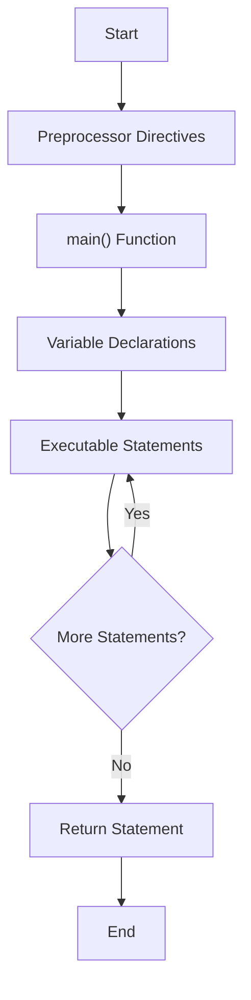
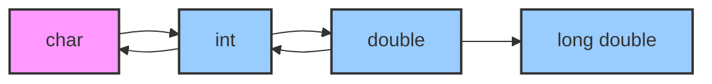
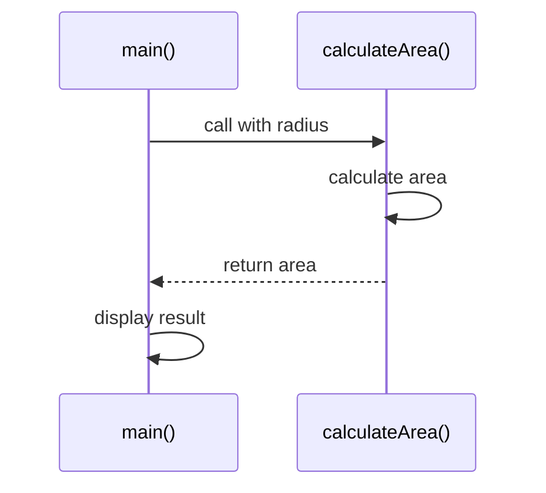

---
tags:
  - C
  - IMPR
  - CCT1
Topic: C programming language
Semester: CCT1
Course: IMPR1
Module: N/A
Course Date: N/A
Litterature:
  - Problem Solving and Program Design in C, Global Edition, 8th ed.
Created: 23-11-25
---
- - -
## Table of Contents

- [[#C Programming Fundamentals|C Programming Fundamentals]]
	- [[#C Programming Fundamentals#Quick Reference|Quick Reference]]
	- [[#C Programming Fundamentals#Preprocessor Directives|Preprocessor Directives]]
	- [[#C Programming Fundamentals#Syntax Displays for Preprocessor Directives|Syntax Displays for Preprocessor Directives]]
	- [[#C Programming Fundamentals#Reserved Words|Reserved Words]]
	- [[#C Programming Fundamentals#Standard Identifiers|Standard Identifiers]]
	- [[#C Programming Fundamentals#User-Defined Identifiers|User-Defined Identifiers]]
		- [[#User-Defined Identifiers#Valid Identifier names|Valid Identifier names]]
		- [[#User-Defined Identifiers#Invalid Identifier names|Invalid Identifier names]]
	- [[#C Programming Fundamentals#Uppercase & Lowercase|Uppercase & Lowercase]]
- [[#2.2 Variable Declarations and Data Types|2.2 Variable Declarations and Data Types]]
	- [[#2.2 Variable Declarations and Data Types#Variable Declarations|Variable Declarations]]
	- [[#2.2 Variable Declarations and Data Types#Data Types|Data Types]]
		- [[#Data Types#Data Type - Int|Data Type - Int]]
		- [[#Data Types#Data Type - Double|Data Type - Double]]
		- [[#Data Types#Data Type - Char|Data Type - Char]]
	- [[#2.2 Variable Declarations and Data Types#Differences Between Numeric Types|Differences Between Numeric Types]]
	- [[#2.2 Variable Declarations and Data Types#The ASCII Code|The ASCII Code]]
- [[#2.3 Executable Statements|2.3 Executable Statements]]
	- [[#2.3 Executable Statements#Programs in Memory|Programs in Memory]]
	- [[#2.3 Executable Statements#Assignment Statements|Assignment Statements]]
	- [[#2.3 Executable Statements#I/O Operations and Functions|I/O Operations and Functions]]
	- [[#2.3 Executable Statements#The printf Function|The printf Function]]
		- [[#The printf Function#Multiple Placeholders|Multiple Placeholders]]
		- [[#The printf Function#About|About]]
		- [[#The printf Function#Displaying Prompts|Displaying Prompts]]
	- [[#2.3 Executable Statements#The scanf function|The scanf function]]
	- [[#2.3 Executable Statements#The return Statement|The return Statement]]
- [[#2.4 General Form of a C Program|2.4 General Form of a C Program]]
	- [[#2.4 General Form of a C Program#Program Style - Spaces in Programs|Program Style - Spaces in Programs]]
	- [[#2.4 General Form of a C Program#Comments in Programs|Comments in Programs]]
	- [[#2.4 General Form of a C Program#Program Style - Using Comments|Program Style - Using Comments]]
- [[#2.5 Arithmetic Expressions|2.5 Arithmetic Expressions]]
	- [[#2.5 Arithmetic Expressions#/ and % Operators|/ and % Operators]]
		- [[#/ and % Operators#/ operator|/ operator]]
		- [[#/ and % Operators#% operator|% operator]]
	- [[#2.5 Arithmetic Expressions#Data Type of an Expression|Data Type of an Expression]]
	- [[#2.5 Arithmetic Expressions#Mixed-Type Assignment Statements|Mixed-Type Assignment Statements]]
	- [[#2.5 Arithmetic Expressions#Type Conversion Through Casts|Type Conversion Through Casts]]
	- [[#2.5 Arithmetic Expressions#Characters as Integers|Characters as Integers]]
	- [[#2.5 Arithmetic Expressions#Expressions with Multiple Operators|Expressions with Multiple Operators]]
		- [[#Expressions with Multiple Operators#Rules for Expression Evaluation|Rules for Expression Evaluation]]
	- [[#2.5 Arithmetic Expressions#Writing Mathematical Formulas in C|Writing Mathematical Formulas in C]]
	- [[#2.5 Arithmetic Expressions#Numerical Inaccuracies|Numerical Inaccuracies]]
- [[#2.6 Formatting Numbers in Program Output|2.6 Formatting Numbers in Program Output]]
	- [[#2.6 Formatting Numbers in Program Output#Formatting Values of Type int|Formatting Values of Type int]]
	- [[#2.6 Formatting Numbers in Program Output#Formatting Values of Type double|Formatting Values of Type double]]
	- [[#2.6 Formatting Numbers in Program Output#Program Style - Elimination leading Blanks|Program Style - Elimination leading Blanks]]
- [[#2.7 Interactive Mode, Batch Mode, and Data Files|2.7 Interactive Mode, Batch Mode, and Data Files]]
	- [[#2.7 Interactive Mode, Batch Mode, and Data Files#Input Redirection|Input Redirection]]
	- [[#2.7 Interactive Mode, Batch Mode, and Data Files#Program Style - Echo Prints vs. Prompts|Program Style - Echo Prints vs. Prompts]]
	- [[#2.7 Interactive Mode, Batch Mode, and Data Files#Output Redirection|Output Redirection]]
- [[#2.8 Common Programming Errors|2.8 Common Programming Errors]]
	- [[#2.8 Common Programming Errors#Syntax Errors|Syntax Errors]]
	- [[#2.8 Common Programming Errors#Run-Time Errors|Run-Time Errors]]
	- [[#2.8 Common Programming Errors#Undetected Errors|Undetected Errors]]
	- [[#2.8 Common Programming Errors#Logic Errors|Logic Errors]]
- [[#Program Flow and Data Structures|Program Flow and Data Structures]]
	- [[#Program Flow and Data Structures#C Program Execution Flow|C Program Execution Flow]]
	- [[#Program Flow and Data Structures#Data Type Relationships|Data Type Relationships]]
	- [[#Program Flow and Data Structures#Function Call Sequence|Function Call Sequence]]


# C Programming Fundamentals

## Quick Reference

| Concept/Syntax | Description |
|---|---|
| `#include <stdio.h>` | Includes the standard input/output library |
| `#define NAME value` | Defines a constant macro |
| `int main(void)` | The main function where program execution begins |
| `// comment` or `/* comment */` | Adds comments to the code |
| `int variable;` | Declares an integer variable |
| `double variable;` | Declares a double-precision floating-point variable |
| `char variable;` | Declares a character variable |
| `variable = expression;` | Assigns the value of an expression to a variable |
| `printf("format string", variables);` | Displays formatted output to the screen |
| `scanf("format string", &variables);` | Reads formatted input from the keyboard |
| `return 0;` | Exits the main function, indicating successful execution |
| `+`, `-`, `*`, `/`, `%` | Arithmetic operators for addition, subtraction, multiplication, division, and modulus |

---

## Preprocessor Directives

A C program has two main components: preprocessor directives and the main function. Preprocessor directives are commands that give instructions to the C preprocessor, which modifies the text of a C program *before* compilation.

> [!info] **Preprocessor Directives**
> Commands that give instructions to the C preprocessor, which modifies the text of a C program *before* compilation. These directives begin with the `#` symbol. The most common are `#include` and `#define`.

Many actions necessary in a computer program are not defined directly by C. Instead, these functions are provided by a **library**, which is a collection of useful functions and special symbols.

> [!info] **``#include`` Directive**
> Gives a program access to a library. This directive causes the preprocessor to insert definitions from a header file before compilation.

> [!info] **``#define`` Directive**
> Associates a **constant macro** with a specific value. This directive causes the preprocessor to replace all occurrences of the constant macro in the text of the program with the specified value before compilation.

> [!example] **Preprocessor Directives Example**
> ```c
> #include <stdio.h>  // Include standard input/output library
> #include <math.h>   // Include math library for functions like sqrt()
> #define PI 3.14159  // Define a constant for PI
> #define MAX_SIZE 100 // Define a constant for array size
> ```

> [!tip] **Header File Naming Convention**
> Standard library header files use angle brackets (`<stdio.h>`), while user-defined header files use double quotes (`"myheader.h"`). This helps the compiler distinguish between system libraries and local files.

> [!warning] **Preprocessor Pitfalls**
> When using `#define`, remember that it's a simple text replacement. This can lead to unexpected behavior if not used carefully. For example, `#define SQUARE(x) x*x` would give incorrect results for `SQUARE(a+b)` because it expands to `a+b*a+b` instead of `(a+b)*(a+b)`.

The main function is the body of the program, containing the algorithm or instructions, which gets compiled into a machine-understandable format. The two-line head `int main(void)` marks the beginning of the main function, with the remaining lines functioning as the *body* of the function, which is enclosed in braces (`{}`).

![[Pasted image 20250917192631.png]]
_Figure 2.1.1: The structure of the `main` function header and the start of its body._

![[Pasted image 20250917192707.png]]
_Figure 2.1.2: The complete structure of a simple C program showing preprocessor directives and the main function._

---

## Syntax Displays for Preprocessor Directives

![[Pasted image 20250917192152.png]]
_Figure 2.1.3: Syntax display for the `#include` preprocessor directive._

![[Pasted image 20250917192209.png]]
_Figure 2.1.4: Syntax display for the `#define` preprocessor directive._

---

## Reserved Words

In C, there are certain words reserved to function as instructions for the compiler to orientate the program correctly. There are other blocked words (blocked meaning they either cannot or should not be overwritten by the user, or have their meaning/function changed in any way), that are not reserved words, like identifiers from a library or names for memory cells.

All reserved words appear in lowercase and have special meaning in C.
![[Pasted image 20250917193125.png]]
_Figure 2.1.5: A table listing C's reserved words._

> [!warning] **Reserved Words Case Sensitivity**
> All reserved words in C are lowercase. Using uppercase letters (e.g., `INT` instead of `int`) will result in a syntax error, as C is case-sensitive.

---

## Standard Identifiers

Standard identifiers, like reserved words, are blocked words with special meaning in C. `printf` and `scanf` are names of operations defined in the standard I/O library.

Unlike reserved words, standard identifiers *can* be overwritten/redefined by the user, but this is not recommended. If you redefine a standard identifier, C will no longer be able to use it for the original purpose.

![[Pasted image 20250917194332.png]]
_Figure 2.1.6: A table listing common C standard identifiers._

> [!warning] **Redefining Standard Identifiers**
> While technically possible, redefining standard identifiers like `printf` can lead to confusion and unexpected behavior. It's considered a poor programming practice and should be avoided.

---

## User-Defined Identifiers

User-defined identifiers are used to name various aspects of our code, like memory cells that hold data, program results, and operations that we define. `KMS_PER_MILE` is an example of a user-defined name of a constant macro.

You have some freedom when choosing a user-defined identifier's name, but there are some syntax rules.

![[Pasted image 20250917194029.png]]
_Figure 2.1.7: Syntax rules for creating valid identifiers in C._

![[Pasted image 20250917194235.png]]
_Figure 2.1.8: Examples of valid and invalid C identifiers._

![[Pasted image 20250917194347.png]]
_Figure 2.1.9: A table summarizing rules for valid identifiers._

> [!example] **Valid and Invalid Identifiers**
> ```c
> // Valid identifiers
> int age;
> double student_gpa;
> char grade;
> int _count;
> int MAX_STUDENTS;
> 
> // Invalid identifiers
> int 2students;    // Cannot start with a digit
> double my-score;  // Cannot contain hyphens
> char class;       // Cannot be a reserved word
> int long;         // Cannot be a reserved word
> ```

### Valid Identifier names

Although the syntax rules for identifiers do not place a limit on length, some ANSI C compilers do not consider two names to be different unless there is a variation within the first 31 characters.

### Invalid Identifier names

![[Pasted image 20250917194214.png]]
_Figure 2.1.10: A table of invalid identifiers with explanations._

> [!tip] **Identifier Naming Conventions**
> 1. Use descriptive names that indicate the purpose of the variable
> 2. Use lowercase for variables and functions (e.g., `studentAge`)
> 3. Use uppercase for constants (e.g., `MAX_STUDENTS`)
> 4. Use underscores to separate words in constants (e.g., `MAX_CLASS_SIZE`)
> 5. Use camelCase for variables and functions (e.g., `calculateAverage`)

---

## Uppercase & Lowercase

The C programming language considers the difference between lowercase and uppercase significant. This means that `x`, `X`, `xx`, `xX`, and `XX` would all be considered different variables.

> [!tip] **Identifier Naming Convention**
> A widely adopted style in industry uses all uppercase letters in the names of constant macros and lowercase for other identifiers.

> [!example] **Case Sensitivity in C**
> ```c
> int main() {
>     int age = 21;
>     int Age = 25;
>     int AGE = 30;
>     
>     printf("age = %d\n", age);  // Outputs: age = 21
>     printf("Age = %d\n", Age);  // Outputs: Age = 25
>     printf("AGE = %d\n", AGE);  // Outputs: AGE = 30
>     
>     return 0;
> }
> ```

---

# 2.2 Variable Declarations and Data Types

## Variable Declarations

The memory cells used for storing a program's input data and its computational results are called **variables**.

The *variable declarations* in a C program tell the compiler the names of all variables used in the program. They also inform the compiler about the type of information stored in each variable and how that information will be represented in memory.

The `double` declaration communicates that we're storing a real number within the named variables `miles` and `kms`.

![[Pasted image 20250917195250.png]]
_Figure 2.2.1: Syntax for declaring variables of type `double`._

![[Pasted image 20250917195347.png]]
_Figure 2.2.2: Syntax for declaring variables, showing the data type, variable name, and terminating semicolon._

> [!example] **Variable Declarations**
> ```c
> // Declaring variables of different types
> int age, height;           // Integer variables
> double weight, gpa;        // Double precision floating-point variables
> char grade, initial;       // Character variables
> 
> // Initializing variables at declaration
> int count = 0;             // Initialize to zero
> double pi = 3.14159;       // Initialize to a specific value
> char letter = 'A';         // Initialize to a character
> ```

> [!tip] **Variable Initialization**
> Always initialize variables before using them. Uninitialized variables contain garbage values and can lead to unpredictable behavior in your program.

---

## Data Types

A *data type* is a set of values and operations on those values. Knowledge of the data type of an item (variable or value) enables the compiler to correctly specify operations on that item.

A standard data type in C is one that's predefined, such as: `char`, `double`, or `int`. `double` and `int` are used as abstractions for real numbers and integers.

### Data Type - Int

In mathematics, integers are whole numbers. `int` in C represents integers. Because of limited memory space in a cell, not all integers can be represented with `int`; the standard range is typically -32767 to 32767.

You can perform common arithmetic operations and compare two `int` integers.

![[Pasted image 20250917202116.png]]
_Figure 2.2.3: A table describing the `int` data type, its purpose, and typical range._

> [!example] **Integer Operations**
> ```c
> int a = 10, b = 3;
> 
> // Arithmetic operations
> int sum = a + b;        // sum = 13
> int difference = a - b; // difference = 7
> int product = a * b;   // product = 30
> int quotient = a / b;   // quotient = 3 (integer division)
> int remainder = a % b;  // remainder = 1 (modulus operator)
> 
> // Comparison operations
> int isGreater = a > b;  // isGreater = 1 (true)
> int isEqual = a == b;   // isEqual = 0 (false)
> ```

> [!warning] **Integer Division**
> Be careful with integer division in C. When dividing two integers, the result is truncated to an integer. For example, $5 / 2$ equals $2$, not $2.5$. Use floating-point division if you need precise results.

### Data Type - Double

A real number in mathematics has an integral part and a fraction part, separated by a decimal point. In C, `double` is used to represent real numbers (both integral and fraction together). You can perform common arithmetic operations and compare them, similarly to `int`.

We use scientific notation to represent real numbers. `double` is an abstraction for real numbers because it doesn't represent all real numbers. Some are simply too large or small, and some cannot be represented accurately.

![[Pasted image 20250917202128.png]]
_Figure 2.2.4: A table describing the `double` data type, its purpose, and examples of scientific notation._

![[Pasted image 20250917202100.png]]
_Figure 2.2.5: Examples of real numbers and their representation in scientific notation._

> [!example] **Double Precision Operations**
> ```c
> double x = 3.14, y = 2.71;
> 
> // Arithmetic operations
> double sum = x + y;           // sum = 5.85
> double difference = x - y;    // difference = 0.43
> double product = x * y;       // product = 8.5094
> double quotient = x / y;       // quotient = 1.158672...
> 
> // Mathematical functions (requires #include <math.h>)
> double sqrt_x = sqrt(x);      // sqrt_x = 1.772...
> double pow_x = pow(x, 2);     // pow_x = 9.8596
> double sin_x = sin(x);        // sin_x = 0.00159...
> ```

> [!warning] **Floating-Point Precision**
> Floating-point numbers have limited precision. Comparing them for exact equality can lead to unexpected results due to rounding errors. Instead, check if the difference between two floating-point numbers is within a small tolerance.

### Data Type - Char

`char` represents an individual character value; a letter, a digit, or a symbol. Each `char` value is enclosed in apostrophes.

![[Pasted image 20250917203027.png]]
_Figure 2.2.7: A table describing the `char` data type and its purpose._

![[Pasted image 20250917203040.png]]
_Figure 2.2.8: Examples of valid `char` constants._

> [!example] **Character Operations**
> ```c
> char letter = 'A';
> char digit = '9';
> char symbol = '$';
> 
> // Characters are stored as integers (ASCII values)
> int ascii_value = letter;    // ascii_value = 65
> 
> // Character arithmetic
> char next_letter = letter + 1; // next_letter = 'B'
> char prev_letter = letter - 1; // prev_letter = '@'
> 
> // Character functions (requires #include <ctype.h>)
> int is_lower = islower(letter);  // is_lower = 0 (false)
> int is_digit = isdigit(digit);   // is_digit = non-zero (true)
> char upper_digit = toupper(digit); // upper_digit = '9'
> ```

> [!tip] **Character vs. String**
> A single character is enclosed in single quotes (`'A'`), while a string is enclosed in double quotes (`"A"`). A string is actually an array of characters terminated by a null character (`\0`).

---

## Differences Between Numeric Types

One of the main differences between the two numeric types represented by `int` and `double` is that operations involving integers are faster than those with real numbers, less storage is needed to store integers, and operations with integers are always precise, whereas there can be some accuracy loss or *round-off error* when using real numbers.

These differences result from the way numbers are represented in the computer's memory. All data is represented in memory as strings of binary digits. The string stored for the type `int` value 13 and the type `double` value 13.0 are not the same.

![[Pasted image 20250917202759.png]]
_Figure 2.2.6: A table comparing the `int` and `double` data types._

> [!example] **Integer vs. Floating-Point Operations**
> ```c
> // Integer operations
> int a = 5, b = 2;
> int int_result = a / b;      // int_result = 2 (truncated)
> 
> // Floating-point operations
> double x = 5.0, y = 2.0;
> double double_result = x / y; // double_result = 2.5 (precise)
> 
> // Mixed operations
> double mixed_result = a / y;  // mixed_result = 2.5 (promoted to double)
> ```

> [!warning] **Mixed-Type Operations**
> Be careful with mixed-type operations. When an `int` and `double` are used in an operation, the `int` is automatically promoted to `double`, and the result is a `double`. This can lead to unexpected results if you're not aware of it.

---

## The ASCII Code

A character is represented in memory as an integer, and the value stored is determined by the code used by the compiler, with the ASCII code being the most common.

> [!info] **American Standard Code for Information Interchange (ASCII)**
> Assigns each character a unique numerical value, regardless of whether it's a symbol, letter, digit, or other type.

In ASCII, the *printable* characters are from code 32 to 126. There are also ASCII codes for *non-printable* control characters. Sending these control characters to an output device causes it to perform a special operation.

![[Pasted image 20250917203658.png]]
_Figure 2.2.9: A table showing a subset of the ASCII character set._

![[Pasted image 20250917203710.png]]
_Figure 2.2.10: A table showing more ASCII characters, including control characters._

> [!example] **ASCII Code Operations**
> ```c
> char ch1 = 'A';
> char ch2 = 'a';
> 
> // Convert uppercase to lowercase
> char lower_ch1 = ch1 + 32;  // lower_ch1 = 'a'
> 
> // Convert lowercase to uppercase
> char upper_ch2 = ch2 - 32;  // upper_ch2 = 'A'
> 
> // Check if a character is a digit
> char digit = '5';
> int is_digit = (digit >= '0' && digit <= '9');  // is_digit = 1 (true)
> 
> // Convert character digit to integer value
> int digit_value = digit - '0';  // digit_value = 5
> ```

> [!tip] **Character Conversion Functions**
> Instead of manually adding or subtracting ASCII values, use the standard library functions `toupper()`, `tolower()`, etc., which are more portable and readable.

---

# 2.3 Executable Statements

The executable statements follow the declarations in a function. These statements are used in C to write the algorithm and its refinements, with the compiler translating these statements into machine language.

## Programs in Memory

An overview of the memory, before (*a*) and after (*b*) execution:

![[Pasted image 20250918065146.png]]
_Figure 2.3.1: A diagram showing the state of memory before and after the execution of assignment statements._

---

## Assignment Statements

An *assignment statement* stores a value or computational result in a variable and is used to perform most arithmetic operations.

`kms = KMS_PER_MILE * miles;` is an assignment statement that assigns a value to the variable `kms`. The value is the computational result of the multiplication of the constant macro `KMS_PER_MILE` (which is replaced with value 1.609 by the preprocessor) and the variable `miles`.

In C, the `=` symbol is the assignment operator.

![[Pasted image 20250918070026.png]]
_Figure 2.3.2: Syntax diagram for an assignment statement, showing the variable, assignment operator, and expression._

In C, you can also assign in the form of `result_sum = sum + item`.

![[Pasted image 20250918070139.png]]
_Figure 2.3.3: Syntax diagram for an assignment statement where the expression is a sum._

> [!example] **Assignment Statements**
> ```c
> // Simple assignments
> int age = 25;
> double pi = 3.14159;
> char grade = 'A';
> 
> // Assignment with expressions
> int x = 5, y = 3;
> int sum = x + y;           // sum = 8
> int product = x * y;       // product = 15
> 
> // Multiple assignments
> int a, b, c;
> a = b = c = 0;             // All variables are set to 0
> 
> // Assignment with different types
> double d = 3.14;
> int i = d;                 // i = 3 (fractional part is truncated)
> ```

> [!warning] **Assignment vs. Comparison**
> Be careful not to confuse the assignment operator (`=`) with the equality comparison operator (`==`). Using `=` in a conditional statement when you meant to use `==` can lead to bugs that are hard to find.

> [!tip] **Compound Assignment Operators**
> C provides compound assignment operators that combine an arithmetic operation with assignment:
> ```c
> int x = 10;
> x += 5;    // Equivalent to x = x + 5;  (x = 15)
> x -= 3;    // Equivalent to x = x - 3;  (x = 12)
> x *= 2;    // Equivalent to x = x * 2;  (x = 24)
> x /= 4;    // Equivalent to x = x / 4;  (x = 6)
> x %= 4;    // Equivalent to x = x % 4;  (x = 2)
> ```

---

## I/O Operations and Functions

Data can be stored in two different ways:
- Assignment to a variable
- Copying input data to a variable using a function like `scanf`

Data transfer from the outside into memory is called an *input operation*. The results of a program can be displayed to the user by an *output operation*. All I/O operations in C are performed by special units called *Input/Output functions*, with the most common supplied with C as part of the input/output library `<stdio.h>`.

`printf` is an output function that displays output on the screen.
`scanf` is an input function that assigns a variable with the input data.

---

## The printf Function

To display the results of a program execution, we must specify what variable values should be displayed. This is the function of the `printf` function.

![[Pasted image 20250918161720.png]]
_Figure 2.3.4: Syntax for the `printf` function, showing the format string and print list._

The arguments for `printf` consist of a *format string* (in quotes) and a *print list* (list of variables).

![[Pasted image 20250918161909.png]]
_Figure 2.3.5: An example of a `printf` call with a format string containing one placeholder and a print list with one variable._

The `%f` is called a placeholder, which is replaced by variables from the print list.

![[Pasted image 20250918162333.png]]
_Figure 2.3.6: A table showing common placeholders used in `printf` format strings._

> [!example] **printf Function Examples**
> ```c
> // Basic output
> printf("Hello, World!\n");
> 
> // Output with variables
> int age = 25;
> printf("I am %d years old.\n", age);
> 
> // Multiple variables
> double pi = 3.14159;
> printf("The value of pi is approximately %.2f.\n", pi);
> 
> // Mixed types
> char grade = 'A';
> double score = 95.5;
> printf("Your grade is %c and your score is %.1f.\n", grade, score);
> ```

### Multiple Placeholders

Format strings can have multiple placeholders. If the print list of a `printf` function has several variables, the format string should contain the same number of placeholders.

![[Pasted image 20250918162027.png]]
_Figure 2.3.7: An example of a `printf` call with multiple placeholders in the format string and multiple variables in the print list._

![[Pasted image 20250918162230.png]]
_Figure 2.3.8: A diagram showing how each placeholder corresponds to a variable in the print list in order._

### About \n

The *cursor* is a moving place-marker that indicates the next position on the screen where information will be displayed. When executing a `printf` function, the cursor will move to the start of the next line if the `\n` escape sequence is encountered in the format string.

![[Pasted image 20250918175105.png]]
_Figure 2.3.9: A table of common escape sequences used in C._

![[Pasted image 20250918175155.png]]
_Figure 2.3.10: An example showing the effect of the `\n` escape sequence on program output._

### Displaying Prompts

In an interactive program, use `printf` to display a prompt that tells the user what data to enter.

![[Pasted image 20250918175347.png]]
_Figure 2.3.11: Example of using `printf` to display a user prompt._

> [!example] **printf with Escape Sequences**
> ```c
> // Using escape sequences
> printf("Hello\tWorld!\n");  // Tab between Hello and World
> printf("C:\\Program Files\\MyApp\n");  // Backslash in file path
> printf("She said: \"Hello!\"\n");  // Double quotes in string
> printf("Line 1\nLine 2\n");  // Multiple lines
> printf("Sound: \a\n");  // Alert (bell) sound
> ```

> [!tip] **Format Specifiers for printf**
> Use the following format specifiers for different data types:
> - `%d` or `%i` for integers
> - `%f` for floating-point numbers (default)
> - `%.nf` for floating-point numbers with n decimal places
> - `%c` for characters
> - `%s` for strings
> - `%p` for memory addresses
> - `%x` or `%X` for hexadecimal numbers
> - `%o` for octal numbers

> [!warning] **Format String Mismatch**
> Make sure the format specifiers in the format string match the types of variables in the print list. A mismatch can lead to undefined behavior and hard-to-find bugs.

---

## The scanf function

`scanf` copies data from the standard input device into a named variable. In most cases, the standard input device is the keyboard.

![[Pasted image 20250918175605.png]]
_Figure 2.3.12: Syntax for the `scanf` function, showing the format string and the address list of variables._

The format string `%lf` consists of a single placeholder, telling `scanf` what kind of data to copy to the variable `miles`. Note that each variable in `scanf` is preceded by an ampersand (`&`). The `&` in C is the *address-of* operator.

![[Pasted image 20250918183624.png]]
_Figure 2.3.13: A diagram illustrating that the `&` operator provides the memory address of the variable to `scanf`._

When `scanf` executes, the program pauses until the required data is entered and the `return` or `enter` key is pressed.

![[Pasted image 20250918183657.png]]
_Figure 2.3.14: An example of a `scanf` statement and the corresponding user input._

The number of input characters consumed by `scanf` depends on the current format placeholder, which should reflect the type of variable in which the data is stored:
- `%c` - for `char` variable
- `%d` - for `int` variable
- `%lf` - for `double` variable

![[Pasted image 20250918183950.png]]
_Figure 2.3.15: A table showing placeholders for `scanf` and the data types they correspond to._

> [!example] **scanf Function Examples**
> ```c
> // Reading different data types
> int age;
> double height;
> char initial;
> 
> printf("Enter your age: ");
> scanf("%d", &age);
> 
> printf("Enter your height in meters: ");
> scanf("%lf", &height);
> 
> printf("Enter your middle initial: ");
> scanf(" %c", &initial);  // Note the space before %c to skip whitespace
> 
> // Reading multiple values
> int day, month, year;
> printf("Enter a date (dd mm yyyy): ");
> scanf("%d %d %d", &day, &month, &year);
> ```
> 
> [!warning] **The & Operator with scanf**
> Always remember to use the `&` (address-of) operator with variables in `scanf`. Forgetting it can lead to program crashes or undefined behavior. The only exception is when reading strings into character arrays, where the array name already represents the address.

> [!warning] **scanf and Whitespace**
> When reading a character with `%c`, `scanf` will read the next character in the input buffer, which might be a newline character from a previous input. To avoid this, put a space before the `%c` format specifier (`" %c"`) to skip any whitespace characters.

> [!tip] **Checking scanf Return Value**
> `scanf` returns the number of items successfully read. You can check this value to ensure that the input was read correctly:
> ```c
> int result = scanf("%d %lf", &age, &height);
> if (result != 2) {
>     printf("Invalid input format.\n");
> }
> ```

---

## The return Statement

`return` transfers control from the program back to the operating system. The value `0` put in parentheses after `return` (`return (0)`) is considered the "result" of function `main`'s execution and indicates that your program executed without error.

![[Pasted image 20250918184231.png]]
_Figure 2.3.16: Syntax for the `return` statement._

> [!example] **return Statement Examples**
> ```c
> // Successful execution
> int main() {
>     // Program code...
>     return 0;  // Indicates successful execution
> }
> 
> // Returning a value from a function
> int add(int a, int b) {
>     return a + b;  // Returns the sum of a and b
> }
> 
> // Early return from a function
> int divide(int a, int b) {
>     if (b == 0) {
>         printf("Error: Division by zero.\n");
>         return -1;  // Error code
>     }
>     return a / b;
> }
> ```

> [!tip] **Return Values from main**
> By convention, returning `0` from `main` indicates successful execution, while a non-zero value indicates an error. This can be useful when your program is called from a script or another program.

---

# 2.4 General Form of a C Program

There are certain rules for combining the individual statements that can appear into a functioning algorithm/program.

- The order of directives is as follows:

![[Pasted image 20250918184446.png]]
_Figure 2.4.1: A diagram showing the standard order of elements in a C program._

- You can write more than one statement on a line:

![[Pasted image 20250918184528.png]]
_Figure 2.4.2: An example of multiple C statements written on a single line._

> [!example] **Complete C Program Structure**
> ```c
> #include <stdio.h>
> #include <math.h>
> 
> #define PI 3.14159
> #define MAX_RADIUS 100
> 
> // Function prototype
> double calculateArea(double radius);
> 
> int main() {
>     double radius, area;
>     
>     printf("Enter the radius of the circle: ");
>     scanf("%lf", &radius);
>     
>     if (radius <= 0 || radius > MAX_RADIUS) {
>         printf("Invalid radius.\n");
>         return 1;
>     }
>     
>     area = calculateArea(radius);
>     printf("The area of the circle is %.2f.\n", area);
>     
>     return 0;
> }
> 
> // Function definition
> double calculateArea(double radius) {
>     return PI * radius * radius;
> }
> ```

---

## Program Style - Spaces in Programs

- The consistent and careful use of blank spaces can improve the style of a program.
- A blank space is required between consecutive words in a program line.
- The compiler ignores extra blanks between words and symbols.
- You should always leave a blank space after a comma and before and after operators such as asterisk, minus, and equals.
- You should indent the body of the main function and insert blank lines between sections of the program.

> [!example] **Good vs. Poor Spacing**
> ```c
> // Good spacing - readable and clear
> int a = 5, b = 10;
> int sum = a + b;
> 
> if (sum > 15) {
>     printf("The sum is greater than 15.\n");
> }
> 
> // Poor spacing - hard to read
> int a=5,b=10;
> int sum=a+b;
> if(sum>15){printf("The sum is greater than 15.\n");}
> ```

> [!tip] **Indentation Guidelines**
> Use consistent indentation (typically 2-4 spaces) to show the structure of your code. Indent:
> - The body of functions
> - The statements inside control structures (if, for, while, etc.)
> - The contents of blocks

---

## Comments in Programs

Comments can make a program much easier to understand by describing the purpose of parts of the program, such as different identifiers and the purpose of each program step. Comments are a part of the *program documentation*.

![[Pasted image 20250918185016.png]]
_Figure 2.4.3: Syntax for writing a comment in C._

> [!example] **Comment Examples**
> ```c
> // Single-line comment
> int count = 0;  // Initialize counter to zero
> 
> /*
>  * Multi-line comment that can span
>  * multiple lines and provide more
>  * detailed explanations.
>  */
> double calculateAverage(int sum, int count) {
>     // Calculate the average by dividing sum by count
>     // and return the result
>     return (double)sum / count;
> }
> ```

> [!warning] **Commenting Out Code**
> Be careful when commenting out code that contains multi-line comments. This can lead to syntax errors because C doesn't support nested multi-line comments. Use single-line comments (`//`) to comment out code that might contain multi-line comments.

---

## Program Style - Using Comments

Each program should begin with a header section that consists of a series of comments specifying:
- Author of the program
- Date of the current version
- Description of the program's purpose

![[Pasted image 20250918185139.png]]
_Figure 2.4.4: An example of a program header comment block._

![[Pasted image 20250918185200.png]]
_Figure 2.4.5: Another example of a program header comment block._

If you're writing a program for a class assignment, you should also list the class'/course's name and your instructor's name.

![[Pasted image 20250918185305.png]]
_Figure 2.4.6: An example of a program header for a class assignment._

When implementing each step in the algorithm, you should try to write a comment summarizing the purpose of that step.

![[Pasted image 20250918185453.png]]
_Figure 2.4.7: An example of in-line comments explaining program steps._

> [!tip] **Effective Commenting**
> 1. Comment *why* something is done, not *what* is done (the code already shows what)
> 2. Keep comments concise and to the point
> 3. Update comments when you update the code
> 4. Use comments to explain complex algorithms or non-obvious code
> 5. Avoid commenting obvious code (e.g., `i++; // Increment i`)

---

# 2.5 Arithmetic Expressions

Most programming problems are solved with *arithmetic expressions* that manipulate `int` and/or `double` data.

![[Pasted image 20250918185650.png]]
_Figure 2.5.1: Syntax diagram for a C expression, showing operands and operators._

> [!example] **Arithmetic Expressions**
> ```c
> int a = 10, b = 3;
> double x = 5.5, y = 2.0;
> 
> // Integer arithmetic
> int sum = a + b;           // sum = 13
> int diff = a - b;          // diff = 7
> int prod = a * b;          // prod = 30
> int quot = a / b;          // quot = 3 (integer division)
> int rem = a % b;           // rem = 1 (remainder)
> 
> // Floating-point arithmetic
> double sum_fp = x + y;     // sum_fp = 7.5
> double diff_fp = x - y;    // diff_fp = 3.5
> double prod_fp = x * y;    // prod_fp = 11.0
> double quot_fp = x / y;    // quot_fp = 2.75
> 
> // Mixed arithmetic
> double mixed = a + y;      // mixed = 12.0 (a is promoted to double)
> ```

---

## / and % Operators

### / operator

The *division* operator. When applied to two positive integers, it computes the integral part of the result of dividing the first operand by the second.

If `/` is used on a negative and a positive integer, the result may vary from one C implementation to another. The result is ***undefined*** when the divisor (second operand) is 0.

![[Pasted image 20250918190336.png]]
_Figure 2.5.2: Examples of integer division using the `/` operator._

### % operator

The *integer remainder* operator. Returns the remainder of the result of a division between the first and second operand.

![[Pasted image 20250918190548.png]]
_Figure 2.5.3: Examples of the remainder operator `%`._

![[Pasted image 20250918190751.png]]
_Figure 2.5.4: A table showing the relationship between division and remainder operators._

![[Pasted image 20250918190819.png]]
_Figure 2.5.5: A diagram illustrating the concept of integer quotient and remainder._

> [!example] **Division and Modulus Operators**
> ```c
> // Integer division
> int a = 10, b = 3;
> int quotient = a / b;      // quotient = 3
> int remainder = a % b;     // remainder = 1
> 
> // Verifying the relationship
> // a = b * quotient + remainder
> // 10 = 3 * 3 + 1
> 
> // Using modulus for even/odd determination
> int number = 7;
> if (number % 2 == 0) {
>     printf("%d is even.\n", number);
> } else {
>     printf("%d is odd.\n", number);
> }
> 
> // Using modulus for circular patterns
> int colors[] = {0, 1, 2, 3, 4, 5, 6};  // RGB color indices
> int color_index = 15;
> int actual_color = colors[color_index % 7];  // actual_color = colors[1] = 1
> ```

> [!warning] **Division by Zero**
> Division by zero is undefined in C and will cause a runtime error. Always check if the divisor is zero before performing division.

> [!tip] **Modulus with Negative Numbers**
> The result of the modulus operator with negative numbers can vary between implementations. If you need consistent behavior, you can use:
> ```c
> // Consistent positive remainder
> int remainder = ((a % b) + b) % b;
> ```

---

## Data Type of an Expression

The data type of each variable must be specified in its declaration. The type of an expression depends on the type(s) of its operands. An expression involving two variables is `int` if both, and ONLY if **both** the variables are `int`; otherwise it's `double`.

> [!example] **Expression Data Types**
> ```c
> int a = 5, b = 2;
> double x = 5.0, y = 2.0;
> 
> // Integer expression
> int int_result = a + b;     // int_result = 7 (int)
> 
> // Floating-point expression
> double fp_result = x + y;    // fp_result = 7.0 (double)
> 
> // Mixed expression
> double mixed_result = a + y; // mixed_result = 7.0 (double)
> 
> // Division examples
> int int_div = a / b;         // int_div = 2 (integer division)
> double fp_div = x / y;       // fp_div = 2.5 (floating-point division)
> double mixed_div = a / y;    // mixed_div = 2.5 (a is promoted to double)
> ```

> [!warning] **Unexpected Integer Division**
> Be careful with expressions like $1/2$ which evaluates to $0$ in integer arithmetic, not $0.5$. To get floating-point division, use $1.0/2$ or cast one of the operands: `(double)1/2`.

---

## Mixed-Type Assignment Statements

When a mixed-type assignment statement is executed:
1. The expression is evaluated
2. The result is assigned to the variable listed on the left of the = operator

Either `double` or `int` may be assigned to a `double` variable.

![[Pasted image 20250918192913.png]]
_Figure 2.5.6: Example of assigning an `int` expression to a `double` variable._

![[Pasted image 20250918192930.png]]
_Figure 2.5.7: Example of assigning a `double` expression to a `double` variable._

In a mixed assignment such as `$y = m / n$`, the expression has a different data type from the variable `y`. A common mistake is assuming that since `y` is `double`, the expression is evaluated as if `m` and `n` are also `double` instead of `int`. The expression is evaluated *before* the assignment is made, and the type of the variable being assigned has no effect on the expression.

Assignment of a `double` expression to an `int` variable will cause the fractional part of the expression to be lost.

![[Pasted image 20250918195000.png]]
_Figure 2.5.8: Example of assigning a `double` expression to an `int` variable, showing truncation._

> [!example] **Mixed-Type Assignments**
> ```c
> int i = 5, j = 2;
> double d = 5.0;
> 
> // Assigning int to double
> double result1 = i / j;     // result1 = 2.0 (integer division, then promotion)
> double result2 = d / j;     // result2 = 2.5 (j is promoted to double)
> 
> // Assigning double to int
> int result3 = d / j;        // result3 = 2 (fractional part is truncated)
> int result4 = 7.9;          // result4 = 7 (fractional part is truncated)
> 
> // Using explicit casting
> double result5 = (double)i / j;  // result5 = 2.5 (i is cast to double before division)
> int result6 = (int)(d / j);      // result6 = 2 (explicit cast after division)
> ```

> [!warning] **Data Loss in Type Conversion**
> When assigning a `double` value to an `int` variable, the fractional part is truncated (not rounded). This can lead to unexpected results and potential data loss.

> [!tip] **Explicit Type Casting**
> Use explicit type casting to make your intentions clear and avoid unexpected behavior:
> ```c
> int a = 5, b = 2;
> double result = (double)a / b;  // Explicitly cast a to double before division
> ```

---

## Type Conversion Through Casts

C allows conversion of the type of an expression by placing the desired type in parentheses before the expression. This operation is called a *type cast*.

![[Pasted image 20250918195147.png]]
_Figure 2.5.9: Syntax for a type cast._

Two common usages of a cast are:
- To avoid integer division when computing an average
- Rounding a `double` value by adding 0.5 and converting to `int`

![[Pasted image 20250918195358.png]]
_Figure 2.5.10: Examples of using type casts to control the result of an expression._

> [!example] **Type Casting Examples**
> ```c
> int a = 5, b = 2;
> double x = 3.7, y = 3.2;
> 
> // Avoiding integer division
> double average = (double)(a + b) / 2;  // average = 3.5
> 
> // Rounding
> int rounded_x = (int)(x + 0.5);       // rounded_x = 4
> int rounded_y = (int)(y + 0.5);       // rounded_y = 3
> 
> // Truncating
> int truncated_x = (int)x;              // truncated_x = 3
> 
> // Character to integer
> char ch = 'A';
> int ascii_value = (int)ch;             // ascii_value = 65
> 
> // Integer to character
> int num = 66;
> char character = (char)num;            // character = 'B'
> ```

> [!tip] **Rounding vs. Truncating**
> To round a floating-point number to the nearest integer, use `(int)(x + 0.5)` for positive numbers. For negative numbers, use `(int)(x - 0.5)`.

> [!warning] **Cast Precedence**
> Be aware that casting has higher precedence than most arithmetic operators. For example, `(int)x + y` casts `x` to `int` before adding `y`, while `(int)(x + y)` casts the sum of `x` and `y` to `int`.

---

## Characters as Integers

Since individual characters are represented by integer codes (often ASCII), C allows conversion between `char` and `int`.

![[Pasted image 20250918195527.png]]
_Figure 2.5.11: Examples of arithmetic operations on `char` data types._

This also means you can perform arithmetic operations on characters' (ASCII) codes, for example, `'a' + 1 = 'b'`.

> [!example] **Character Arithmetic**
> ```c
> char ch = 'A';
> 
> // Character to integer
> int ascii_value = ch;          // ascii_value = 65
> 
> // Integer to character
> char next_char = ascii_value + 1;  // next_char = 'B'
> 
> // Direct character arithmetic
> char prev_char = ch - 1;        // prev_char = '@'
> 
> // Converting case
> char lower = 'a';
> char upper = lower - 32;        // upper = 'A'
> 
> // Converting digit character to integer value
> char digit_char = '7';
> int digit_value = digit_char - '0';  // digit_value = 7
> ```

> [!tip] **Character Conversion Functions**
> Instead of manually adding or subtracting ASCII values for case conversion, use the standard library functions `toupper()` and `tolower()` from `<ctype.h>`, which are more portable and readable.

> [!warning] **Non-ASCII Characters**
> Character arithmetic assumes ASCII encoding. On systems with different character encodings, the results may vary. Use character functions from `<ctype.h>` for more portable code.

---

## Expressions with Multiple Operators

Expressions with multiple operators are common in C. Expressions can include both unary (1 operand) and binary (2 operands) operators. The expression `$x / y * z$` is evaluated as `$(x / y) * z$`.

### Rules for Expression Evaluation

These rules help understand how C evaluates expressions.

![[Pasted image 20250918200038.png]]
_Figure 2.5.12: The three rules for evaluating expressions with multiple operators._

![[Pasted image 20250918200229.png]]
_Figure 2.5.13: A table showing operator precedence and associativity in C._

![[Pasted image 20250918200252.png]]
_Figure 2.5.14: Example 1 of evaluating an expression with multiple operators._

![[Pasted image 20250918200321.png]]
_Figure 2.5.15: Example 2 of evaluating an expression with multiple operators._

![[Pasted image 20250918200349.png]]
_Figure 2.5.16: Example 3 of evaluating an expression with multiple operators._

![[Pasted image 20250918200405.png]]
_Figure 2.5.17: Example 4 of evaluating an expression with multiple operators._

![[Pasted image 20250918200420.png]]
_Figure 2.5.18: Example 5 of evaluating an expression with multiple operators._

> [!example] **Operator Precedence and Associativity**
> ```c
> int a = 5, b = 3, c = 2, d = 4;
> 
> // Example 1: Multiplication and division have same precedence
> // and are evaluated left to right
> int result1 = a * b / c;      // (5 * 3) / 2 = 7
> 
> // Example 2: Addition and subtraction have same precedence
> // and are evaluated left to right
> int result2 = a + b - c;      // (5 + 3) - 2 = 6
> 
> // Example 3: Multiplication has higher precedence than addition
> int result3 = a + b * c;       // 5 + (3 * 2) = 11
> 
> // Example 4: Parentheses override precedence
> int result4 = (a + b) * c;     // (5 + 3) * 2 = 16
> 
> // Example 5: Multiple operators with different precedences
> int result5 = a + b * c - d / a;  // 5 + (3 * 2) - (4 / 5) = 10
> ```

> [!tip] **Use Parentheses for Clarity**
> Even when you know the precedence rules, use parentheses to make your intentions clear and improve code readability. For example, `a + (b * c)` is clearer than `a + b * c`, even though they evaluate to the same result.

> [!warning] **Undefined Behavior with Multiple Modifications**
> Modifying a variable more than once in an expression without a sequence point leads to undefined behavior. For example, `a = a++ + ++a` is undefined and should be avoided.

---

## Writing Mathematical Formulas in C

You may encounter two problems when converting mathematical formulas to C:
1. Multiplication is often implied in a written formula by writing the two items next to each other ($ab = a \times b$). In C, you must always use the asterisk operator between each item.
2. Division. Normally we write the numerator and the denominator on separate lines, but in C, they are placed on the same line. Parentheses are often needed to separate the numerator and denominator and to indicate clearly the order of evaluation of the operators in the expression.

![[Pasted image 20250918200821.png]]
_Figure 2.5.19: A mathematical formula with a fraction that needs to be converted to C._

![[Pasted image 20250918201039.png]]
_Figure 2.5.20: Correct and incorrect ways to represent the formula in C._

![[Pasted image 20250918201054.png]]
_Figure 2.5.21: Another mathematical formula to be converted to C._

![[Pasted image 20250918201116.png]]
_Figure 2.5.22: Correct and incorrect ways to represent the second formula in C._

> [!example] **Converting Mathematical Formulas to C**
> ```c
> // Mathematical formula: z = 3x² + 2y - 5
> // C implementation:
> double x, y, z;
> z = 3 * x * x + 2 * y - 5;
> 
> // Mathematical formula: area = πr²
> // C implementation:
> double r, area, PI = 3.14159;
> area = PI * r * r;
> 
> // Mathematical formula: distance = √((x₂-x₁)² + (y₂-y₁)²)
> // C implementation (requires #include <math.h>):
> double x1, y1, x2, y2, distance;
> distance = sqrt((x2 - x1) * (x2 - x1) + (y2 - y1) * (y2 - y1));
> 
> // Mathematical formula: average = (a + b + c) / 3
> // C implementation with floating-point division:
> double a, b, c, average;
> average = (a + b + c) / 3.0;  // Use 3.0 instead of 3 to ensure floating-point division
> ```

> [!tip] **Mathematical Functions**
> For complex mathematical operations, use the functions from `<math.h>`:
> - `sqrt(x)` for square root
> - `pow(x, y)` for x raised to the power of y
> - `sin(x)`, `cos(x)`, `tan(x)` for trigonometric functions
> - `exp(x)` for exponential function ($e^x$)
> - `log(x)` for natural logarithm
> - `log10(x)` for base-10 logarithm

> [!warning] **Integer Division in Formulas**
> Be careful with division in mathematical formulas. If all operands are integers, C will perform integer division. Use floating-point literals (e.g., `3.0` instead of `3`) or cast to `double` to ensure floating-point division.

---

## Numerical Inaccuracies

One of the issues when processing `double` values is that an error can occur in representing real numbers. This is usually with "irrational" or "infinite" fractions ($1/3 = 0.333...$). This representational error (also called *round-off error*) will depend on the number of bits used in the mantissa.

Errors may also occur when manipulating very large and/or very small real numbers. When you add a large number and a small number, the larger number may "cancel out" the smaller number, resulting in a *cancellation error*. If *x* is much larger than *y*, then `$x + y$` may give the same value as *x*.

If two very small numbers are multiplied, the result may be too small and misrepresented as 0. This is called *arithmetic underflow*. Similarly, if two large numbers are multiplied, the result may simply be too large to represent. This is called *arithmetic overflow*.

> [!example] **Numerical Inaccuracies**
> ```c
> // Round-off error
> double one_third = 1.0 / 3.0;
> double three_times_one_third = one_third * 3.0;
> // three_times_one_third might not be exactly 1.0 due to round-off error
> 
> // Cancellation error
> double large_number = 1e15;
> double small_number = 1.0;
> double sum = large_number + small_number;
> // sum might be exactly equal to large_number due to cancellation error
> 
> // Arithmetic underflow
> double very_small = 1e-300;
> double result = very_small * very_small;
> // result might be 0.0 due to underflow
> 
> // Arithmetic overflow
> double very_large = 1e150;
> double result = very_large * very_large;
> // result might be infinity due to overflow
> ```

> [!tip] **Comparing Floating-Point Numbers**
> Due to potential round-off errors, avoid direct equality comparisons with floating-point numbers. Instead, check if the difference is within a small tolerance:
> ```c
> double a = 0.1 + 0.2;  // Might not be exactly 0.3
> double b = 0.3;
> 
> // Instead of:
> if (a == b) { ... }
> 
> // Use:
> double epsilon = 1e-9;
> if (fabs(a - b) < epsilon) { ... }
> ```

> [!warning] **Financial Calculations**
> Avoid using floating-point types for financial calculations where exact precision is required. Use integer types to represent cents or use specialized decimal arithmetic libraries.

---

# 2.6 Formatting Numbers in Program Output

C displays all numbers in its default notation unless you instruct it to do otherwise.

## Formatting Values of Type int

Specifying the format of an integer value is fairly easy. You simply add a number between `%` and `d` of the placeholder `%d` in the `printf` format string. This number specifies the *field width* (the number of columns to use for the display).

![[Pasted image 20250918205412.png]]
_Figure 2.6.1: Examples of formatting integers with different field widths._

## Formatting Values of Type double

For `double` values, we must indicate both the total *field width* needed and the number of *decimal places* desired. The total width should be large enough to accommodate all digits before and after the decimal point.

![[Pasted image 20250918205841.png]]
_Figure 2.6.2: A diagram showing the components of a formatted `double` value (field width, decimal places, etc.)._

The form of the format string placeholder is `%n.m`, where:
- *n* is a number representing the total field width
- *m* is the desired number of decimal places

![[Pasted image 20250918210139.png]]
_Figure 2.6.3: Examples of formatting `double` values with different field widths and decimal places._

![[Pasted image 20250918210156.png]]
_Figure 2.6.4: A table summarizing the format for `double` values._

> [!example] **Formatting Numbers with printf**
> ```c
> int age = 25;
> double pi = 3.14159265;
> 
> // Integer formatting
> printf("Age: %d\n", age);        // Age: 25
> printf("Age: %5d\n", age);       // Age:    25 (right-aligned in 5-character field)
> printf("Age: %-5d\n", age);      // Age: 25   (left-aligned in 5-character field)
> printf("Age: %05d\n", age);      // Age: 00025 (zero-padded)
> 
> // Double formatting
> printf("Pi: %f\n", pi);          // Pi: 3.141593 (default 6 decimal places)
> printf("Pi: %.2f\n", pi);        // Pi: 3.14 (2 decimal places)
> printf("Pi: %8.2f\n", pi);       // Pi:     3.14 (8-character field, 2 decimal places)
> printf("Pi: %-8.2f\n", pi);      // Pi: 3.14     (left-aligned)
> printf("Pi: %08.2f\n", pi);      // Pi: 00003.14 (zero-padded)
> 
> // Scientific notation
> printf("Pi: %e\n", pi);          // Pi: 3.141593e+00 (scientific notation)
> printf("Pi: %.2e\n", pi);        // Pi: 3.14e+00 (2 decimal places in scientific notation)
> 
> // Mixed formatting
> printf("Age: %d, Pi: %.2f\n", age, pi);  // Age: 25, Pi: 3.14
> ```

> [!tip] **Dynamic Formatting**
> You can use an asterisk (*) in the format specifier to specify the field width or precision dynamically:
> ```c
> int width = 10, precision = 4;
> double value = 3.14159;
> printf("%*.*f\n", width, precision, value);  // Outputs:     3.1416
> ```

> [!warning] **Field Width Too Small**
> If the field width specified is smaller than the actual width of the number, C will ignore the field width and display the number with its required width.

---

## Program Style - Elimination leading Blanks

A value whose whole-number part requires fewer display columns than are specified by the format field width is displayed with leading blanks. To eliminate extra leading blanks, omit the field width from the format string placeholder. The simple placeholder `%d` will cause an integer value to be displayed with no leading blanks. A placeholder of the form `%.mf` has the same effect for values of type double.

> [!example] **Eliminating Leading Blanks**
> ```c
> int num = 42;
> double value = 3.14;
> 
> // With leading blanks
> printf("Number: %10d\n", num);   // Number:         42
> printf("Value: %10.2f\n", value); // Value:       3.14
> 
> // Without leading blanks
> printf("Number: %d\n", num);     // Number: 42
> printf("Value: %.2f\n", value);  // Value: 3.14
> ```

---

# 2.7 Interactive Mode, Batch Mode, and Data Files

There are two basic modes of computer operation: *batch mode* and *interactive mode*.

- In *interactive mode*, the program user interacts with the program and types in data while it is running. We include prompts so the program user knows when to enter each data item.
- In *batch mode*, the program scans its data from a data file prepared beforehand instead of interacting with its user.

> [!example] **Interactive vs. Batch Mode**
> ```c
> // Interactive mode example
> #include <stdio.h>
> 
> int main() {
>     int age;
>     printf("Enter your age: ");  // Prompt for user input
>     scanf("%d", &age);
>     printf("Next year, you will be %d years old.\n", age + 1);
>     return 0;
> }
> 
> // Batch mode example (reading from a file)
> #include <stdio.h>
> 
> int main() {
>     int age;
>     FILE *input_file = fopen("data.txt", "r");
>     if (input_file == NULL) {
>         printf("Error opening file.\n");
>         return 1;
>     }
>     fscanf(input_file, "%d", &age);  // Read from file instead of stdin
>     fclose(input_file);
>     printf("Next year, you will be %d years old.\n", age + 1);
>     return 0;
> }
> ```

---

## Input Redirection

In most systems, the association between a program and a data file can be accomplished relatively easily through *input/output redirection* using operating system commands or by changing settings in your development environment.

> [!example] **Input Redirection**
> ```c
> // Program that reads from stdin
> #include <stdio.h>
> 
> int main() {
>     int age;
>     scanf("%d", &age);
>     printf("Age: %d\n", age);
>     return 0;
> }
> ```
> 
> If the program is named `age_program`, you can run it with input redirection:
> ```
> // On Unix/Linux/macOS
> ./age_program < input.txt
> 
> // On Windows
> age_program.exe < input.txt
> ```
> 
> Where `input.txt` contains a single integer.

---

## Program Style - Echo Prints vs. Prompts

In a batch mode program, `scanf` gets a value from a line of the data file. Because the input comes from a file, a user prompt isn't needed; instead it's replaced with an *echo print* (a `printf` following the `scanf`) to display the value just stored and provide a record of the data manipulated by the program. As a rule of thumb, you should replace all prompts in an interactive mode program with echo prints for a batch mode program.

> [!example] **Interactive vs. Batch Mode I/O**
> ```c
> // Interactive mode with prompts
> #include <stdio.h>
> 
> int main() {
>     int age, height;
>     printf("Enter your age: ");     // Prompt
>     scanf("%d", &age);
>     printf("Enter your height in cm: ");  // Prompt
>     scanf("%d", &height);
>     printf("Age: %d, Height: %d cm\n", age, height);
>     return 0;
> }
> 
> // Batch mode with echo prints
> #include <stdio.h>
> 
> int main() {
>     int age, height;
>     scanf("%d", &age);
>     printf("Age: %d\n", age);       // Echo print
>     scanf("%d", &height);
>     printf("Height: %d cm\n", height);  // Echo print
>     printf("Age: %d, Height: %d cm\n", age, height);
>     return 0;
> }
> ```

---

## Output Redirection

Program outputs can also be redirected to a disk file instead of to the screen (displayed). From the disk, you can send the output file to the printer output device to obtain a hard copy of the program output. If an output is written to an already existing file, that file's contents will be overwritten with the new output.

> [!example] **Output Redirection**
> ```c
> // Program that writes to stdout
> #include <stdio.h>
> 
> int main() {
>     printf("This output goes to the screen.\n");
>     printf("But it can be redirected to a file.\n");
>     return 0;
> }
> ```
> 
> If the program is named `output_program`, you can run it with output redirection:
> ```
> // On Unix/Linux/macOS
> ./output_program > output.txt
> 
> // On Windows
> output_program.exe > output.txt
> ```
> 
> The output will be written to `output.txt` instead of the screen.

> [!tip] **Both Input and Output Redirection**
> You can redirect both input and output simultaneously:
> ```
> // On Unix/Linux/macOS
> ./program < input.txt > output.txt
> 
> // On Windows
> program.exe < input.txt > output.txt
> ```

> [!warning] **Overwriting Files**
> Be careful with output redirection, as it will overwrite the contents of the target file if it already exists. To append to a file instead of overwriting, use `>>` instead of `>`:
> ```
> ./program >> output.txt  // Append to file
> ```

---

# 2.8 Common Programming Errors

As you begin to program, you will soon discover that a program rarely runs correctly the first time it executes. When the compiler detects an error, the computer displays an *error message*, which indicates that you have made a mistake and what the likely cause of the error might be.

There are three main kinds of errors:
1. Syntax errors
2. Run-time errors
3. Logic errors

## Syntax Errors

A *syntax error* occurs when your code violates one or more grammar rules of C and is detected by your compiler. Since the compiler cannot translate the errored code, your program will not be executed.

![[Pasted image 20250918212737.png]]
_Figure 2.8.1: An example of a program with a syntax error and the corresponding compiler error message._

> [!example] **Common Syntax Errors**
> ```c
> // Missing semicolon
> int x = 5  // Error: missing semicolon before 'int'
> int y = 10;
> 
> // Mismatched parentheses or braces
> if (x > 0 {  // Error: expected ')' before '{'
>     printf("x is positive");
> }
> 
> // Using undefined variable
> int z = a + b;  // Error: 'a' undeclared
> 
> // Wrong format specifier
> printf("%d\n", 3.14);  // Warning: format '%d' expects argument of type 'int'
> 
> // Missing quotes
> printf(Hello);  // Error: 'Hello' undeclared
> ```

> [!tip] **Reading Compiler Error Messages**
> Compiler error messages can sometimes be cryptic, but they usually point to the line where the error was detected. Note that the actual error might be on a previous line, especially for missing semicolons or mismatched braces.

> [!warning] **Cascading Errors**
> A single syntax error can sometimes trigger multiple error messages. Fix the first error and recompile, as subsequent errors might disappear.

---

## Run-Time Errors

Run-time errors may be detected and displayed by the computer as it executes the program. They occur when the program directs the computer to do an illegal or impossible operation, such as dividing by 0. This stops the computer from executing and will display a diagnostic message describing the error.

![[Pasted image 20250918212750.png]]
_Figure 2.8.2: An example of a program that causes a run-time error and the resulting error message._

> [!example] **Common Run-Time Errors**
> ```c
> // Division by zero
> int a = 5, b = 0;
> int result = a / b;  // Run-time error: division by zero
> 
> // Array out of bounds
> int arr[5];
> arr[10] = 42;  // Run-time error: array index out of bounds
> 
> // Null pointer dereference
> int *ptr = NULL;
> *ptr = 5;  // Run-time error: segmentation fault
> 
> // Invalid memory access
> int *ptr;
> *ptr = 5;  // Run-time error: using uninitialized pointer
> ```
> 
> [!tip] **Preventing Run-Time Errors**
> - Always check for division by zero before performing division
> - Ensure array indices are within bounds
> - Initialize pointers before use
> - Check for NULL pointers before dereferencing
> - Validate user input before using it

> [!warning] **Undefined Behavior**
> Some operations in C have undefined behavior, meaning the standard doesn't specify what should happen. These might not always cause a crash but can lead to unpredictable results. Examples include:
> - Using an uninitialized variable
> - Modifying a variable multiple times between sequence points
> - Accessing an array out of bounds
> - Dereferencing an invalid pointer

---

## Undetected Errors

Many errors will not prevent the program from running to completion but may simply lead to an incorrect result. It's therefore important that you predict the results the program **should** produce and verify the output is correct. A very common source of incorrect results in C programs is the input of a mixture of character and numeric data.

![[Pasted image 20250918213013.png]]
_Figure 2.8.3: An example of a program with an undetected error that produces incorrect output._

> [!example] **Undetected Errors**
> ```c
> // Integer division instead of floating-point division
> int a = 5, b = 2;
> double average = a / b;  // average = 2.0, not 2.5
> 
> // Off-by-one error in loops
> for (int i = 0; i <= 10; i++) {  // Executes 11 times, not 10
>     printf("%d ", i);
> }
> 
> // Using = instead of ==
> int x = 5;
> if (x = 0) {  // Always false because x is assigned 0
>     printf("This will never print\n");
> }
> 
> // Mixing character and numeric input
> int age;
> char initial;
> printf("Enter your age: ");
> scanf("%d", &age);
> printf("Enter your initial: ");
> scanf("%c", &initial);  // Reads the newline character, not the initial
> ```
> 
> [!tip] **Detecting Undetected Errors**
> - Test your program with various inputs, including edge cases
> - Use assertions to check assumptions in your code
> - Use a debugger to step through your code and verify variable values
> - Have someone else review your code (code review)

> [!warning] **Input Buffer Issues**
> When mixing character and numeric input, be aware that `scanf` leaves the newline character in the input buffer. Use a space before `%c` (`" %c"`) to skip whitespace characters, or use `getchar()` to consume the newline.

---

## Logic Errors

*Logic errors* occur when a program follows a faulty algorithm. Because logic errors usually do not cause run-time errors and do not display error messages, they are very difficult to detect. The only sign of a logic error may be incorrect program output.

![[Pasted image 20250918213231.png]]
_Figure 2.8.4: An example of a program with a logic error, where the formula is implemented incorrectly._

> [!example] **Logic Errors**
> ```c
> // Incorrect formula implementation
> // Mathematical formula: c = √(a² + b²)
> double a = 3.0, b = 4.0;
> double c = a * a + b * b;  // Incorrect: should be sqrt(a * a + b * b)
> 
> // Incorrect condition
> int temperature = 25;
> if (temperature > 30 || temperature < 20) {  // Incorrect: should be && (AND)
>     printf("Temperature is extreme\n");
> }
> 
> // Incorrect loop bounds
> int sum = 0;
> for (int i = 1; i < 10; i++) {  // Incorrect: should be i <= 10 to include 10
>     sum += i;
> }
> 
> // Incorrect operator precedence
> int result = 5 + 3 * 2;  // Evaluates to 11, but might have intended (5 + 3) * 2 = 16
> ```
> 
> [!tip] **Debugging Logic Errors**
> - Use print statements to trace the execution of your program
> - Use a debugger to step through your code line by line
> - Verify the algorithm before implementing it
> - Break down complex problems into smaller, testable parts
> - Write unit tests to verify individual components

> [!warning] **Off-by-One Errors**
> Off-by-one errors are a common type of logic error, especially with loops and array indices. Be careful with your loop conditions and array bounds checking.

---

# Program Flow and Data Structures

## C Program Execution Flow

Understanding how a C program executes is crucial for effective programming. The following flowchart illustrates the typical execution flow of a C program:



> [!tip] **Program Flow Visualization**
> Creating flowcharts for your algorithms before coding can help identify potential issues and improve the overall design of your program.

> [!warning] **Infinite Loops**
> Be careful with loop conditions to avoid infinite loops, which will cause your program to run forever without reaching the return statement.

## Data Type Relationships

Understanding the relationships between different data types in C is essential for proper programming. The following diagram illustrates how data types are related and can be converted:



> [!tip] **Type Promotion**
> When different data types are used in an expression, C automatically promotes smaller types to larger types to avoid data loss. For example, when an `int` and a `double` are used in an operation, the `int` is promoted to `double`.

> [!warning] **Data Loss in Demotion**
> When a larger type is converted to a smaller type (demotion), data loss can occur. For example, converting a `double` to an `int` will truncate the fractional part.

## Function Call Sequence

Understanding how functions are called and return is fundamental to C programming. The following sequence diagram illustrates the flow of control when a function is called:



> [!tip] **Function Design**
> Design functions to perform a single, well-defined task. This makes your code more modular, easier to test, and more reusable.

> [!warning] **Stack Overflow**
> Be careful with recursive functions, as excessive recursion can lead to stack overflow, which causes your program to crash.

> [!summary]
> This document provides a comprehensive overview of the fundamental elements of the C programming language. It begins by explaining the structure of a C program, including preprocessor directives like `#include` and `#define`, and the role of the `main` function. It details the different types of identifiers: reserved words, standard identifiers, and user-defined identifiers, along with the rules for naming them. The document then covers variable declarations and the primary data types in C: `int`, `double`, and `char`, including their representation in memory using the ASCII code. It moves on to executable statements, focusing on assignment statements and the core I/O functions, `printf` and `scanf`, for interacting with the user. The guide also explains the general form of a C program, emphasizing the importance of comments and proper spacing for readability. A significant portion is dedicated to arithmetic expressions, covering operators, data type rules, mixed-type assignments, and type casting. It also provides guidance on writing mathematical formulas in C and understanding potential numerical inaccuracies. Finally, the document touches on formatting program output, differentiating between interactive and batch modes, and categorizes the common programming errors a developer might encounter, such as syntax, run-time, and logic errors. The notes have been enhanced with LaTeX formatting for mathematical expressions and Mermaid.js diagrams to illustrate program flow and data structures.