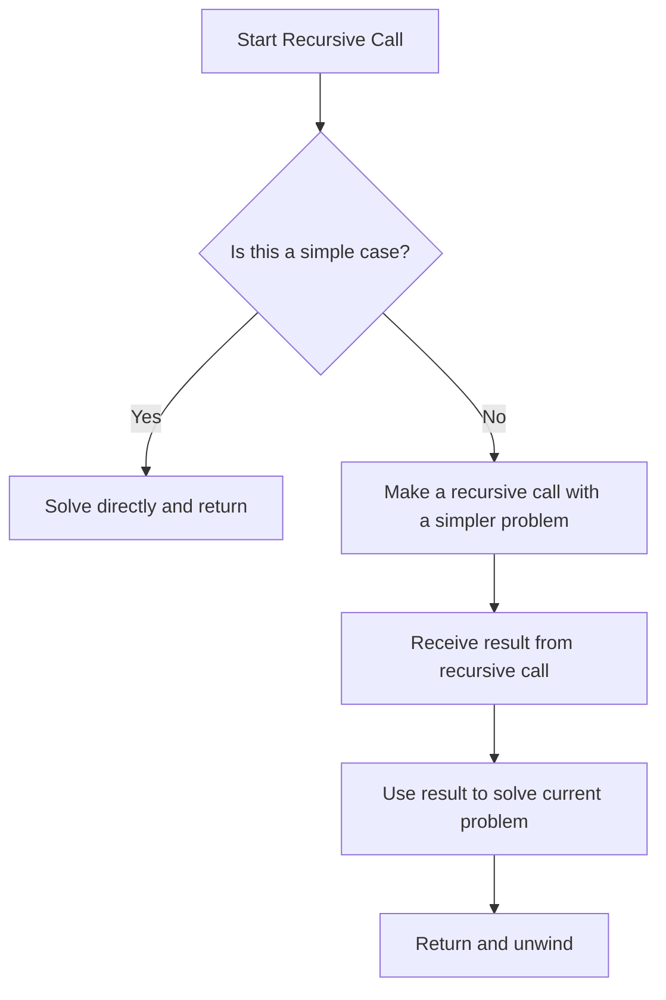
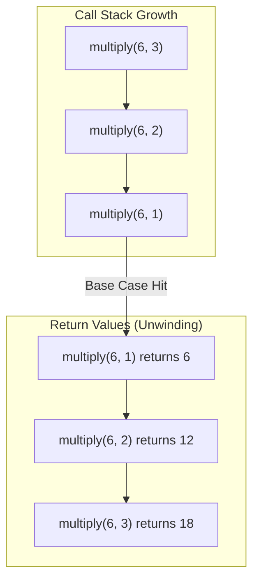

---
tags:
  - CCT1
  - CE
Topic: Recursion
Semester: CCT1
Course: CE1
Module: K13
Course Date: 28-11-25
Litterature:
  - Digital Design, 5th ed.
Created: 26-11-25
---
---
## Table of Contents

- [[#Recursion in Programming|Recursion in Programming]]
	- [[#Recursion in Programming#Quick Reference Table|Quick Reference Table]]
	- [[#Recursion in Programming#Introduction to Recursion|Introduction to Recursion]]
	- [[#Recursion in Programming#The Nature of Recursion|The Nature of Recursion]]
		- [[#The Nature of Recursion#Multiplication Example|Multiplication Example]]
		- [[#The Nature of Recursion#Recursion with Lists|Recursion with Lists]]
	- [[#Recursion in Programming#Tracing a Recursive Function|Tracing a Recursive Function]]
		- [[#Tracing a Recursive Function#Tracing a Function That Returns a Value|Tracing a Function That Returns a Value]]
		- [[#Tracing a Recursive Function#Tracing a void Function That Is Recursive|Tracing a void Function That Is Recursive]]
		- [[#Tracing a Recursive Function#Parameter and Local Variable Stacks|Parameter and Local Variable Stacks]]
		- [[#Tracing a Recursive Function#When and How to Trace Recursive Functions|When and How to Trace Recursive Functions]]
	- [[#Recursion in Programming#Recursive Mathematical Functions|Recursive Mathematical Functions]]
		- [[#Recursive Mathematical Functions#Factorial Function|Factorial Function]]
		- [[#Recursive Mathematical Functions#Fibonacci Sequence|Fibonacci Sequence]]
		- [[#Recursive Mathematical Functions#Greatest Common Divisor (GCD)|Greatest Common Divisor (GCD)]]
	- [[#Recursion in Programming#Recursive Functions with Array and String Parameters|Recursive Functions with Array and String Parameters]]
		- [[#Recursive Functions with Array and String Parameters#Case Study: Finding Capital Letters in a String|Case Study: Finding Capital Letters in a String]]
		- [[#Recursive Functions with Array and String Parameters#Case Study: Recursive Selection Sort|Case Study: Recursive Selection Sort]]
	- [[#Recursion in Programming#Problem Solving with Recursion|Problem Solving with Recursion]]
		- [[#Problem Solving with Recursion#Case Study: Operations on Sets|Case Study: Operations on Sets]]
	- [[#Recursion in Programming#A Classic Case Study in Recursion: Towers of Hanoi|A Classic Case Study in Recursion: Towers of Hanoi]]
		- [[#A Classic Case Study in Recursion: Towers of Hanoi#Analysis|Analysis]]
		- [[#A Classic Case Study in Recursion: Towers of Hanoi#Design|Design]]
		- [[#A Classic Case Study in Recursion: Towers of Hanoi#Implementation|Implementation]]
	- [[#Recursion in Programming#Common Programming Errors|Common Programming Errors]]


# Recursion in Programming

## Quick Reference Table

| Concept | Description | Example |
|---|---|---|
| **Recursive Function** | A function that calls itself directly or indirectly | `int factorial(int n) { return ($n == 0$) ? 1 : $n \cdot$ factorial($n-1$); }` |
| **Base Case** | Simple case that can be solved without recursion | `if ($n == 1$) return $m$;` in the multiplication function |
| **Recursive Step** | Part of function that calls itself with modified parameters | `$ans = m +$ multiply($m$, $n - 1$);` |
| **Activation Frame** | Conceptual tool showing parameter values for each function call | Used to trace recursive function execution |
| **Stack Overflow** | Error that occurs when recursion doesn't terminate properly | Often indicated by "stack overflow" error message |

---

## Introduction to Recursion

A function that calls itself is said to be *recursive*. A function `f1` is also recursive if it calls a function `f2`, which under some circumstances calls `f1`, creating a cycle in the sequence of calls. The ability to invoke itself enables a recursive function to be repeated with different parameter values. You can use recursion as an alternative to iteration (looping).

> [!info] **Recursion vs. Iteration**
> 
> Generally, a recursive solution is less efficient than an iterative solution in terms of computer time due to the overhead for the extra function calls. However, in many instances, the use of recursion enables us to specify a very natural, simple solution to a problem that would otherwise be very difficult to solve.

## The Nature of Recursion

Problems that lend themselves to a recursive solution have three key characteristics:

1. One or more simple cases of the problem have a straightforward, nonrecursive solution
2. The other cases can be redefined in terms of problems that are closer to the simple cases
3. By applying this redefinition process every time the recursive function is called, eventually the problem is reduced entirely to simple cases

The general form of a recursive algorithm follows this structure:

```c
if this is a simple case
    solve it
else
    redefine the problem using recursion
```

> [!tip] **Developing Recursive Algorithms**
> 
> In order to solve a problem recursively, first we must trust our function to solve a simpler version of the problem. Then we build the solution to the whole problem on the result from the simpler version.

The following flowchart visualizes the decision-making process within a typical recursive function.



_Figure 1.1: Flowchart of a general recursive function's execution flow._

### Multiplication Example

Let's consider how we might solve the problem of multiplying $6$ by $3$, assuming we know our addition tables but not our multiplication tables.

> [!example] **Multiplication Using Recursion**
> 
> ```c
> /*
>  * Performs integer multiplication using + operator.
>  * Pre: m and n are defined and n > 0
>  * Post: returns m * n
>  */
> int
> multiply(int m, int n)
> {
>     int ans;
> 
>     if (n == 1)
>         ans = m; /* simple case */
>     else
>         ans = m + multiply(m, n - 1); /* recursive step */
> 
>     return (ans);
> }
> ```

### Recursion with Lists

One group of problems for which recursive solutions seem very natural are problems involving varying-length lists. Since a *string* is a varying-length list of characters, recursive functions that process strings are common.

> [!example] **Character Counting Example**
> 
> Let's develop a function to count the number of times a particular character appears in a string. For example, `count('s', "Mississippi sassafrs")` should return the value $8$.
> 
> ```c
> /*
>  * Counts the number of times ch occurs in string str.
>  * Pre: Letter ch and string str are defined.
>  */
> int
> count(char ch, const char *str)
> {
>     int ans;
> 
>     if (str[0] == '\0') /* simple case */
>         ans = 0;
>     else /* redefine problem using recursion */
>         if (ch == str[0]) /* first character must be counted */
>             ans = 1 + count(ch, &str[1]);
>         else /* first character is not counted */
>             ans = count(ch, &str[1]);
> 
>     return (ans);
> }
> ```
>
>![[Pasted image 20251126170403.png]]
>_Figure 1.2: Thought process of a recursive algorithm for counting 's' in a string._

## Tracing a Recursive Function

Hand tracing an algorithm's execution provides valuable insight into how that algorithm works. This is particularly useful for understanding recursive functions.

### Tracing a Function That Returns a Value

To trace a recursive function that returns a value, we can draw an _activation frame_ for each call of the function.

> [!info] **Activation Frame**
> 
> An activation frame is a conceptual tool that shows the parameter values for each specific function call and summarizes the execution of that call. It helps visualize the flow of control and data through the recursive calls.

> [!example] **Tracing a Recursive Multiplication**
> 
> To trace the call `multiply($6$, $3$)`, we would generate a sequence of activation frames:
> 
> 1. **First Call:** `$m=6$, $n=3$` - makes recursive call `multiply($6$, $2$)`
> 2. **Second Call:** `$m=6$, $n=2$` - makes recursive call `multiply($6$, $1$)`
> 3. **Third Call:** `$m=6$, $n=1$` - returns value $6$ (simple case)
> 
> The recursion then "unwinds" as each call receives the result from the one it made:
> - Second call receives $6$, adds $6$, returns $12$
> - First call receives $12$, adds $6$, returns $18$

The diagram below visualizes the call stack for this process, showing how each call is pushed onto the stack and then popped off as it returns a value.



_Figure 2.1: Visualization of the call stack for `multiply($6$, $3$)`._

![[Pasted image 20251126195219.png]]
_Figure 2.2: Activation frames for `multiply(6, 3)`_

### Tracing a void Function That Is Recursive

Hand tracing a `void` function is somewhat simpler than tracing a function that returns a value.

> [!example] **Function reverse_input_words**
> 
> ```c
> /*
>  * Take n words as input and print them in reverse order on separate lines.
>  * Pre: n > 0
>  */
> void
> reverse_input_words(int n)
> {
>     char word[WORDSIZ]; /* local variable for storing one word */
> 
>     if (n <= 1) { /* simple case: just one word to get and print */
>         scanf("%s", word);
>         printf("%s\n", word);
>     } else { /* get this word; get and print the rest of the words in
>     reverse order; then print this word */
>         scanf("%s", word);
>         reverse_input_words(n - 1);
>         printf("%s\n", word);
>     }
> }
> ```

> [!info] **Function Behavior**
> 
> If the words entered are:
> - the
> - course
> - of
> - human
> - events
> 
> The program output will be:
> - events
> - human
> - of
> - course
> - the

![[Pasted image 20251126195844.png]]
_Figure 2.3: Trace of `reverse_input_words($3$)`_

### Parameter and Local Variable Stacks

C uses a stack data structure to keep track of parameter values and local variables during recursive function calls. This stack operates on a Last-In-First-Out (LIFO) principle.

> [!info] **Stack Operations**
> 
> When executing a call to a recursive function like `reverse_input_words`, the system:
> - Pushes the parameter value on top of the parameter stack
> - Pushes a new undefined cell on top of the stack for local variables
> - When returning, pops each stack to remove the top values

> [!tip] **Automatic Stack Management**
> 
> While a stack is a data structure that you can implement yourself, C automatically handles all the stack manipulation associated with function calls. This allows us to write recursive functions without needing to manage the stacks ourselves.

> [!example]
> Let's trace through the execution of `reverse_input_words` to understand how these stacks work:
> 
> When the first call to `reverse_input_words` is made, one cell is created on each stack - one for the parameter `n` and one for the local variable `word`.
> ![[Pasted image 20251126200237.png]]
> 
> Before the second recursive call, the first word (e.g., "bits") is stored in the `word` variable.
> ![[Pasted image 20251126200255.png]]
> 
> After the second call, the new parameter value ($2$) is pushed onto the stack for `n`, and the top of the stack for `word` becomes undefined again. The value at the top of each stack is highlighted.
> ![[Pasted image 20251126200311.png]]
> 
> Before the third call, the second word (e.g., "and") is scanned and stored in `word`.
> ![[Pasted image 20251126200326.png]]
> 
> However, `word` becomes undefined again *immediately* after the third call is made.
> ![[Pasted image 20251126200345.png]]
> 
> During the execution of the third call, the third word (e.g., "bytes") is scanned and stored in `word`, and since `n` is $1$ (the simple case), "bytes" is immediately printed.
> ![[Pasted image 20251126200408.png]]
> 
> When the function returns, both stacks are popped, removing the top values.
> ![[Pasted image 20251126200419.png]]
> 
> Control returns to the previous call, where the value of `word` ("and") at the top of the stack is then displayed. Another return occurs, popping the stacks again.
> ![[Pasted image 20251126200429.png]]
> 
> Finally, control returns to the original call, where the value of `word` ("bits") at the top of the stack is displayed. The third and last return exits the original function call, so there is no longer any memory allocated for `n` and `word`.

### When and How to Trace Recursive Functions

> [!tip] **During Algorithm Development**
> 
> When developing a recursive algorithm, it's best to trace a specific case by trusting any recursive call to return a correct value based on the function's purpose. Then check whether this value is manipulated properly to produce a correct result for the case under consideration.

> [!info] **Self-Tracing Functions**
> 
> A function can be made to trace itself by inserting debugging print statements that show entry to and exit from the function.

> [!example] **Self-Tracing multiply Function**
> 
> ```c
> /*
>  * *** Includes calls to printf to trace execution ***
>  * Performs integer multiplication using + operator.
>  * Pre: m and n are defined and n > 0
>  * Post: returns m * n
>  */
> int
> multiply(int m, int n)
> {
>     int ans;
> 
>     printf("Entering multiply with m = %d, n = %d\n", m, n);
> 
>     if (n == 1)
>         ans = m; /* simple case */
>     else
>         ans = m + multiply(m, n - 1); /* recursive step */
>     printf("multiply(%d, %d) returning %d\n", m, n, ans);
> 
>     return (ans);
> }
> ```

## Recursive Mathematical Functions

Many mathematical functions can be defined recursively. This approach is particularly useful when a problem can be broken down into smaller instances of the same problem.

### Factorial Function

> [!info] **Factorial Function Definition**
> 
> The factorial of a number $n$ ($n!$) can be defined recursively as:
> - $0! = 1$
> - $n! = n \times (n-1)!$, for $n > 0$

> [!example] **Recursive Factorial Implementation**
> 
> ```c
> /*
>  * Compute n! using a recursive definition
>  * Pre: n >= 0
>  */
> int
> factorial(int n)
> {
>     int ans;
> 
>     if (n == 0)
>         ans = 1;
>     else
>         ans = n * factorial(n - 1);
> 
>     return (ans);
> }
> ```

![[Pasted image 20251126201239.png]]
_Figure 3.1: Recursive factorial execution trace_

> [!warning] **Potential Integer Overflow**
> 
> Be careful when using the factorial function, as its value increases very rapidly and could lead to an integer overflow error (e.g., $8!$ is 40,320).

### Fibonacci Sequence

> [!info] **Fibonacci Sequence Definition**
> 
> The Fibonacci numbers are a sequence of numbers defined as:
> - $\text{Fibonacci}(1) = 1$
> - $\text{Fibonacci}(2) = 1$
> - $\text{Fibonacci}(n) = \text{Fibonacci}(n-2) + \text{Fibonacci}(n-1)$, for $n > 2$

> [!example] **Recursive Fibonacci Implementation**
> 
> ```c
> /*
>  * Computes the nth Fibonacci number
>  * Pre: n > 0
>  */
> int
> fibonacci(int n)
> {
>     int ans;
> 
>     if (n == 1 || n == 2)
>         ans = 1;
>     else
>         ans = fibonacci(n - 2) + fibonacci(n - 1);
> 
>     return (ans);
> }
> ```

> [!warning] **Efficiency Concern**
> 
> Although easy to write, this recursive version of fibonacci is not very efficient because each recursive step generates two calls to function fibonacci, and these calls duplicate many computations.

### Greatest Common Divisor (GCD)

> [!info] **Greatest Common Divisor (GCD) Definition**
> 
> Euclid's algorithm for finding the gcd can be defined recursively as:
> - $\text{gcd}(m,n)$ is $n$ if $n$ divides $m$ evenly
> - $\text{gcd}(m,n)$ is $\text{gcd}(n, m \% n)$ otherwise

> [!example] **Recursive GCD Implementation**
> 
> ```c
> /*
>  * Finds the greatest common divisor of m and n
>  * Pre: m and n are both > 0
>  */
> int
> gcd(int m, int n)
> {
>     int ans;
> 
>     if (m % n == 0)
>         ans = n;
>     else
>         ans = gcd(n, m % n);
> 
>     return (ans);
> }
> ```

## Recursive Functions with Array and String Parameters

In this section, we examine recursive functions that process arrays and strings. These problems can often be solved by working with the first element of the array/string and then recursively processing the rest.

### Case Study: Finding Capital Letters in a String

> [!summary] ## Case Study: Finding Capital Letters in a String
> 
> ### The Problem
> Form a string containing all the capital letters found in another string.
> 
> ### Analysis
> Recursion allows us to solve this problem by processing the string's first letter and then combining this with a recursive call that handles the rest of the string.
> 
> ### Implementation
> ```c
> /*
>  * Forms a string containing all the capital letters found in the input
>  * parameter str.
>  * Pre: caps has sufficient space to store all caps in str plus the null
>  */
> char *
> find_caps(char *caps, /* output - string of all caps found in str */
>           const char *str) /* input - string from which to extract caps */
> {
>     char restcaps[STRSIZ]; /* caps from reststr */
> 
>     if (str[0] == '\0')
>         caps[0] = '\0'; /* no letters in str => no caps in str */
>     else
>         if (isupper(str[0]))
>             sprintf(caps, "%c%s", str[0], find_caps(restcaps, &str[1]));
>         else
>             find_caps(caps, &str[1]);
> 
>     return (caps);
> }
> ```

![[Pasted image 20251126202805.png]]
_Figure 4.1: Trace of find_caps function_

![[Pasted image 20251126202827.png]]
_Figure 4.2: Event sequence of trace of `find_caps`_

### Case Study: Recursive Selection Sort

> [!summary] ## Case Study: Recursive Selection Sort
> 
> ### Problem
> Sort an array in ascending order 
> 
> ### Analysis
> To perform a selection sort of an array with $n$ elements (subscripts $0..n-1$), we:
> 1. Locate the largest element in the array
> 2. Switch the largest element with the element at subscript $n-1$
> 3. Repeat this process for the remaining subarray (subscripts $0..n-2$)
> 
> ### Implementation
> 
> **place_largest Function**
> ```c
> void
> place_largest(int array[], /* input/output - array in which to place largest */
>               int n) /* input - number of array elements to consider */
> {
>     int temp, /* temporary variable for exchange */
>         j, /* array subscript and loop control */
>         max_index; /* index of largest so far */
> 
>     /* Save subscript of largest array value in max_index */
>     max_index = n - 1; /* assume last value is largest */
>     for (j = n - 2; j >= 0; --j)
>         if (array[j] > array[max_index])
>             max_index = j;
> 
>     /* Unless largest value is already in last element, exchange
>        largest and last elements */
>     if (max_index != n - 1) {
>         temp = array[n - 1];
>         array[n - 1] = array[max_index];
>         array[max_index] = temp;
>     }
> }
> ```
> 
> **select_sort Function**
> ```c
> void
> select_sort(int array[], /* input/output - array to sort */
>             int n) /* input - number of array elements to sort */
> {
>     if (n > 1) {
>         place_largest(array, n);
>         select_sort(array, n - 1);
>     }
> }
> ```

![[Pasted image 20251126203446.png]]
_Figure 4.3: Trace of selection sort algorithm_

## Problem Solving with Recursion

### Case Study: Operations on Sets

> [!summary] ## Case Study: Operations on Sets
> 
> ### The Problem
> Develop a group of functions to perform operations on sets of characters:
> - ∈ (is an element of)
> - ⊆ (is a subset of)
> - ∪ (union)
> 
> ### Implementation
> ```c
> /*
>  * Determines if ele is an element of set.
>  */
> int
> is_element(char ele, /* input - element to look for in set */
>             const char *set) /* input - set in which to look for ele */
> {
>     int ans;
> 
>     if (is_empty(set))
>         ans = FALSE;
>     else if (set[0] == ele)
>         ans = TRUE;
>     else
>         ans = is_element(ele, &set[1]);
> 
>     return (ans);
> }
> 
> /*
>  * Finds the union of set1 and set2.
>  * Pre: size of result array is at least SETSIZ;
>  * set1 and set2 are valid sets of characters and digits
>  */
> char *
> set_union(char *result, /* output - space in which to store
>                           string result */
>            const char *set1, /* input - sets whose */
>            const char *set2) /* union is being formed */
> {
>     char temp[SETSIZ]; /* local variable to hold result of call
>                           to set_union embedded in sprintf call */
> 
>     if (is_empty(set1))
>         strcpy(result, set2);
>     else if (is_element(set1[0], set2))
>         set_union(result, &set1[1], set2);
>     else
>         sprintf(result, "%c%s", set1[0],
>                 set_union(temp, &set1[1], set2));
> 
>     return (result);
> }
> ```

## A Classic Case Study in Recursion: Towers of Hanoi

The Towers of Hanoi problem is a classic example that demonstrates the power of recursion in solving complex problems.

> [!info] **Problem Statement**
> 
> The Towers of Hanoi problem involves moving a specified number of disks that are all different sizes from one tower (or peg) to another. The goal is to move $n$ disks from peg A to peg C using peg B as needed, with these conditions:
> 1. Only one disk at a time may be moved, and this disk must be the top disk on a peg.
> 2. A larger disk can never be placed on top of a smaller disk.

![[Pasted image 20251126210956.png]]
_Figure 5.1: Towers of Hanoi setup_

### Analysis

The problem can be solved by breaking it down into simpler subproblems. For example, to move $5$ disks from peg A to peg C, we can:

1. Move four disks from peg A to peg B.
2. Move disk $5$ from peg A to peg C.
3. Move four disks from peg B to peg C.

> [!example] **Problem Decomposition**
> 
> The key insight is that an $n$-disk problem can be broken down into:
> - Moving $n-1$ disks to the auxiliary peg B
> - Moving the largest disk to the target peg C
> - Moving the $n-1$ disks from the auxiliary peg to the target peg

![[Pasted image 20251126211027.png]]
_Figure 5.2: Towers after steps 1 & 2_

### Design

The recursive algorithm for solving the Towers of Hanoi problem follows this structure:

> [!info] **Algorithm**
> 
> 1. if $n$ is 1 then
>    - Move disk $1$ from the from peg to the to peg
> 2. else
>    - Move $n-1$ disks from the from peg to the auxiliary peg using the to peg
>    - Move disk $n$ from the from peg to the to peg
>    - Move $n-1$ disks from the auxiliary peg to the to peg using the from peg

The flowchart below illustrates the recursive logic for the `tower` function.

```mermaid
flowchart TD
    A[Start: tower(from, to, aux, n)] --> B{n == 1?};
    B -- Yes --> C[Print: Move disk 1 from 'from' to 'to'];
    B -- No --> D[Call: tower(from, aux, to, n-1)];
    D --> E[Print: Move disk n from 'from' to 'to'];
    E --> F[Call: tower(aux, to, from, n-1)];
    C --> G[End];
    F --> G;
```

_Figure 5.3: Flowchart of the recursive Towers of Hanoi algorithm._

### Implementation

> [!example] **Recursive Tower Function**
> 
> ```c
> /*
>  * Displays instructions for moving n disks from from_peg to to_peg using
>  * aux_peg as an auxiliary. Disks are numbered 1 to n (smallest to
>  * largest). Instructions call for moving one disk at a time and never
>  * require placing a larger disk on top of a smaller one.
>  */
> void
> tower(char from_peg, /* input - characters naming */
>       char to_peg, /* the problem's */
>       char aux_peg, /* three pegs */
>       int n) /* input - number of disks to move */
> {
>     if (n == 1) {
>         printf("Move disk 1 from peg %c to peg %c\n", from_peg, to_peg);
>     } else {
>         tower(from_peg, aux_peg, to_peg, n - 1);
>         printf("Move disk %d from peg %c to peg %c\n", n, from_peg, to_peg);
>         tower(aux_peg, to_peg, from_peg, n - 1);
>     }
> }
> ```

![[Pasted image 20251126211219.png]]
_Figure 5.4: Trace of `tower('A', 'C', 'B', $3$)`_

![[Pasted image 20251126211300.png]]
_Figure 5.5: Output of `tower`_

> [!warning] **Performance Considerations**
> 
> The number of moves required to solve the $n$-disk problem is $2^n - 1$. Because each function call requires allocation and initialization of a local data area in memory, the computer time increases exponentially with the problem size. Be careful about running this program with a value of $n$ that is larger than $10$.

## Common Programming Errors

When working with recursive functions, several common programming errors can occur.

> [!warning] **Improper Function Termination**
> 
> The most common problem with recursive functions is that they may not terminate properly. This can happen when:
> - The terminating condition is incorrect or incomplete
> - The function calls itself indefinitely or until all available memory is exhausted
> 
> A run-time error message noting "stack overflow" or "access violation" often indicates that a recursive function is not terminating.

> [!tip] **Ensuring Proper Termination**
> 
> To prevent termination issues:
> - Identify all simple cases and provide a terminating condition for each one
> - Ensure each recursive step redefines the problem using arguments that are closer to simple cases
> - Verify that repeated recursive calls will eventually lead to simple cases only

> [!warning] **Missing Return Statements**
> 
> In functions that return values, it's critical that every path through the function leads to a return statement. It's easy to inadvertently omit one of these necessary return statements when using multiple return statements throughout a function.

> [!warning] **Memory Issues with Data Recopying**
> 
> Recopying large arrays or other data structures inside recursive functions can quickly consume all available memory. To avoid this:
> - Only recopy data inside a recursive function when absolutely essential for data protection
> - If only a single copy is necessary, create a nonrecursive function that makes the copy and passes it to the recursive function

> [!tip] **Efficient Error Handling**
> 
> It's good practice to introduce a nonrecursive function to handle preliminaries and call the recursive function when there is error checking. This approach is more efficient because checking for errors inside a recursive function is extremely inefficient if error would be detected on the very first call.

---

> [!summary] **Summary**
> 
> Recursion is a powerful programming technique where a function calls itself to solve problems by breaking them down into smaller, similar subproblems. A recursive solution requires:
> 
> 1. One or more base cases that can be solved directly
> 2. A way to redefine other cases in terms of problems closer to the base cases
> 3. A mechanism to eventually reduce all problems to base cases
> 
> While recursive solutions are often less efficient than iterative ones due to function call overhead, they can provide much more natural and elegant solutions to certain problems, particularly those involving:
> - Mathematical sequences (factorial, Fibonacci)
> - String and array processing
> - Complex problems like the Towers of Hanoi
> 
> Understanding how to trace recursive functions using activation frames and how the system manages parameter and local variable stacks is essential for debugging and optimizing recursive code. Common pitfalls include improper termination conditions, missing return statements, and inefficient memory usage.