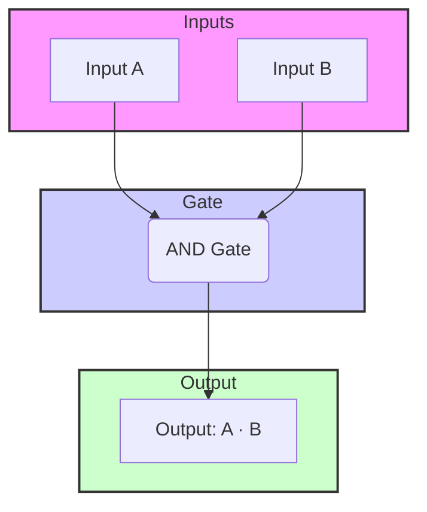
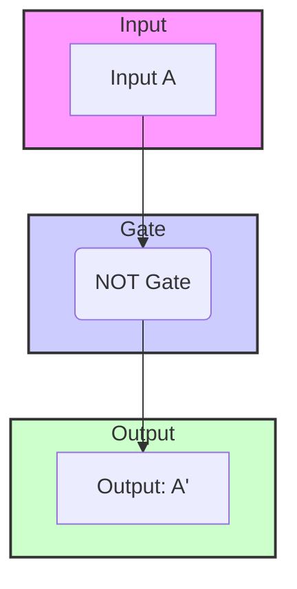

---
tags:
  - CCT1
  - CE
Topic: Boolean Algebra and Logic Gates
Semester: CCT1
Course: CE1
Module: K2
Course Date: N/A
Litterature:
  - Digital Design, 5th ed.
Created: 16-11-25
---
- - -
## Table of Contents

- [[#Boolean Algebra and Logic Gates|Boolean Algebra and Logic Gates]]
	- [[#Boolean Algebra and Logic Gates#Quick Reference Table|Quick Reference Table]]
	- [[#Boolean Algebra and Logic Gates#Boolean Algebra Fundamentals|Boolean Algebra Fundamentals]]
		- [[#Boolean Algebra Fundamentals#1. Closure|1. Closure]]
		- [[#Boolean Algebra Fundamentals#2. Associative Property|2. Associative Property]]
		- [[#Boolean Algebra Fundamentals#3. Commutative Property|3. Commutative Property]]
		- [[#Boolean Algebra Fundamentals#4. Identity Element|4. Identity Element]]
		- [[#Boolean Algebra Fundamentals#5. Inverse Element|5. Inverse Element]]
		- [[#Boolean Algebra Fundamentals#6. Distributive Property|6. Distributive Property]]
	- [[#Boolean Algebra and Logic Gates#Logic Gates and Boolean Algebra|Logic Gates and Boolean Algebra]]
		- [[#Logic Gates and Boolean Algebra#Two-Valued Boolean Algebra|Two-Valued Boolean Algebra]]
		- [[#Logic Gates and Boolean Algebra#Logic Gates|Logic Gates]]
			- [[#Logic Gates#AND-Gate|AND-Gate]]
			- [[#Logic Gates#OR-Gate|OR-Gate]]
			- [[#Logic Gates#NOT-Gate|NOT-Gate]]


# Boolean Algebra and Logic Gates

## Quick Reference Table

| Concept          | Symbol                            | Description                                                               | Example                                                |
| ---------------- | --------------------------------- | ------------------------------------------------------------------------- | ------------------------------------------------------ |
| **Closure**      | -                                 | Operation on elements of a set always produces an element in the same set | Natural numbers are closed under addition: $2 + 3 = 5$ |
| **Associative**  | $(x \cdot y) \cdot z = x \cdot (y \cdot z)$       | Grouping of operations doesn't affect the result                          | $(2 + 3) + 4 = 2 + (3 + 4)$                            |
| **Commutative**  | $x \cdot y = y \cdot x$                   | Order of operations doesn't affect the result                             | $2 + 3 = 3 + 2$                                        |
| **Identity**     | $e \cdot x = x \cdot e = x$               | Element that leaves other elements unchanged                              | $0$ is identity for addition: $5 + 0 = 5$              |
| **Inverse**      | $x \cdot y = e$                       | Element that produces the identity when combined with another             | For addition, inverse of$ 5$ is $-5: 5 + (-5) = 0$     |
| **Distributive** | $x \cdot (y + z) = (x \cdot y) + (x \cdot z)$ | One operator distributes over another                                    | $2 \times (3 + 4) = (2 \times 3) + (2 \times 4)$                      |
| **AND Gate**     | $x \cdot y$                           | Output is 1 only if all inputs are 1                                      | $1 \cdot 1 = 1$, $1 \cdot 0 = 0$                               |
| **OR Gate**      | $x + y$                           | Output is 1 if any input is 1                                             | $1 + 0 = 1$, $0 + 0 = 0$                               |
| **NOT Gate**     | $\overline{x}$                              | Output is the complement of the input                                     | $\overline{1} = 0$, $\overline{0} = 1$                                     |

## Boolean Algebra Fundamentals

Boolean algebra is a mathematical system defined with a set of elements, operators, and a number of axioms and postulates. It forms the foundation of digital logic and computer science.

A _set_ of elements is any collection of objects, usually having a common property.

![[Pasted image 20250917180300.png]]

_Figure 1.1: Representation of a set of elements_

The postulates of a mathematical system form the basic assumptions, from which the rules, theorems, properties and axioms are deduced. There are 6 common postulates that formulate various algebraic structures, including boolean algebra:

### 1. Closure

A set _S_ is said to be _closed_ or have _closure_ with respect to the binary operator if, for every pair of elements of _S_, the binary _operator_ specifies a rule for obtaining a unique element of _S_.

The set of natural numbers _N_ is closed with respect to the binary operator '+' by the rules of arithmetic addition, since $a + b$ withing _N_, there's a unique _c_, such that $a + b = c$.

N is **not** closed with respect to the '-' operator, since $a - b$ can equal a negative integer, and negative integers are not part of the natural numbers: $2 - 3 = -1$, $-1$ is **NOT** part of _N_.

![[Pasted image 20250917173817.png]]

_Figure 1.2: Illustrating the concept of closure, showing that operations within a set produce results that remain in the set._

### 2. Associative Property

A binary operator '$\cdot$' on the set _S_, is said to be _associative_ whenever
$$(x \cdot y) \cdot z = x \cdot (y \cdot z)$$
for all _x_, _y_, _z_ within _S_.

![[Pasted image 20250917173830.png]]

_Figure 1.3: Showing the associative property of operations._

### 3. Commutative Property

A binary operator '$\cdot$' on the set _S_, is said to be _commutative_ whenever
$$x \cdot y = y \cdot x$$
for all _x_, _y_ within _S_.

![[Pasted image 20250917173841.png]]

_Figure 1.4: Illustrating the commutative property of operations._

### 4. Identity Element

An element _e_ within the set _S_ is said to be the _identity element_ with respect to the binary operation '$\cdot$' if _e_ has the following property:
$$e \cdot x = x \cdot e = x$$
for every _x_ within _S_.

The element _e_ = 0, is an _identity element_ with respect to the binary operator '+', on the set of integers {..., -1, 0, 1, ...}, since:
$$x + 0 = 0 + x = x$$
for any _x_.

The element _e_ = 1, is an _identity element_ with respect to the binary operator '×' (times/multiplication), on the set of integers {$..., -1, 0, 1, ...$}, since:
$$y \times 1 = 1 \times y = y$$
for any _y_.

![[Pasted image 20250917180153.png]]

_Figure 1.5: Illustrating the identity element property._

### 5. Inverse Element

A set _S_, having the identity element _e_ with respect to the binary operator $\cdot$, is said to have an _inverse_ whenever, for every _x_ within _S_, there exists an element _y_ within _S_ such that:
$$x \cdot y = e$$

In the integer-set _I_, with the operator '+', with the identity element _e_ = 0, the inverse of an element _a_ is -_a_, since:
$$a + (-a) = 0$$

### 6. Distributive Property

If $\cdot$ and $+$ are two binary operators on the set _S_, $\cdot$ is said to be distributive over $+$ whenever:
$$x \cdot (y + z) = (x \cdot y) + (x \cdot z)$$

![[Pasted image 20250917180207.png]]

_Figure 1.6: Illustrating the distributive property of operations._

| Postulate        | Formal Definition                                                                      | Example (Standard Arithmetic)                    | Relevance to Boolean Algebra                                                     |
| :--------------- | :------------------------------------------------------------------------------------- | :----------------------------------------------- | :------------------------------------------------------------------------------- |
| **Closure**      | An operation on a set always produces a unique element that is also in the set.        | `2 + 3 = 5` (in Natural Numbers)                 | `0 + 1 = 1` (in Boolean set {0,1})                                               |
| **Associative**  | The grouping of operations does not affect the result: `(x · y) · z = x · (y · z)`     | `(2 + 3) + 4 = 2 + (3 + 4)`                      | `(A AND B) AND C = A AND (B AND C)`                                              |
| **Commutative**  | The order of operands does not affect the result: `x · y = y · x`                      | `2 + 3 = 3 + 2`                                  | `A OR B = B OR A`                                                                |
| **Identity**     | An element `e` exists that leaves other elements unchanged: `e · x = x`                | `5 + 0 = 5` (0 is the additive identity)         | `A OR 0 = A` (0 is OR identity) <br> `A AND 1 = A` (1 is AND identity)           |
| **Inverse**      | For every element `x`, there is an element `y` that produces the identity: `x · y = e` | `5 + (-5) = 0` (-5 is the additive inverse of 5) | `A OR A' = 1` (A' is the OR inverse) <br> `A AND A' = 0` (A' is the AND inverse) |
| **Distributive** | One operator distributes over another: `x · (y + z) = (x · y) + (x · z)`               | `2 * (3 + 4) = (2 * 3) + (2 * 4)`                | `A AND (B OR C) = (A AND B) OR (A AND C)`                                        |
_Table 1.1: A table summarizing all six postulates with examples_

![[Pasted image 20250917185526.png]]

_Figure 1.7: A summary table of the six postulates from the original source material._-

---

## Logic Gates and Boolean Algebra

The "logic" behind logic gates such as the AND-, OR- or NOT-gate is based upon the _two-valued_ Boolean algebraic system, also called _switching algebra_.

![[Pasted image 20250917180643.png]]

_Figure 2.1: _

![[Pasted image 20250917180658.png]]

_Figure 2.2: _

![[Pasted image 20250917180711.png]]

_Figure 2.3: _

### Two-Valued Boolean Algebra

A _two-valued_ Boolean algebra is defined on a set _B_ of two elements _B_ = {0, 1}, mirroring the binary number system/set, with rules for two binary operators '+' (OR) and '$\cdot$' (AND).

![[Pasted image 20250917181010.png]]

_Figure 2.4: A table showing the two-element set of Boolean algebra._

### Logic Gates

#### AND-Gate

The AND logic gate uses the previously defined '$\cdot$' operator, to create a _0-prioritized_ output.

Drawing parallel to the decimal system, the '$\cdot$'-operator could be seen as a multiplication-style operator, where all inputs have to =1 in order for the output to =1.
$$0 \cdot 0 = 0$$
$$0 \cdot 1 = 0$$
$$1 \cdot 0 = 0$$
$$1 \cdot 1 = 1$$


_Figure 2.5: A Mermaid diagram representing an AND gate._

| A | B | A · B (Output) |
|---|---|---|
| 0 | 0 | 0              |
| 0 | 1 | 0              |
| 1 | 0 | 0              |
| 1 | 1 | 1              |
_Table 2.1: Truth table for an AND gate._

#### OR-Gate

The OR logic gate uses '+' operator, to create a _1-prioritized_ output.

Drawing parallel to the decimal system, the '+'-operator could be seen as an addition-style operator, where any singular input has to =1 in order for the output to =1.
$$0 + 0 = 0$$
$$0 + 1 = 1$$
$$1 + 0 = 1$$
$$1 + 1 = 1$$


_Figure 2.6: A Mermaid diagram representing an OR gate._

| A | B | A + B (Output) |
|---|---|---|
| 0 | 0 | 0              |
| 0 | 1 | 1              |
| 1 | 0 | 1              |
| 1 | 1 | 1              |
_Table 2.2: Truth table for an OR gate._

#### NOT-Gate

The NOT logic gate doesn't use an operator, but acts as an inverter, giving the **opposite** output to its input.

If a parallel can even be drawn to decimal, it would be to multiply the input by -1, to invert the sign of the input; though this isn't a complete analogy.
$$\overline{1} = 0$$
$$\overline{0} = 1$$


_Figure 2.7: A Mermaid diagram representing a NOT gate._

| A (Input) | A' (Output) |
|-----------|-------------|
| 0         | 1           |
| 1         | 0           |
_Table 2.3: Truth table for a NOT gate._

> [!example] **Building a Circuit from a Boolean Expression**
> Let's design a logic circuit to implement the Boolean expression $F = (A \cdot B) + \overline{C}$.
> 
> **Step 1: Analyze the expression.** The expression has two main operations combined by an OR (+): $(A \cdot B)$ and $\overline{C}$. This means the final output will come from an OR gate.
> 
> **Step 2: Identify the inputs to the final gate.** The inputs to the OR gate are the results of $(A \cdot B)$ and $\overline{C}$.
> 
> **Step 3: Design the sub-circuits.**
> - The term $(A \cdot B)$ is an AND operation, so we need an AND gate with inputs A and B.
> - The term $\overline{C}$ is a NOT operation, so we need a NOT gate with input C.
> 
> **Step 4: Combine the components.** The outputs of the AND gate and the NOT gate become the inputs to the final OR gate. The output of the OR gate is the final output, F.
> 
> **Resulting Circuit Diagram:**
> ```mermaid
> graph LR
>     subgraph Inputs
>         A[Input A]
>         B[Input B]
>         C[Input C]
>     end
> 
>     subgraph Logic
>         AND[AND Gate]
>         NOT[NOT Gate]
>         OR[OR Gate]
>     end
> 
>     subgraph Output
>         F[Output F]
>     end
> 
>     A --> AND
>     B --> AND
>     C --> NOT
>     AND --> OR
>     NOT --> OR
>     OR --> F
> ```
> _Figure 2.8: A Mermaid diagram of the logic circuit for $F = (A \cdot B) + \overline{C}$_

---

> [!summary] **Key Points**
> - Boolean algebra is a mathematical system with a set of elements, operators, and axioms.
> - The six fundamental postulates (closure, associative, commutative, identity, inverse, distributive) form the foundation of Boolean algebra.
> - Logic gates (`AND`, `OR`, `NOT`) are physical implementations of Boolean operations in digital circuits.
> - Two-valued Boolean algebra uses the set {0, 1} with operators '+' (OR) and '$\cdot$' (AND).
> - `AND` gates produce 1 only when all inputs are 1.
> - `OR` gates produce 1 when any input is 1.
> - `NOT` gates invert the input value.
> - Complex Boolean expressions can be broken down into a series of logic gates to create a functional circuit.

