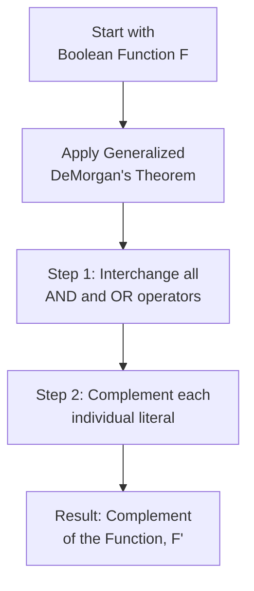
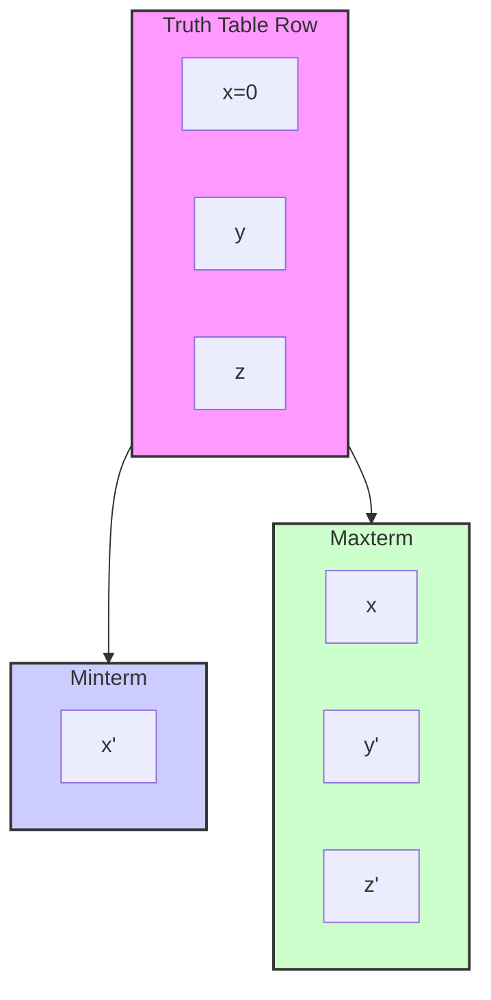
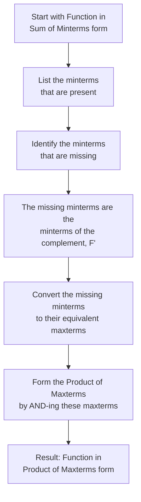
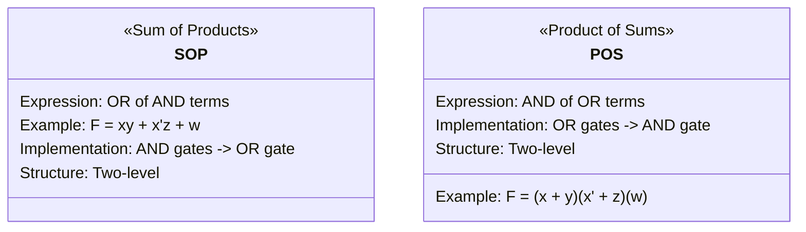
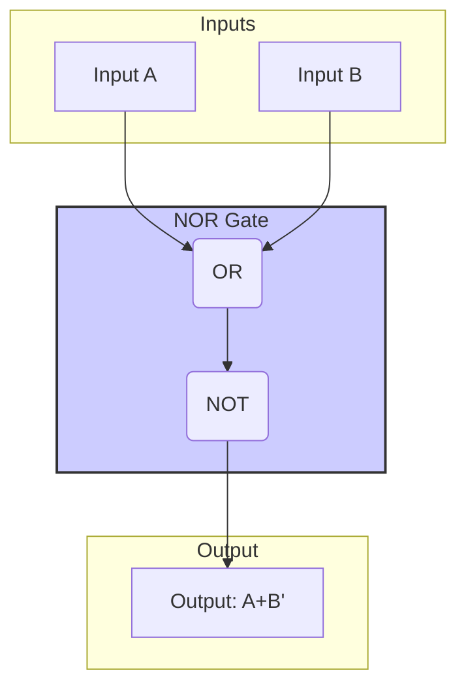
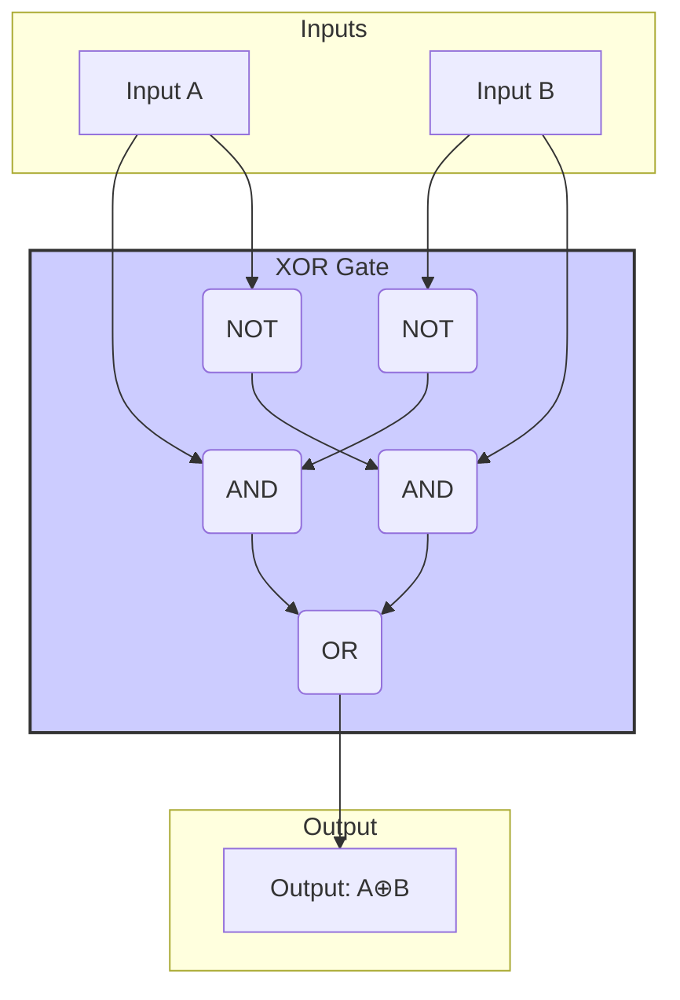
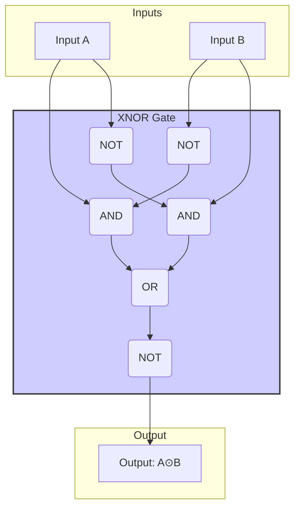
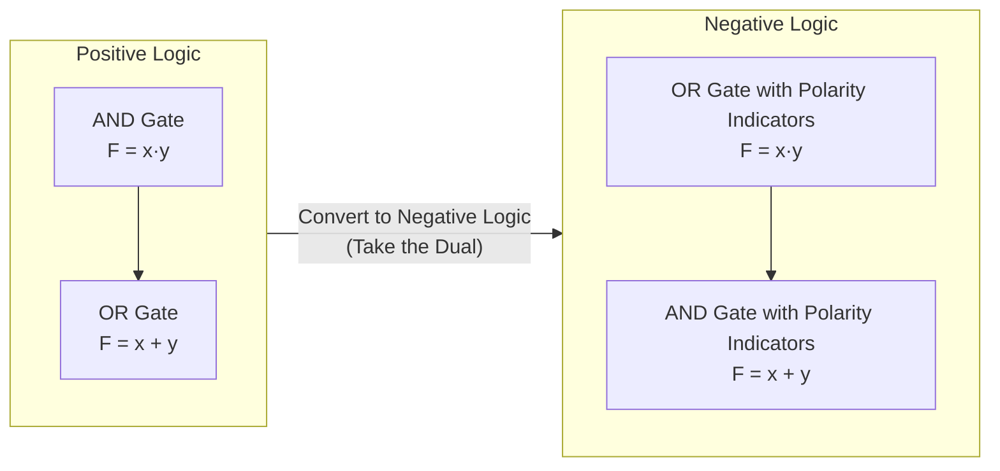

---
tags:
  - CCT1
  - CE
Topic: Basic Theorems and Properties of Boolean Algebra
Semester: CCT1
Course: CE1
Module: K3
Course Date: N/A
Litterature:
  - Digital Design, 5th ed.
Created: 16-11-25
---
- - -
## Table of Contents

- [[#Boolean Algebra and Digital Logic Gates|Boolean Algebra and Digital Logic Gates]]
- [[#2.4 Basic Theorem and Properties of Boolean Algebra|2.4 Basic Theorem and Properties of Boolean Algebra]]
	- [[#2.4 Basic Theorem and Properties of Boolean Algebra#Duality|Duality]]
	- [[#2.4 Basic Theorem and Properties of Boolean Algebra#Basic Theorems|Basic Theorems]]
	- [[#2.4 Basic Theorem and Properties of Boolean Algebra#Operator Precedence|Operator Precedence]]
- [[#2.5 Boolean Functions|2.5 Boolean Functions]]
	- [[#2.5 Boolean Functions#Algebraic Manipulation|Algebraic Manipulation]]
	- [[#2.5 Boolean Functions#Complement of a Function|Complement of a Function]]
- [[#2.6 Canonical and Standard Forms|2.6 Canonical and Standard Forms]]
	- [[#2.6 Canonical and Standard Forms#Minterms and Maxterms|Minterms and Maxterms]]
	- [[#2.6 Canonical and Standard Forms#Sum of Minterms|Sum of Minterms]]
	- [[#2.6 Canonical and Standard Forms#Product of Maxterms|Product of Maxterms]]
	- [[#2.6 Canonical and Standard Forms#Conversion Between Canonical Forms|Conversion Between Canonical Forms]]
	- [[#2.6 Canonical and Standard Forms#Standard Forms|Standard Forms]]
		- [[#Standard Forms#1) The sum of products (SOP)|1) The sum of products (SOP)]]
		- [[#Standard Forms#2) The products of sums (POS)|2) The products of sums (POS)]]
- [[#2.8 Digital Logic Gates|2.8 Digital Logic Gates]]
	- [[#2.8 Digital Logic Gates#Extension to Multiple Inputs|Extension to Multiple Inputs]]
	- [[#2.8 Digital Logic Gates#Positive and Negative Logic|Positive and Negative Logic]]

# Boolean Algebra and Digital Logic Gates

| Concept               | LaTeX Notation                     | Description                                                      |
| --------------------- | ---------------------------------- | ---------------------------------------------------------------- |
| Duality               | -                                  | Principle where operators and identity elements are interchanged |
| Boolean Function      | $F(x,y,z)$                         | Function of binary variables that evaluates to 0 or 1            |
| Minterm               | $m_i$                              | AND term with all variables (complemented if bit is 0)           |
| Maxterm               | $M_i$                              | OR term with all variables (complemented if bit is 1)            |
| Sum of Minterms       | $\sum m(1,3,5)$                    | OR of all minterms that make function equal 1                    |
| Product of Maxterms   | $\prod M(0,2,4)$                   | AND of all maxterms that make function equal 0                   |
| Sum of Products (SOP) | $F = xy + \overline{x}z + w$       | OR of AND terms (product terms)                                  |
| Product of Sums (POS) | $F = (x + y)(\overline{x} + z)(w)$ | AND of OR terms (sum terms)                                      |
| NAND                  | $F = \overline{x \cdot y}$         | NOT of AND operation                                             |
| NOR                   | $F = \overline{x + y}$             | NOT of OR operation                                              |
| XOR                   | $F = x \oplus y$                   | Exclusive OR operation                                           |
| Positive Logic        | H=1, L=0                           | High signal level represents logic 1                             |
| Negative Logic        | H=0, L=1                           | Low signal level represents logic 1                              |

| Law Name              | Form 1 (OR-based)                                    | Form 2 (AND-based)                                   |
| --------------------- | ---------------------------------------------------- | ---------------------------------------------------- |
| **Identity**          | $x + 0 = x$                                          | $x \cdot 1 = x$                                      |
| **Idempotent**        | $x + x = x$                                          | $x \cdot x = x$                                      |
| **Complement / Null** | $x + \overline{x} = 1$                               | $x \cdot \overline{x} = 0$                           |
| **Commutative**       | $x + y = y + x$                                      | $x \cdot y = y \cdot x$                              |
| **Associative**       | $(x + y) + z = x + (y + z)$                          | $(x \cdot y) \cdot z = x \cdot (y \cdot z)$          |
| **Distributive**      | $x + (y \cdot z) = (x + y) \cdot (x + z)$            | $x \cdot (y + z) = (x \cdot y) + (x \cdot z)$        |
| **Absorption**        | $x + (x \cdot y) = x$                                | $x \cdot (x + y) = x$                                |
| **DeMorgan's**        | $\overline{x + y} = \overline{x} \cdot \overline{y}$ | $\overline{x \cdot y} = \overline{x} + \overline{y}$ |

| Symbol         | Meaning                        |
| -------------- | ------------------------------ |
| $x, y, z$      | Boolean variables              |
| $+$            | OR operation                   |
| $\cdot$        | AND operation                  |
| $\overline{x}$ | NOT (complement) operation     |
| $0, 1$         | Binary constants (False, True) |

---

# 2.4 Basic Theorem and Properties of Boolean Algebra

## Duality

> [!info] **Duality Principle**
> The _duality principle_ is a fundamental property of Boolean algebra. It states that every algebraic expression remains valid if you interchange the operators (OR with AND) and identity elements (0 with 1).

To find the **dual** of an algebraic expression, you:
1.  Interchange OR (`+`) with AND ($\cdot$)
2.  Replace 1's with 0's and 0's with 1's

> [!example] **Duality Example**
> The dual of $x + y = 1$ is $x \cdot y = 0$.
> The dual of $x + xy = x$ is $x(x + y) = x$.

> [!question] **Self-Check**
> What is the dual of the expression: $F = x \cdot (y + \overline{z}) + 1$?

## Basic Theorems

_Figure 2.4.1: Basic Theorems of Boolean Algebra_
![[Pasted image 20250922174450.png]]

The theorems are listed in pairs, where each relation is the dual of its pair. This is a direct application of the duality principle.

_Figure 2.4.2: Postulates of theorem 1_
![[Pasted image 20250922174628.png]]
![[Pasted image 20250922174636.png]]

> [!note] **Duality in Proofs**
> Notice how in Figure 2.4.2, Theorem 1(b) is the dual of 1(a). Each step in the proof of (b) is the dual of the corresponding step in the proof of (a). This pattern holds true for all dual theorem pairs in Boolean algebra.

_Figure 2.4.3: Additional Theorems of Boolean Algebra_
![[Pasted image 20250922175238.png]]
![[Pasted image 20250922175246.png]]

_Figure 2.4.4: More Theorems of Boolean Algebra_
![[Pasted image 20250922175257.png]]
![[Pasted image 20250922175445.png]]

_Figure 2.4.5: Absorption Theorems_
![[Pasted image 20250922175507.png]]

These theorems can be proven using truth tables, which verify that both sides of an equation yield the same result for all possible combinations of variables.

![[Pasted image 20250922175747.png]]

_Figure 2.4.6: Truth Table for Theorem 5 (DeMorgan's Theorem)_
![[Pasted image 20250922175842.png]]

## Operator Precedence

The order of operations for resolving Boolean expressions is critical for correct evaluation.

> [!warning] **Operator Precedence**
> Always follow this order to avoid mistakes:
> 1.  **Parentheses**
> 2.  **NOT** Operator (Complement)
> 3.  **AND** Operator
> 4.  **OR** Operator

> [!tip] **Remembering Operator Precedence**
> A helpful mnemonic is "**P**lease **N**ote **A**lways **O**r" (Parentheses, NOT, AND, OR).

> [!question] **Self-Check**
> In the expression $F = \overline{a}b + c(d + \overline{e})$, which operation is performed first?

---

# 2.5 Boolean Functions

> [!info] **Boolean Function**
> A _Boolean function_ is an algebraic expression consisting of binary variables, the constants 0 and 1, and logic operation symbols (AND, OR, NOT). For any given set of variable values, the function evaluates to either 0 or 1.

Consider the following _Boolean function_:

_Figure 2.5.1: Example Boolean Function_
![[Pasted image 20250922182833.png]]

_Figure 2.5.2: Implementation of F1_
![[Pasted image 20250922182941.png]]

This function, $F_1 = x + y\overline{z}$, evaluates to 1 if:
- $x = 1$ (since 1 in any position of an OR operation results in 1)
- OR if $y = 0$ and $z = 1$ (since $\overline{y}$ becomes 1, and $1 \cdot 1 = 1$)

A Boolean function can also be represented in a truth table. The number of rows is $2^n$, where $n$ is the number of variables.

_Figure 2.5.3: Truth Table for F1 & F2_
![[Pasted image 20250922183714.png]]
![[Pasted image 20250922183440.png]]

The algebraic expression of a function dictates the interconnection of gates in a logic circuit. By manipulating the expression using Boolean theorems, we can often find a simpler, equivalent expression that requires fewer gates and inputs, thus reducing circuit complexity and cost.

_Figure 2.5.4: Logic Circuit Implementation of F2_
![[Pasted image 20250922192043.png]]
![[Pasted image 20250922192112.png]]
![[Pasted image 20250922192321.png]]

## Algebraic Manipulation

> [!info] **Literal**
> A _literal_ is a single variable within a term, appearing in either its complemented or uncomplemented form (e.g., $x$ or $\overline{x}$).

By reducing the number of terms and literals in a Boolean expression, we can obtain a simpler circuit.

> [!worked-example] **Simplifying a Boolean Function**
> Let's simplify the function $F = xy + x\overline{y} + \overline{x}y$.
>
> **Step 1:** Apply the distributive law to the first two terms.
> $F = x(y + \overline{y}) + \overline{x}y$
>
> **Step 2:** Apply the complement theorem ($y + \overline{y} = 1$).
> $F = x(1) + \overline{x}y$
>
> **Step 3:** Apply the identity theorem ($x \cdot 1 = x$).
> $F = x + \overline{x}y$
>
> **Step 4:** Apply the distributive law in reverse.
> $F = (x + \overline{x})(x + y)$
>
> **Step 5:** Apply the complement theorem ($x + \overline{x} = 1$).
> $F = 1 \cdot (x + y)$
>
> **Step 6:** Apply the identity theorem.
> $F = x + y$
> The simplified form of $F$ is $x + y$.

_Figure 2.5.5: Example of Algebraic Manipulation to Simplify a Boolean Function_
![[Pasted image 20250922193326.png]]

## Complement of a Function

The complement of a function, $\overline{F}$, is obtained by interchanging 0's and 1's in its truth table. Algebraically, it is found using DeMorgan's theorem.

> [!info] **Generalized DeMorgan's Theorem**
> The complement of a function is obtained by:
> 1.  Interchanging all AND and OR operators.
> 2.  Complementing each individual literal.

> [!worked-example] **Finding the Complement of a Function**
> Let's find the complement of $F = x\overline{y} + \overline{x}yz$.
>
> **Step 1:** Interchange AND and OR operators.
> $\overline{F} = (x + \overline{y}) \cdot (\overline{x} + y + \overline{z})$
>
> **Step 2:** Complement each individual literal.
> $\overline{F} = (\overline{x} + y) \cdot (x + \overline{y} + z)$

_Figure 2.5.9: Example of Finding the Complement of a Function_
![[Pasted image 20250922193941.png]]
![[Pasted image 20250922194005.png]]

_Figure 2.5.10: Process of Finding the Complement of a Function_

---

# 2.6 Canonical and Standard Forms

## Minterms and Maxterms

> [!info] **Minterm**
> A _minterm_ (or standard product) is an AND term that contains all variables of a function, with each variable being complemented if its corresponding bit in the binary representation is 0, and uncomplemented if the bit is 1.

> [!info] **Maxterm**
> A _maxterm_ (or standard sum) is an OR term that contains all variables of a function, with each variable being uncomplemented if its corresponding bit is 0, and complemented if the bit is 1.

> [!important] **Key Difference**
> Notice the key difference: for a given binary row, minterms use 0 for complement ($\overline{x}$) and 1 for normal ($x$), while maxterms are the opposite: 0 for normal ($x$) and 1 for complement ($\overline{x}$).

_Figure 2.6.1: Minterms & Maxterms for Three Variables_
![[Pasted image 20250922194614.png]]

_Figure 2.6.2: Description of Canonical Forms_
![[Pasted image 20250924130656.png]]

_Figure 2.6.2.1: Mapping a Truth Table Row to Minterm and Maxterm_

A Boolean function can be expressed algebraically from a truth table by forming a minterm for each combination that produces a 1 and then OR-ing all those terms.

_Figure 2.6.3: Truth Table for function of 3 variables_
![[Pasted image 20250922204530.png]]
![[Pasted image 20250922204547.png]]
![[Pasted image 20250922204615.png]]
![[Pasted image 20250922204635.png]]

> [!summary] **Canonical Forms**
> Boolean functions expressed as a sum of minterms ($\sum m$) or a product of maxterms ($\prod M$) are said to be in _canonical form_.

_Figure 2.6.4: Example of Canonical Form_
![[Pasted image 20250924130737.png]]

## Sum of Minterms

To express a function in sum-of-minterms form, expand it into a sum of AND terms. If a term is missing a variable, multiply it by an expression like $(x + \overline{x}) = 1$.

> [!example] **Converting to Sum of Minterms**
> $F = x + yz$
> $= x(y + \overline{y}) + yz$
> $= xy + x\overline{y} + yz$
> $= xy + x\overline{y} + yz(x + \overline{x})$
> $= xy + x\overline{y} + xyz + \overline{x}yz$
> $= xy(1 + z) + x\overline{y} + \overline{x}yz$
> $= xy + x\overline{y} + \overline{x}yz$
> $= m_7 + m_5 + m_3$
> $F(x,y,z) = \sum m(3, 5, 7)$

_Figure 2.6.5: Converting to Sum of Minterms_
![[Pasted image 20250922205141.png]]
![[Pasted image 20250922205210.png]]

## Product of Maxterms

To express a function as a product of maxterms, first expand it into a form of OR terms using the distributive law: $x + yz = (x + y)(x + z)$. Then, if an OR term is missing a variable, add it in the form $(x\overline{x}) = 0$.

> [!example] **Converting to Product of Maxterms**
> $F = x + yz$
> $= (x + y)(x + z)$
> $= (x + y + z\overline{z})(x + z + y\overline{y})$
> $= (x + y + z)(x + y + \overline{z})(x + z + y)(x + z + \overline{y})$
> $= (x + y + z)(x + y + \overline{z})(x + \overline{y} + z)$
> $= M_0 \cdot M_1 \cdot M_2$
> $F(x,y,z) = \prod M(0, 1, 2)$

_Figure 2.6.7: Converting to Product of Maxterms_
![[Pasted image 20250922205801.png]]
![[Pasted image 20250922205812.png]]

## Conversion Between Canonical Forms

The complement of a function expressed as a sum of minterms is equal to the sum of the minterms that are *missing* from the original function. The product of maxterms for the original function is formed by taking the maxterms corresponding to these missing minterms.

> [!worked-example] **Conversion Between Canonical Forms**
> Given $F(x,y,z) = \sum m(3, 5, 7)$:
>
> **Step 1:** Identify the missing minterms. The total minterms for 3 variables are $m_0$ to $m_7$. The missing ones are $m_0, m_1, m_2, m_4, m_6$.
>
> **Step 2:** The complement of the function is the sum of the missing minterms.
> $\overline{F} = \sum m(0, 1, 2, 4, 6)$
>
> **Step 3:** Apply DeMorgan's theorem to $\overline{F}$.
> $F = \overline{\sum m(0, 1, 2, 4, 6)} = \overline{m_0 + m_1 + m_2 + m_4 + m_6}$
> $F = \overline{m_0} \cdot \overline{m_1} \cdot \overline{m_2} \cdot \overline{m_4} \cdot \overline{m_6}$
>
> **Step 4:** Replace each $\overline{m_j}$ with its equivalent maxterm $M_j$.
> $F = M_0 \cdot M_1 \cdot M_2 \cdot M_4 \cdot M_6$
> $F(x,y,z) = \prod M(0, 1, 2, 4, 6)$

_Figure 2.6.9: Example of Conversion Between Canonical Forms_
![[Pasted image 20250922211637.png]]
![[Pasted image 20250922211711.png]]
![[Pasted image 20250922211845.png]]
![[Pasted image 20250922211732.png]]

_Figure 2.6.10: Process of Converting Between Canonical Forms_

## Standard Forms

Canonical forms require every term to contain all variables, which is often not the most efficient representation. _Standard forms_ allow terms with fewer literals. There are two types:

### 1) The sum of products (SOP)

> [!info] **Sum of Products (SOP)**
> A _sum of products_ expression is a Boolean expression containing AND terms (product terms) with one or more literals each. The "sum" refers to the OR'ing of these terms.

_Figure 2.6.11: Example of Sum of Products_
![[Pasted image 20250922212701.png]]

The logic diagram for an SOP expression consists of a group of AND gates followed by a single OR gate. This is a _two-level implementation_.

_Figure 2.6.12: Logic Diagram for Sum of Products_
![[Pasted image 20250922213032.png]]

### 2) The products of sums (POS)

> [!info] **Product of Sums (POS)**
> A _product of sums_ expression is a Boolean expression containing OR terms (sum terms) with one or more literals each. The "product" refers to the AND'ing of these terms.

_Figure 2.6.13: Example of Product of Sums_
![[Pasted image 20250922213626.png]]

The logic diagram for a POS expression consists of a group of OR gates followed by a single AND gate, also a _two-level implementation_.

_Figure 2.6.14: Logic Diagram for Product of Sums_
![[Pasted image 20250922213932.png]]

_Figure 2.6.15: Comparison of Standard Forms_

A non-standard form expression can be converted to a standard form using the distributive law.

_Figure 2.6.16: Example of Non-Standard Form_
![[Pasted image 20250922214233.png]]

_Figure 2.6.17: Logic Diagram for Non-Standard Form_
![[Pasted image 20250922214428.png]]

_Figure 2.6.18: Converting $F_3$ to Standard Form_
![[Pasted image 20250922214541.png]]
![[Pasted image 20250922214614.png]]

> [!tip] **Two-Level Implementation**
> In general, a two-level implementation (SOP or POS) is preferable because it minimizes signal propagation delay. However, the number of inputs to a single gate can become impractically large.

> [!question] **Self-Check**
> Convert the non-standard form $F = AB + C(D + E)$ into a standard SOP form.

---

# 2.8 Digital Logic Gates

Boolean functions are implemented with logic gates. While AND, OR, and NOT are fundamental, other gates are often used for practical and economic reasons.

> [!warning] **Impractical Gates**
> Of the 16 possible Boolean functions of two variables, two (inhibition and implication) are not commutative or associative, making them impractical as standard logic gates.

This leaves eight common logic gates: NOT, Buffer, AND, OR, NAND, NOR, XOR, and XNOR.

_Figure 2.8.1: All 16 Boolean Functions of Two Variables_
![[Pasted image 20250923070326.png]]

_Figure 2.8.2: The Eight Common Logic Gates_
![[Pasted image 20250923070130.png]]

> [!info] **NAND Gate**
> The _NAND_ gate produces the complement of the AND operation: $F = \overline{x \cdot y}$.

_Figure 2.8.2.1: NAND Gate Implementation_

> [!info] **NOR Gate**
> The _NOR_ gate produces the complement of the OR operation: $F = \overline{x + y}$.

_Figure 2.8.2.2: NOR Gate Implementation_

> [!info] **XOR Gate (Exclusive-OR)**
> The _XOR_ gate produces a 1 when the inputs are different. It's looking for cases where exclusively one input is 1. $F = x \oplus y$.

_Figure 2.8.2.3: XOR Gate Implementation_

> [!info] **XNOR Gate (Equivalence)**
> The _XNOR_ gate produces the complement of the XOR operation. It produces a 1 when the inputs are the same. $F = \overline{x \oplus y}$.

_Figure 2.8.2.4: XNOR Gate Implementation_

## Extension to Multiple Inputs

Gates can be extended to multiple inputs if their operation is both commutative and associative. This includes AND, OR, NAND, NOR, XOR, and XNOR.

_Figure 2.8.3: Extension of AND and OR Gates to Multiple Inputs_
![[Pasted image 20250923074217.png]]
![[Pasted image 20250923074500.png]]

_Figure 2.8.4: Extension of XOR and XNOR Gates to Multiple Inputs_
![[Pasted image 20250923154030.png]]

## Positive and Negative Logic

The binary signals at a gate's inputs and outputs have two values: a high level (_H_) and a low level (_L_). The assignment of these levels to logic 1 and 0 defines the logic system.

> [!info] **Positive vs. Negative Logic**
> - **Positive Logic**: High level (_H_) = logic 1, Low level (_L_) = logic 0.
> - **Negative Logic**: High level (_H_) = logic 0, Low level (_L_) = logic 1.

_Figure 2.8.5: Signal Levels and Logic Values_
![[Pasted image 20250923154016.png]]

_Figure 2.8.6: Positive and Negative Logic Systems_
![[Pasted image 20250923153935.png]]
![[Pasted image 20250923154115.png]]

Converting from positive to negative logic (and vice versa) is equivalent to taking the **dual** of the function. This means AND operations become OR operations, and vice versa. When representing negative logic gates, polarity-indicator triangles are added to the graphic symbols.

_Figure 2.8.7: Conversion Between Positive and Negative Logic_

> [!tip] **Remembering Logic Conversion**
> A simple way to remember: To convert a gate from positive to negative logic, change the gate symbol to its dual (AND to OR, OR to AND) and add polarity indicators to all inputs and outputs.

---

> [!summary] **Key Points**
>
> - **Duality Principle**: Every Boolean expression has a dual formed by interchanging AND/OR and 0/1.
> - **Basic Theorems**: Boolean algebra is governed by fundamental theorems (Identity, Idempotent, Complement, etc.) that can be paired as duals.
> - **Operator Precedence**: Parentheses > NOT > AND > OR.
> - **Boolean Functions**: Expressed algebraically or with truth tables. Simplification reduces circuit complexity.
> - **Algebraic Manipulation**: Using theorems to simplify expressions, reducing literals and terms.
> - **Complement of a Function**: Found by applying DeMorgan's theorem: interchange AND/OR and complement each literal.
> - **Canonical Forms**:
>     - **Minterms**: AND terms where each variable appears once (complemented if bit is 0).
>     - **Maxterms**: OR terms where each variable appears once (complemented if bit is 1).
>     - **Sum of Minterms ($\sum m$)**: OR of all minterms that make the function equal to 1.
>     - **Product of Maxterms ($\prod M$)**: AND of all maxterms that make the function equal to 0.
> - **Standard Forms**:
>     - **Sum of Products (SOP)**: OR of AND terms (literals may vary).
>     - **Product of Sums (POS)**: AND of OR terms (literals may vary).
> - **Logic Gates**: Implement Boolean functions. Common gates include NOT, Buffer, AND, OR, NAND, NOR, XOR, XNOR.
> - **Gate Extensions**: Gates can be extended to multiple inputs if their operation is commutative and associative.
> - **Logic Polarity**: Positive logic (H=1) and negative logic (L=1) are duals of each other. Converting between them involves taking the dual of the logic function.