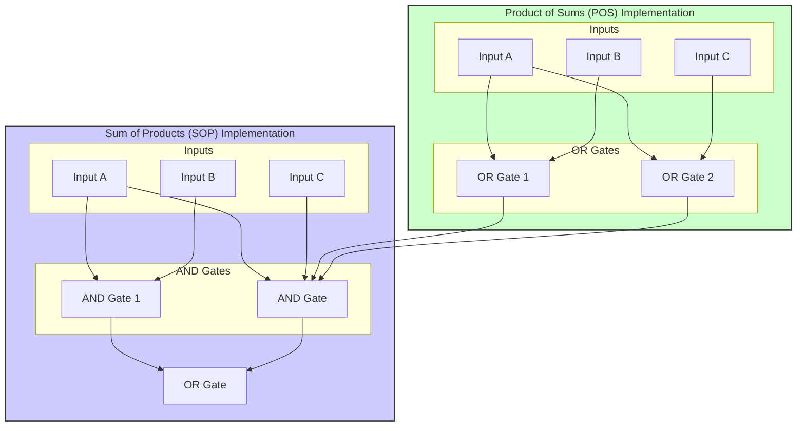
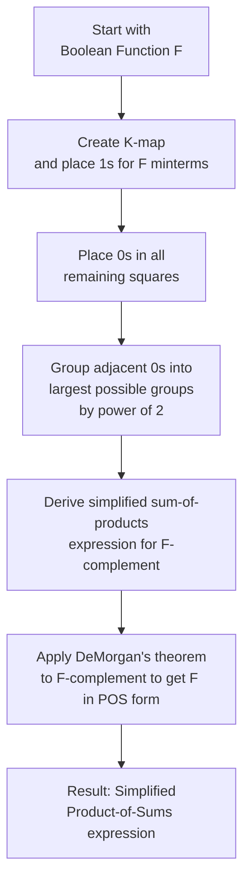

---
tags:
  - CCT1
  - CE
Topic: Simplification via The Map Method
Semester: CCT1
Course: CE1
Module: K3
Course Date: N/A
Litterature:
  - Digital Design, 5th ed.
Created: 16-11-25
---
- - -
## Table of Contents

- [[#Karnaugh Maps for Boolean Function Simplification|Karnaugh Maps for Boolean Function Simplification]]
- [[#3.1 Introduction|3.1 Introduction]]
- [[#3.2 The Map Method|3.2 The Map Method]]
	- [[#3.2 The Map Method#Two-Variable K-Map|Two-Variable K-Map]]
	- [[#3.2 The Map Method#Three-Variable K-Map|Three-Variable K-Map]]
	- [[#3.2 The Map Method#Five-Variable Map|Five-Variable Map]]
- [[#3.5 Product-of-sums Simplification|3.5 Product-of-sums Simplification]]

# Karnaugh Maps for Boolean Function Simplification

| Concept | Description |
| --- | --- |
| Karnaugh Map (K-map) | A pictorial method for simplifying Boolean algebraic expressions |
| Adjacency | Property where only one variable changes between neighboring cells |
| Implicant | A product term that represents a group of adjacent minterms |
| Prime Implicant | An implicant that cannot be fully contained within a larger implicant |
| Essential Prime Implicant | A prime implicant that covers at least one minterm not covered by any other prime implicant |
| Sum of Products (SOP) | Simplified form obtained by grouping 1s in a K-map |
| Product of Sums (POS) | Simplified form obtained by grouping 0s in a K-map and applying DeMorgan's theorem |

---

# 3.1 Introduction

> [!info] **Gate-Level Minimization**
> _Gate-level minimization_ is the design task of finding an optimal gate-level implementation for a Boolean function. The complexity of the digital logic gates that implement a Boolean function is directly related to the complexity of the algebraic expression from which the function is implemented. By simplifying the Boolean expression, we can reduce the number of gates, inputs, and overall cost of a digital circuit.

> [!note] **Why Simplification Matters**
> Simplifying Boolean expressions is not just an academic exercise. In the real world, it directly translates to:
> - **Reduced Cost:** Fewer gates mean a cheaper circuit to manufacture.
> - **Lower Power Consumption:** Simpler circuits typically use less power.
> - **Faster Operation:** Fewer gate levels mean less signal propagation delay.
> - **Higher Reliability:** Fewer components mean fewer potential points of failure.

---

# 3.2 The Map Method

The map method provides a simple, straightforward procedure for minimizing Boolean functions. This method is a pictorial form of a truth table and is also known as a _Karnaugh map_ or _K-map_.

A K-map is a diagram made of squares, where each square represents a minterm of the function to be minimized. Since Boolean functions can be expressed as a sum of minterms, the same functions can be recognized graphically in a K-map. The simplified expressions are always in one of two standard forms: sum of products (SOP) or product of sums (POS).

![[Pasted image 20250924134801.png]]
![[Pasted image 20250924143618.png]]
![[Pasted image 20250924144403.png]]
![[Pasted image 20250924144432.png]]
_Figure 3.2.1: Concept of a K-map as a Pictorial Truth Table and Don't Care Conditions_

> [!tip] **Understanding K-Map Structure**
> The arrangement of cells in a K-map is not random. It follows a specific pattern (Gray code) to ensure that any two adjacent cells (horizontally or vertically) differ by only one variable. This property is the key to simplification, as it allows us to eliminate variables that change within a group.

## Two-Variable K-Map

In a two-variable map, there are four minterms and four squares. If we mark the squares whose minterms belong to a given function, the 2-variable map becomes another way to represent any one of the 16 Boolean functions of two variables.

![[Pasted image 20250923170739.png]]
_Figure 3.2.2: Two-Variable K-map Structure_

Since $xy = m_3$, a 1 is placed inside the square belonging to $m_3$.

![[Pasted image 20250923170442.png]]
_Figure 3.2.3: K-map for Function $F = xy$ & $F = x + y$_

The function of $x + y$ is represented by three squares marked with 1s. These squares form the minterms of the function.

![[Pasted image 20250923170752.png]]
_Figure 3.2.4: Function $F = x + y$ Unsimplified_

![[Pasted image 20250924135307.png]]
_Figure 3.2.5: Simplified Expression from Two-Variable K-map_

> [!tip] **General Rule for Grouping**
> When grouping 1s in a K-map, always try to form the largest possible groups. The size of a group must be a power of 2 (1, 2, 4, 8, etc.). Larger groups lead to simpler terms with fewer literals.

> [!example] **Simplifying $F(A, B) = \sum m(1, 2, 3)$**
> The sum of minterms notation $\sum m(1, 2, 3)$ corresponds to the following algebraic expression:
> $$F = AB + \overline{A}B + A\overline{B}$$
> ### Truth Table (Unsimplified)
> This truth table shows the output of the unsimplified expression for all combinations of A and B. The function is 1 for the minterms $m_1$, $m_2$, and $m_3$.
>
> | A | B | $\overline{A}B$ | $A\overline{B}$ | $AB$ | **F** |
> |---|---|---|---|---|---|---|
> | 0 | 0 | 0 | 0 | 0 | **0** |
> | 0 | 1 | 1 | 0 | 0 | **1** |
> | 1 | 0 | 0 | 1 | 0 | **1** |
> | 1 | 1 | 0 | 0 | 1 | **1** |
>
> _Table 3.2.1: Truth Table for $F = AB + \overline{A}B + A\overline{B}$_
> ### K-Map Simplification
> The process involves plotting the 1s from the truth table onto a K-map and grouping them.
> #### Step 1: Plot Minterms on the K-Map
>
> | | B=0 | B=1 |
> |---|---|---|
> | **A=0** | `m0(00)` -> 0 | `m1(01)` -> 1 |
> | **A=1** | `m2(10)` -> 1 | `m3(11)` -> 1 |
>
> _Table 3.2.2: Initial K-map for $F(A, B) = \sum m(1, 2, 3)$_
> #### Step 2: Group Adjacent 1s
> We group adjacent `1`s into the largest possible rectangular groups.
> - **Group 1 (Vertical):** The cells $m_1$ and $m_3$ are vertically adjacent. Variable $A$ changes, but $B$ is constant at `1`. This group represents the term $B$.
> - **Group 2 (Horizontal):** The cells $m_2$ and $m_3$ are horizontally adjacent. Variable $B$ changes, but $A$ is constant at `1`. This group represents the term $A$.
>
> | | B=0 | B=1 |
> |---|---|---|
> | **A=0** | `m0(00)` -> 0 | `m1(01)` -> **1** |
> | **A=1** | `m2(10)` -> *1* | `m3(11)` -> ***1*** |
>
> _Table 3.2.3: K-map with Groupings Highlighted_
> #### Step 3: Write the Simplified Expression
> The final simplified expression is the sum (OR) of the terms from each group.
> $$F = A + B$$
> ### Truth Table (Simplified)
> This truth table verifies that the simplified expression $F = A + B$ produces the exact same output as the original, unsimplified expression.
>
> | A | B | **F** |
> |---|---|---|
> | 0 | 0 | **0** |
> | 0 | 1 | **1** |
> | 1 | 0 | **1** |
> | 1 | 1 | **1** |
>
> _Table 3.2.4: Truth Table for $F = A + B$_

---

## Three-Variable K-Map

In a 3-variable K-map, there are 8 minterms for 3 binary variables. The minterms are arranged in a sequence similar to Gray code. The characteristic of this sequence is that **only one bit changes in value from one adjacent column to the next**.

This means that the binary sequence `00 01 10 11` would become `00 01 11 10`, with only one digit changing per column.

![[Pasted image 20250923171242.png]]
_Figure 3.2.6: Three-Variable K-map Structure_

> [!note] **Understanding Adjacency and Wrapping**
> A key feature of K-maps is that they are considered to "wrap around" on both the horizontal and vertical axes. This means the leftmost column is adjacent to the rightmost column, and the top row is adjacent to the bottom row. This wrapping property is crucial for finding the largest possible groups.

Any two adjacent squares in the map differ by only one variable, which is primed in one square and unprimed in the other.

![[Pasted image 20250923171537.png]]
![[Pasted image 20250923171626.png]]
_Figure 3.2.7: Example of Three-Variable K-map_

![[Pasted image 20250924135331.png]]
![[Pasted image 20250924140533.png]]
_Figure 3.2.8: Rules and Procedures for K-maps_

```mermaid
graph TD
    subgraph KMap ["3-Variable K-map"]
        direction TB
        m0[m0: 000]
        m1[m1: 001]
        m3[m3: 011]
        m2[m2: 010]
        m4[m4: 100]
        m5[m5: 101]
        m7[m7: 111]
        m6[m6: 110]
    end

    subgraph WrapAround ["Wrapping Example"]
        direction TB
        wrap1["Group of 4 wraps around"]
        wrap2["m0 is adjacent to m4"]
        wrap3["m1 is adjacent to m5"]
    end

    style m0 fill:#f9f,stroke:#333,stroke-width:2px
    style m1 fill:#f9f,stroke:#333,stroke-width:2px
    style m2 fill:#f9f,stroke:#333,stroke-width:2px
    style m3 fill:#f9f,stroke:#333,stroke-width:2px
    style m4 fill:#f9f,stroke:#333,stroke-width:2px
    style m5 fill:#f9f,stroke:#333,stroke-width:2px
    style m6 fill:#f9f,stroke:#333,stroke-width:2px
    style m7 fill:#f9f,stroke:#333,stroke-width:2px

    style WrapAround fill:#e6f3ff,stroke:#0066cc,stroke-width:2px,stroke-dasharray: 5 5
```

_Figure 3.2.9: Visualizing the "Wrapping Around" Property in a K-map_

> [!example] **Simplifying $F(A, B, C) = \sum m(0, 2, 4, 5, 6)$**
> ### Unsimplified Boolean Expression
> The sum of minterms notation $\sum m(0, 2, 4, 5, 6)$ corresponds to the following algebraic expression:
> $$F = \overline{ABC} + \overline{A}B\overline{C} + A\overline{BC} + A\overline{B}C + AB\overline{C}$$
> ### Truth Table (Unsimplified)
> This truth table shows the output of the unsimplified expression for all combinations of A, B, and C. The function is 1 for the minterms $m_0$, $m_2$, $m_4$, $m_5$, and $m_6$.
>
> | A | B | C | $\overline{ABC}$ | $\overline{A}B\overline{C}$ | $A\overline{BC}$ | $A\overline{B}C$ | $AB\overline{C}$ | **F** |
> |---|---|---|---|---|---|---|---|
> | 0 | 0 | 0 | 1 | 0 | 0 | 0 | 0 | **1** |
> | 0 | 0 | 1 | 0 | 0 | 0 | 0 | 0 | **0** |
> | 0 | 1 | 0 | 0 | 1 | 0 | 0 | 0 | **1** |
> | 0 | 1 | 1 | 0 | 0 | 0 | 0 | 0 | **0** |
> | 1 | 0 | 0 | 0 | 0 | 1 | 0 | 0 | **1** |
> | 1 | 0 | 1 | 0 | 0 | 0 | 1 | 0 | **1** |
> | 1 | 1 | 0 | 0 | 0 | 0 | 0 | 1 | **1** |
> | 1 | 1 | 1 | 0 | 0 | 0 | 0 | 0 | **0** |
>
> _Table 3.2.5: Truth Table for $F = \sum m(0, 2, 4, 5, 6)$_
> ### K-Map Simplification
> The process involves plotting the 1s from the truth table onto a K-map and grouping them.
> #### Step 1: Plot Minterms on the K-Map
>
> | | BC=00 | BC=01 | BC=11 | BC=10 |
> |---|---|---|---|---|
> | **A=0** | `m0(000)` -> 1 | `m1(001)` -> 0 | `m3(011)` -> 0 | `m2(010)` -> 1 |
> | **A=1** | `m4(100)` -> 1 | `m5(101)` -> 1 | `m7(111)` -> 0 | `m6(110)` -> 1 |
>
> _Table 3.2.6: Initial K-map for $F(A, B, C) = \sum m(0, 2, 4, 5, 6)$_
> #### Step 2: Group Adjacent 1s
> We group adjacent `1`s into the largest possible rectangular groups, remembering that the map wraps around.
> - **Group 1 (Group of Four):** The cells $m_0$, $m_2$, $m_6$, and $m_4$ form a group of four that wraps around the edge. Variables $A$ and $B$ change, but $C$ is constant at `0`. This group represents the term $\overline{C}$.
> - **Group 2 (Pair):** The cells $m_4$ and $m_5$ form a group of two. Variable $C$ changes, but $A$ is constant at `1` and $B$ is constant at `0`. This group represents the term $A\overline{B}$.
>
> | | BC=00 | BC=01 | BC=11 | BC=10 |
> |---|---|---|---|---|
> | **A=0** | `m0(000)` -> **1** | `m1(001)` -> 0 | `m3(011)` -> 0 | `m2(010)` -> **1** |
> | **A=1** | `m4(100)` -> ***1*** | `m5(101)` -> *1* | `m7(111)` -> 0 | `m6(110)` -> **1** |
>
> _Table 3.2.7: K-map with Groupings Highlighted_
> #### Step 3: Write the Simplified Expression
> The final simplified expression is the sum (OR) of the terms from each group.
> $$F = \overline{C} + A\overline{B}$$
> ### Truth Table (Simplified)
> This truth table verifies that the simplified expression $F = \overline{C} + A\overline{B}$ produces the exact same output as the original, unsimplified expression.
>
> | A | B | C | $\overline{C}$ | $A\overline{B}$ | **F** |
> |---|---|---|---|---|---|
> | 0 | 0 | 0 | 1 | 0 | **1** |
> | 0 | 0 | 1 | 0 | 0 | **0** |
> | 0 | 1 | 0 | 1 | 0 | **1** |
> | 0 | 1 | 1 | 0 | 0 | **0** |
> | 1 | 0 | 0 | 1 | 1 | **1** |
> | 1 | 0 | 1 | 0 | 1 | **1** |
> | 1 | 1 | 0 | 1 | 0 | **1** |
> | 1 | 1 | 1 | 0 | 0 | **0** |
>
> _Table 3.2.8: Truth Table for $F = \overline{C} + A\overline{B}$_

---

## Five-Variable Map

> [!warning] **Complexity of Larger K-maps**
> Maps for more than four variables are not as simple to use as those for four or less. A five-variable K-map needs 32 squares, and a six-variable map needs 64 squares. For functions with more than four variables, other minimization methods like the Quine-McCluskey algorithm or computer-based minimization tools are often more practical.

---

# 3.5 Product-of-sums Simplification

The minimized Boolean functions derived can, with a minor modification, obtain a product-of-sum form of a function. The procedure for minimizing a function in product-of-sums follows from the basic properties of Boolean functions.

- The 1s are placed in the squares that represent the minterms of the function.
- The minterms not included in the standard sum-of-products of a function denote the complement of the function.
- This means that the function's complement is represented by the squares _not_ marked by 1s.

> [!note] **Core Idea of POS Simplification**
> Instead of grouping the 1s to find a simplified Sum of Products (SOP), we group the 0s to find a simplified expression for the function's complement ($F'$). Then, we apply DeMorgan's theorem to this simplified expression to get the original function ($F$) in Product of Sums (POS) form.

If we mark the empty squares with 0s and combine them into valid adjacent squares, we obtain a simplified sum-of-products expression of the complement of the function ($F'$). The complement of $F'$ ($F$) gives us the function in product-of-sums, as a consequence of DeMorgan's theorem.

![[Pasted image 20250923173640.png]]
![[Pasted image 20250923173656.png]]
![[Pasted image 20250923173716.png]]
_Figure 3.5.1: Product-of-Sums/Sum-of-Products Simplification Process_

_Figure 3.5.2: Visualizing the Difference Between SOP and POS Implementations_

> [!tip] **Practical Application of POS**
> In some digital logic families (like TTL), NAND gates are faster and more common than NOR gates. Since a POS form can be implemented using only NAND gates (by applying DeMorgan's theorem), it might be preferred in these technologies despite potentially having more gate levels.

_Figure 3.5.3: Process for Product-of-Sums Simplification_

---

> [!summary] **Key Points**
>
> - A Karnaugh map (K-map) is a pictorial method for simplifying Boolean algebraic expressions.
> - The K-map is a diagram of squares, where each square represents a minterm.
> - To simplify a function, plot the 1s on a K-map and group them into the largest possible rectangular groups.
> - The simplified expression is the sum (OR) of the terms from each group.
> - For product-of-sums (POS) simplification, group the 0s on a K-map to get a simplified expression for the complement of the function, then apply DeMorgan's theorem.
> - K-maps are most practical for functions with up to four variables.