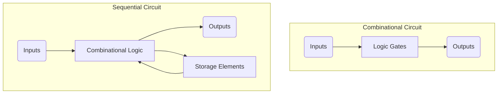
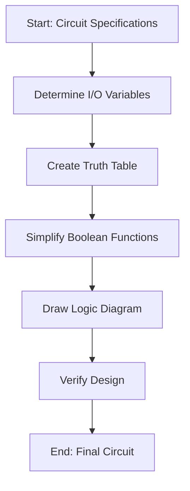
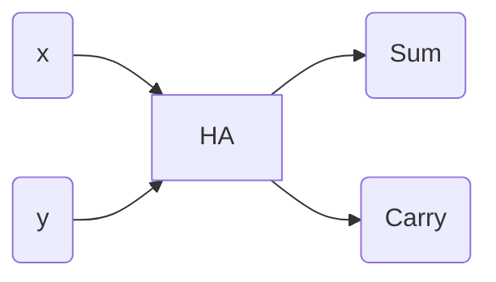
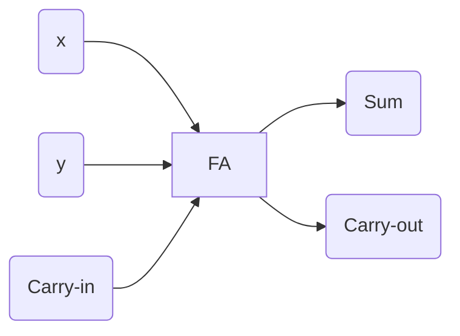
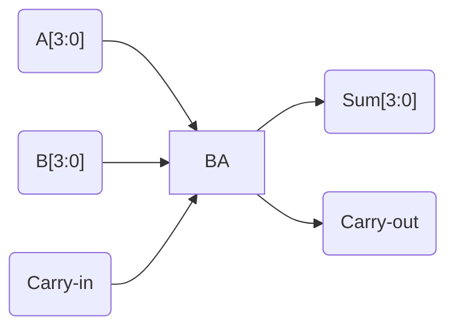
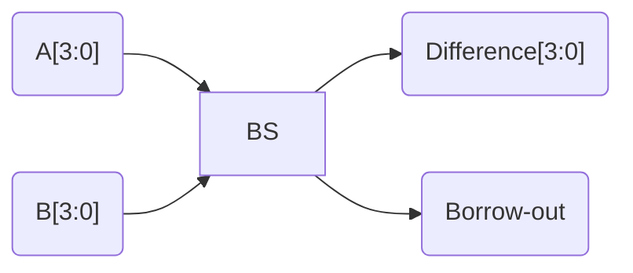
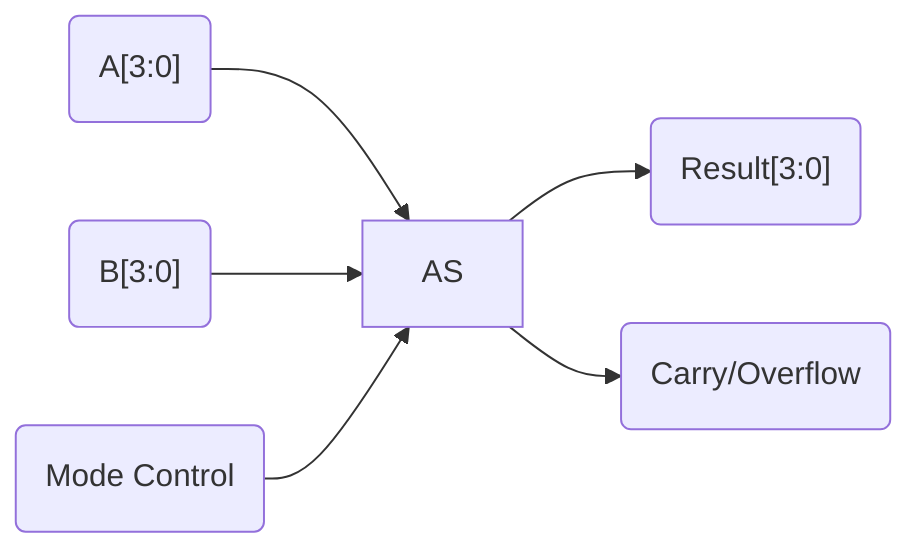

---
tags:
  - CCT1
  - CE
Topic: Combinational Circuits, Binary Adders/Subtractors
Semester: CCT1
Course: CE1
Module: K4
Course Date: N/A
Litterature:
  - Digital Design, 5th ed.
Created: 16-11-25
---
- - -
## Table of Contents

- [[#Combinational Circuits: Analysis, Design, and Implementation|Combinational Circuits: Analysis, Design, and Implementation]]
- [[#Introduction|Introduction]]
		- [[#Comparison of Circuit Types|Comparison of Circuit Types]]
- [[#4.2 Combinational Circuits|4.2 Combinational Circuits]]
- [[#4.3 Analysis Procedure|4.3 Analysis Procedure]]
	- [[#4.3 Analysis Procedure#Analysis Steps|Analysis Steps]]
	- [[#4.3 Analysis Procedure#Alternative Analysis Method|Alternative Analysis Method]]
- [[#4.4 Design Procedure|4.4 Design Procedure]]
	- [[#4.4 Design Procedure#Code Conversion Example|Code Conversion Example]]
- [[#4.5 Binary Adder-Subtractor|4.5 Binary Adder-Subtractor]]
	- [[#4.5 Binary Adder-Subtractor#Half Adder|Half Adder]]
	- [[#4.5 Binary Adder-Subtractor#Full Adder|Full Adder]]
	- [[#4.5 Binary Adder-Subtractor#Binary Adder|Binary Adder]]
	- [[#4.5 Binary Adder-Subtractor#Carry Propagation|Carry Propagation]]
	- [[#4.5 Binary Adder-Subtractor#Binary Subtractor|Binary Subtractor]]
	- [[#4.5 Binary Adder-Subtractor#Overflow|Overflow]]

# Combinational Circuits: Analysis, Design, and Implementation

| Concept | Description | Key Components/Formula |
| :--- | :--- | :--- |
| **Combinational Circuit** | Logic circuit where outputs depend only on current inputs. | Logic gates, no feedback paths. |
| **Sequential Circuit** | Logic circuit where outputs depend on current inputs and previous states. | Logic gates, storage elements. |
| **Half Adder** | Adds two binary bits. | Inputs: x, y Outputs: S (sum), C (carry) Boolean functions: $S = x \oplus y$ $C = x \cdot y$ |
| **Full Adder** | Adds three binary bits (two bits + carry). | Inputs: x, y, z Outputs: S (sum), C (carry) Boolean functions: $S = x \oplus y \oplus z$ $C = xy + (x \oplus y)z$ |
| **Binary Adder** | Adds multi-bit binary numbers. | Cascade of full adders. |
| **Binary Subtractor** | Subtracts binary numbers. | Adder with complemented inputs. |
| **Carry Lookahead** | Technique to reduce propagation delay in adders. | Uses generate ($G_i = x_i y_i$) and propagate ($P_i = x_i \oplus y_i$) signals. |
| **Overflow Detection** | Detects when result exceeds available bits. | For signed numbers: $V = C_{sign} \oplus C_{out}$ |

---
# Introduction

Logic circuits for digital systems can be categorized into two main types:

> [!info] **Combinational Circuits**
> Consists of logic gates whose outputs at any time are determined from only the present combination of inputs. Can be specified logically by a set of Boolean functions.

> [!info] **Sequential Circuits**
> Employ storage elements in addition to logic. Outputs are functions of the inputs and the state of storage elements. Depends not only on present and current values, but also past inputs, and must be specified by a time sequence of inputs and states.

### Comparison of Circuit Types

| Feature | Combinational Circuit | Sequential Circuit |
| :--- | :--- | :--- |
| **Dependency** | Output depends only on present inputs. | Output depends on present inputs and past states. |
| **Memory** | No memory elements. | Contains memory elements (e.g., flip-flops). |
| **Feedback** | No feedback loops. | Has feedback paths. |
| **Speed** | Generally faster, as signals don't need to propagate through memory. | Can be slower due to clock cycles and memory access. |
| **Design Complexity** | Simpler to design and analyze. | More complex due to state transitions. |
| **Examples** | Adders, Multiplexers, Decoders. | Counters, Shift Registers, Memory Units. |

_Table 1.1: Comparison of Combinational and Sequential Circuit Characteristics_

_Figure 1.1: Structural comparison of combinational and sequential circuits_

# 4.2 Combinational Circuits

A combinational circuit has _n_ input variables that produce _m_ output variables through internal combinational logic circuitry. Each I/O variable exists physically as an analog signal, representing `logic 1` and `logic 0`.

> [!note]
> Some simulators show only the 1's and 0's, not the actual analog signals.

![[Pasted image 20250929172452.png]]
_Figure 4.2.1: Block diagram of a combinational circuit_

Often the source of the outputs are _storage registers_. If the registers are included with the gates, the total circuit must be considered a sequential circuit.

A combinational circuit can be specified by a truth table that lists all output values for all input variables.

# 4.3 Analysis Procedure

The analysis of combinational circuits requires determining the function they implement. This starts with a logic diagram and culminates with a set of Boolean functions, a truth table, and/or an explanation of the circuit operation.

> [!warning]
> The first step is to make sure the circuit is combinational and not sequential. The diagram of a combinational circuit has gates with no feedback paths or memory elements.

## Analysis Steps

To obtain the output Boolean function(s) from a logic diagram:
1.  Label all gate outputs that are functions of input variables with arbitrary but meaningful symbols.
2.  Label the gates that are functions of input variables and previously labeled gates with other symbols.
3.  Repeat step 2 until the outputs of the circuit are obtained.
4.  By repeated substitution of previously defined functions, obtain the output Boolean functions in terms of input variables.

> [!example] Detailed Analysis Example
> Let's analyze a more complex circuit with three inputs ($A, B, C$) and two outputs ($F1, F2$).
>
> **Step 1 & 2: Label Intermediate Gates**
> - Let $T_1$ be the output of the AND gate with inputs A and B:
>   $T_1 = A \cdot B$
> - Let $T_2$ be the output of the XOR gate with inputs B and C:
>   $T_2 = B \oplus C$
> - Let $T_3$ be the output of the NOT gate for input A:
>   $T_3 = \overline{A}$
>
> **Step 3: Express Outputs in Terms of Intermediate Variables**
> - Output $F_1$ is the output of an OR gate with inputs $T_1$ and $T_2$:
>   $F_1 = T_1 + T_2$
> - Output $F_2$ is the output of an AND gate with inputs $T_3$ and $C$:
>   $F_2 = T_3 \cdot C$
>
> **Step 4: Substitute to Get Final Boolean Functions**
> - Substitute $T_1$ and $T_2$ into the equation for $F_1$:
>   $F_1 = (A \cdot B) + (B \oplus C)$
> - Substitute $T_3$ into the equation for $F_2$
>   $F_2 = \overline{A} \cdot C$
>
> The final Boolean functions for the circuit are:
> $$F_1 = AB + (B \oplus C)$$
> $$F_2 = \overline{A}C$$
> This systematic process breaks down a complex circuit into manageable parts.

![[Pasted image 20250930074710.png]]
_Figure 4.3.1: Example logic diagram for analysis_

![[Pasted image 20250930074723.png]]
_Figure 4.3.2: Logic diagram_

The Boolean functions _F1_ and _F2_ implement a circuit. By observing the Boolean equations and the truth table for _F1_ and _F2_, we can see they match those describing the functionality of a _full adder_.

> [!tip]
> Merely finding a Boolean representation doesn't provide much insight into the behavior of the circuit. It's important to interpret the operations of the circuit in relation to the derived functions and truth table.

## Alternative Analysis Method

To obtain the truth table **without** going through derivations of the Boolean functions:
1.  Determine the number of input variables in the circuit. For _n_ inputs, list all 2^_n_ possible input combinations.
2.  Label outputs of selected gates with arbitrary symbols.
3.  Obtain the truth table for the outputs of the gates that are functions of **only** the input variables.
4.  Proceed to obtain the truth table for the output of the gates that are functions of the previous _input-only_ gates' defined values, and repeat until all outputs are determined.

![[Pasted image 20250930115706.png]]
_Figure 4.3.3: Truth table derived directly from the logic diagram_

# 4.4 Design Procedure

The procedure for designing combinational circuits involves the following steps:
1.  From the specifications of the circuit, determine the required number of inputs and outputs, and assign a symbol to each.
2.  Derive the truth table that defines the required relation between inputs and outputs.
3.  Obtain the simplified Boolean functions for each output as a function of the input variables.
4.  Draw the logic diagram and verify the design (either manually or by simulation).

> [!note]
> A truth table for a combinational circuit consists of input columns and output columns. The input columns are obtained from the binary numbers for the _n_ input variables. The binary values for the outputs are determined from the specifications.

_Figure 4.4.1: Flowchart of the combinational circuit design procedure_

## Code Conversion Example

Due to large code variety, it's sometimes necessary to use the output of one system as the input of another. A _conversion circuit_ must be inserted between the two to translate from one code to another.

To convert from binary A to B, the input lines must supply the bit combination from binary code A, and the output lines must generate the corresponding version of elements for binary code B.

Since each code in this example uses 4 bits to represent a decimal digit, there must be four input and output variables: _A_, _B_, _C_, _D_ and _w_, _x_, _y_, _z_.

> [!note]
> A 4-bit truth table can have 16 possible bit combinations, but only 10 are shown. The 6 not shown are "don't care" combinations, which have no meaning in our input code (BCD). Therefore, we can assign these 6 combinations any value that leads to a simpler circuit.

![[Pasted image 20250930135940.png]]
_Figure 4.4.2: Truth table for BCD to Excess-3 code conversion_

Using [[INCE CPH CCT1/K3 R3 - 3.1 - 3.2 + 3.5#3.2 The Map Method|Karnaugh maps]] for each output variable, we obtain the simplified Boolean functions:

![[Pasted image 20250930142049.png]]
_Figure 4.4.3: K-map for output z and y output_

![[Pasted image 20250930142101.png]]
_Figure 4.4.4: K-map for x and w output_

![[Pasted image 20250930142220.png]]
_Figure 4.4.5: Functions for w, x, y, z_

With the simplified Boolean functions, we can create a logic diagram implementing these expressions:

![[Pasted image 20250930142544.png]]
_Figure 4.4.6: Logic diagram for BCD to Excess-3 code converter_

# 4.5 Binary Adder-Subtractor

Digital computers perform various arithmetic operations, with the most basic being the addition of two binary digits. This consists of four possible elementary operations: `0 + 0 = 0, 0 + 1 = 1, 1 + 0 = 1, 1 + 1 = 10`.

A combinational circuit that performs the addition of two bits is called a _half adder_. One performing addition of 3 bits (2 bits and a carry) is called a _full adder_.

An _adder-subtractor_ is a combinational circuit that performs arithmetic of both addition and subtraction with binary numbers.

## Half Adder

The circuit needs 2 inputs and 2 outputs. The inputs are designated the augend and the addend bits; the output variables produce the sum and the carry.

We assign the inputs _x_ and _y_, _S_ to the sum, and _C_ to the carry. The C variable represents the most significant bit (the _carry bit_), and the S variable represents the least significant bit in the sum.

_Figure 4.5.1.1: Input/Output block diagram of a half adder_

![[Pasted image 20250930143723.png]]
_Figure 4.5.1: Truth table for a half adder_

![[Pasted image 20251002074912.png]]
_Figure 4.5.2: Functions for Sum and Carry_

![[Pasted image 20251002074943.png]]
_Figure 4.5.3: Logic diagram of a half adder_

## Full Adder

Addition of _n_-bit binary numbers requires a _full adder_. The process of addition proceeds bit-by-bit, starting from right to left, with the right-most (least significant) bit. Each position adds not only the respective bits but also considers a possible carry from the addition performed at the previous position.

A **full** adder is a combinational circuit performing arithmetic on three bits, consisting of 3 inputs and two outputs. Two of the inputs _x_ and _y_ represent two significant bits to be added, and the third _z_ represents the possible carry obtained from the previous lesser significance position.

The outputs are the sum _S_ and the carry _C_, where _S_ gives the least significant bit of the sum, and _C_ gives the output carry formed by adding the input carry and the bits.

_Figure 4.5.4.1: Input/Output block diagram of a full adder_

![[Pasted image 20251002080351.png]]
_Figure 4.5.4: Functions for Sum and Carry_

![[Pasted image 20251002080359.png]]
_Figure 4.5.5: Truth table for a full adder_

![[Pasted image 20251002080653.png]]
_Figure 4.5.6: K-map for Full-adder_

![[Pasted image 20251002080705.png]]
_Figure 4.5.7: Implemenation of Full-adder in SOP form_

The _S_ output from the 2nd half adder is equal to the XOR of _z_ and the output of the first adder:

![[Pasted image 20251002080831.png]]
_Figure 4.5.8: Boolean function derivation for full adder sum and carry_

## Binary Adder

A _binary adder_ is a digital circuit that produces the arithmetic sum of two binary numbers, constructed with full adders connected in cascade, with the output-carry from each connected to the input-carry of the next in the chain.

_Figure 4.5.9.1: Input/Output block diagram of a 4-bit binary adder_

![[Pasted image 20251002081056.png]]
_Figure 4.5.9: Logic diagram of a 4-bit binary adder_

Addition of _n_-bit numbers requires a chain of _n_ full adders, or 1 half-adder and _n-1_ full adders. With all full adders (FA), the input carry to the least significant position is fixed at 0.

For a _$n=4$_-bit adder, the augend bits _A_ and addend bits _B_ are designated with subscripts, from right to left, with 0 being the least significant bits.

![[Pasted image 20251002081556.png]]
_Figure 4.5.10: i-table for $n=4$_

![[Pasted image 20251002081607.png]]
_Figure 4.5.11: Logic symbol for a 4-bit binary adder_

## Carry Propagation

The addition of numbers in parallel implies that all bits of _A_ and _B_ are available at the same time. However, as in any circuit, the signal must propagate through the circuit before the correct output sum is available at the output terminal.

The longest propagation delay in an adder is the time it takes the carry to propagate through the full adders.

> [!warning]
> Since each bit sum _output_ depends on the value of the _input_ carry, the value of _S_ at any given stage in the adder will only be in its final value after the input to that stage has propagated.

For an _n_-bit adder, there are _2n_-gate levels for the carry to propagate from ultimate input to ultimate output, since the signal from the input carry to the output in a single adder propagates through an AND and an OR gate per adder.

![[Pasted image 20251002173718.png]]
_Figure 4.5.12: Carry propagation in a 4-bit adder_

The carry propagation time is an important attribute of the adder because it limits the speed at which two numbers can be added. The value at the ultimate output terminal is only correct once the signals have propagated from the ultimate inputs.

Several techniques exist for reducing the propagation time, with the most widely used being the principle of _carry lookahead logic_.
![[Pasted image 20251002174154.png]]
![[Pasted image 20251002174214.png]]
![[Pasted image 20251002174225.png]]

Since the Boolean function for each output-carry is expressed as a sum-of-products, each can be implemented with one level of AND gates followed by an OR gate.

![[Pasted image 20251002174849.png]]
_Figure 4.5.16: Implementation of carry lookahead logic_

Each sum output requires two XOR gates:
- The first XOR's output generates the _Pi_ variable
- The AND gate generates the _Gi_ variable

The carries are propagated through the lookahead and applied as inputs to the second XOR. All output carries are generated after a delay through 2 levels of gates, thus _S1_ and _S3_ have equal propagation times.

![[Pasted image 20251002174906.png]]
_Figure 4.5.17: 4-bit adder with carry lookahead_

## Binary Subtractor

The subtraction of unsigned binary numbers can be done by means of complements. The circuit for subtracting _A - B_ consists of an adder with inverts placed between each data input _B_ and the corresponding input of the full adder.

The operation performed becomes _A_ + _r-1_'s complement of _B_ + 1, which is equal to _A_ + _r_'s complement of B. This equals _A_ - _B_ for unsigned numbers if A ≥ B, or _r_'s complement of _B - A_ if A < B. For signed numbers, the result is _A - B_, provided there's no overflow.

_Figure 4.5.18.1: Input/Output block diagram of a 4-bit binary subtractor_

Addition and subtraction can be combined into one circuit with one common binary adder by including a XOR gate with each full adder.

![[Pasted image 20251002181917.png]]
_Figure 4.5.18: Implementation of a binary adder-subtractor_

In a 4-bit adder-subtractor circuit, the input mode _M_ controls the operation (addition or subtraction):
- When _M_=0, the circuit is an adder
- When _M_=1, the circuit is a subtractor

_Figure 4.5.19.1: Input/Output block diagram of a 4-bit adder-subtractor_

![[Pasted image 20251002182845.png]]

## Overflow

When two numbers of _n_ digits each are added and the sum is a number of _n+1_ digits, this is called an overflow. This is true for any number type (signed, unsigned, binary, hex, decimal, etc.).

When performed on paper, an overflow isn't an issue since there's no digit limit. In digital computers, however, because the number of bits that hold the number is finite, a result of _n+1_ bits is bigger than the bits of an _n_-bit word and cannot be accommodated.

The detection of an overflow after addition depends on whether the numbers are considered signed or unsigned:

> [!warning] For signed numbers
> the left-most bit always represents the sign, and negative numbers are in _r_'s-complement. When two signed numbers are added, the _sign_-bit is treated as part of the number, and the end carry doesn't indicate an overflow.

An overflow cannot occur when one number is positive and the other negative.

![[Pasted image 20251003070656.png]]
_Figure 4.5.20: Example of overflow in signed binary addition_

> [!note]
> The 8-bit result that should have been positive has a negative sign bit, and the negative has a positive sign. If the carry out of the sign bit position is taken as the sign bit of the result, then the 9-bit answer obtained will be correct. But the answer cannot be accommodated within 8 bits, so an overflow has occurred.

An overflow condition can be detected by observing the carry into the sign-bit position and the carry out of the sign-bit position. If these carries are **not** equal, an overflow has occurred.

If two carries are applied to a XOR gate, an overflow is detected if the gate output is 1.

> [!tip]
> For this method to work, the _r_'s complement of a negative number must be computed by taking _r-1_'s complement, then adding 1.

In a binary adder-subtractor with outputs _C_ and _V_:
- If the two binary numbers are unsigned, the _C_-bit detects a carry after addition or a borrow after subtraction.
- If the numbers are considered signed, the _V_-bit detects an overflow.
    - If _V_=0 after an addition or subtraction, no overflow occurred, and the _n_-bit result is correct.
    - If _V_=1, then the result of the operation contains _n+1_-bits, but only the right-most _n_ bits of the number fit in the space available; an overflow occurred. The (_n+1_)-th bit is the sign bit that has shifted out of position.

> [!summary]
> This note covered the fundamental concepts of combinational logic circuits. It began by distinguishing them from sequential circuits based on memory and feedback. The core processes of **analysis** (deriving functions from a diagram) and **design** (creating a circuit from specifications) were detailed, using a code converter as a practical example. The note then delved into the implementation of key arithmetic circuits, including the **half adder**, **full adder**, and the construction of multi-bit **binary adders**. It addressed the critical issue of **carry propagation delay** and introduced the **carry lookahead** technique as a solution. Finally, it explained how a single circuit can function as both an **adder and subtractor** and discussed the important concept of **overflow** in digital arithmetic.