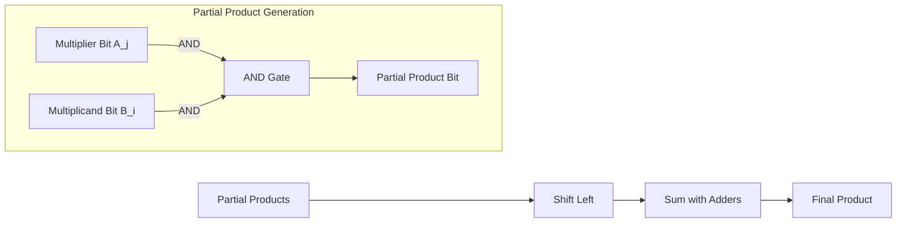
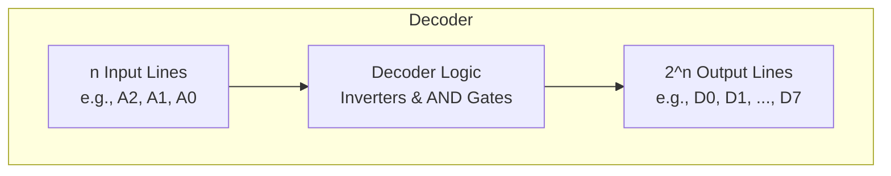
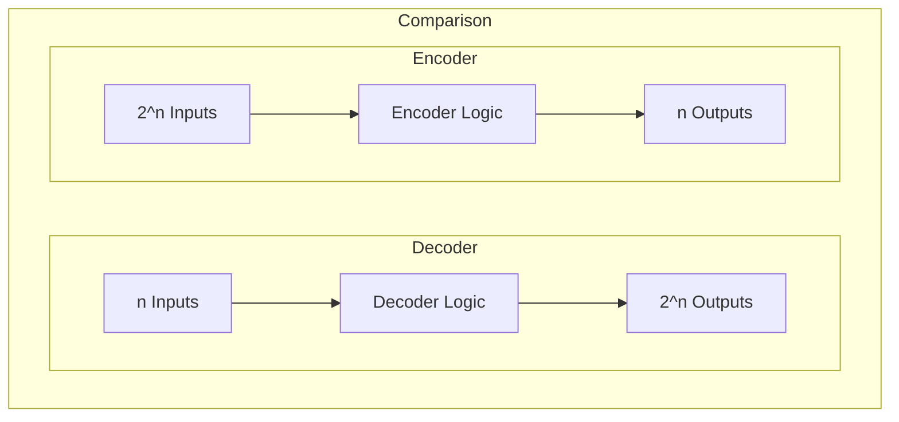
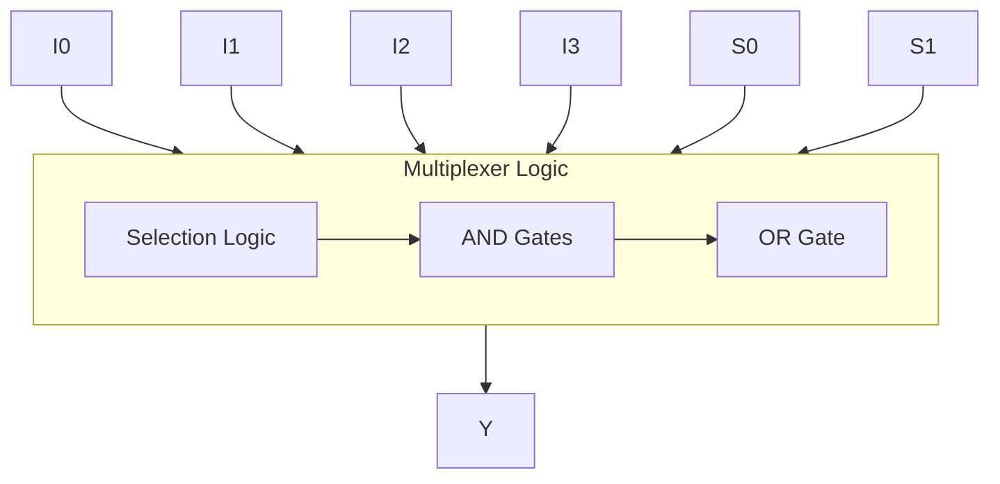
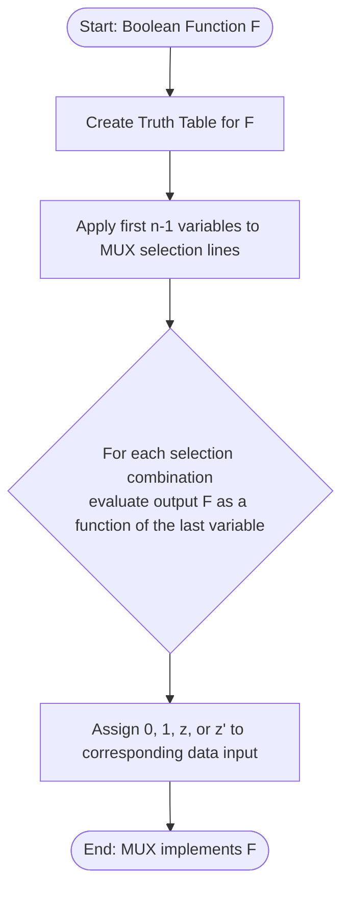

---
tags:
  - CCT1
  - CE
Topic: Decoders, Encoders & Multiplexers
Semester: CCT1
Course: CE1
Module: K5
Course Date: N/A
Litterature:
  - Digital Design, 5th ed.
Created: 16-11-25
---
- - -
## Table of Contents

- [[#Digital Logic Components: Multipliers, Decoders, Encoders, and Multiplexers|Digital Logic Components: Multipliers, Decoders, Encoders, and Multiplexers]]
- [[#4.7 Binary Multiplier|4.7 Binary Multiplier]]
- [[#4.9 Decoders|4.9 Decoders]]
	- [[#4.9 Decoders#Combinational Logic Implementation|Combinational Logic Implementation]]
- [[#4.10 Encoders|4.10 Encoders]]
	- [[#4.10 Encoders#Priority Encoder|Priority Encoder]]
- [[#4.11 Multiplexers|4.11 Multiplexers]]
	- [[#4.11 Multiplexers#Boolean Function Implementation|Boolean Function Implementation]]
	- [[#4.11 Multiplexers#Three-state Gates|Three-state Gates]]

# Digital Logic Components: Multipliers, Decoders, Encoders, and Multiplexers

| Component | Function | Key Features | Implementation Example |
|---|---|---|---|
| **Binary Multiplier** | Performs binary multiplication of two numbers. | Generates partial products using `AND` gates for each bit of the multiplier. Sums the shifted partial products using adders. For a $J \times K$ bit multiplication, it requires $J \times K$ `AND` gates and $J-1$ $K$-bit adders. | A $2 \times 2$ multiplier (e.g., $B_1B_0 \times A_1A_0$) uses 4 `AND` gates for partial products and a 2-bit adder to sum them, producing a 4-bit product ($C_3C_2C_1C_0$). |
| **Decoder** | Converts binary information from $n$ inputs to a maximum of $2^n$ unique output lines. | Generates one of $2^n$ minterms at the output. Implemented with $n$ inverters and $2^n$ `AND` gates. Can include an `enable` input to function as a demultiplexer or to expand decoder capacity. | A 3-to-8 decoder with inputs $A_2, A_1, A_0$ will activate one of eight outputs ($D_0$ to $D_7$) corresponding to the binary input. It can be used for binary-to-octal conversion or to implement a 3-variable Boolean function with external `OR` gates. |
| **Encoder** | Performs the inverse operation of a decoder, converting $2^n$ input lines to an $n$-line binary output. | Basic encoders have a limitation: only one input can be active at a time. Priority encoders solve this by giving precedence to the highest-priority active input, often including a `valid bit` indicator. | A 4-to-2 priority encoder with inputs $D_3-D_0$ (where $D_3$ has highest priority) outputs a 2-bit binary code for the highest-priority active input. If $D_3$ and $D_1$ are active, the output is `11`. |
| **Multiplexer (MUX)** | Selects binary information from one of multiple input lines and directs it to a single output line. | Also called a `data selector`. Uses $n$ `selection lines` to choose one of $2^n$ data inputs. Can implement Boolean functions efficiently, often with fewer components than standard gate implementations. | A 4-to-1 MUX uses 2 `selection lines` ($S_1, S_0$) to connect one of four data inputs ($I_0-I_3$) to the single output ($Y$). A 3-variable function can be implemented with a 4-to-1 MUX by using 2 variables for selection and the 3rd variable for the data inputs. |

---

# 4.7 Binary Multiplier

> [!info] **Binary Multiplier Definition**
> 
> A binary multiplier is a combinational logic circuit that performs multiplication of binary numbers. It follows the same process as decimal multiplication, using `AND` gates for partial products and adders for summing them.

Multiplication of binary numbers follows the same process as decimal multiplication. The multiplicand is multiplied by each bit of the multiplier, starting from the least significant bit. Each operation yields a partial product, and successive partial products are shifted one position to the left. The final product is obtained from the sum of all partial products.

![[Pasted image 20251007144634.png]]
_Figure 1.1: $2 \times 2$ binary multiplier circuit_

The multiplication process involves multiplicand bits ($B_1$ and $B_0$), multiplier bits ($A_1$ and $A_0$), and product bits ($C_3$ to $C_0$).

> [!example] **Example: Multiplying $0011$ (3) by $0010$ (2)** 
> Let's multiply the multiplicand $B = 0011$ by the multiplier $A = 0010$.
> 
> 1. **Multiply by LSB ($A_0=0$):** $0011 \times 0 = 0000$ (First partial product)
> 2. **Multiply by MSB ($A_1=1$):** $0011 \times 1 = 0011$ (Second partial product)
> 3. **Shift left:** Shift the second partial product one position left: $0110$
> 4. **Add:** Add the partial products: $0000 + 0110 = 0110$
> 
> The result is $0110$ (binary), which is $6$ in decimal. Correct, since $3 \times 2 = 6$.

The multiplication of two bits produces a $1$ if both bits are $1$, and $0$ otherwise. This operation is identical to an `AND` operation.

_Figure 1.2: Process flow for binary multiplication_

> [!example] **Example: Multiplying $0101$ (5) by $0011$ (3)** 
> Let's multiply the multiplicand $B = 0101$ by the multiplier $A = 0011$.
> 
> 1. **Multiply by LSB ($A_0=1$):** $0101 \times 1 = 0101$ (First partial product)
> 2. **Multiply by MSB ($A_1=1$):** $0101 \times 1 = 0101$ (Second partial product)
> 3. **Shift left:** Shift the second partial product one position left: $1010$
> 4. **Add:** Add the partial products: $0101 + 1010 = 1111$
> 
> The result is $1111$ (binary), which is $15$ in decimal. Correct, since $5 \times 3 = 15$.

![[Pasted image 20251008124030.png]]
![[Pasted image 20251008124038.png]]
![[Pasted image 20251008124047.png]]
![[Pasted image 20251008124056.png]]
![[Pasted image 20251008124106.png]]
_Figure 1.3: Multi-bit binary multiplier implementation_

> [!tip] **Design Tip**
> 
> For a multiplier with $J$ bits and a multiplicand with $K$ bits, you need $J \times K$ `AND` gates and $J-1$ $K$-bit adders to produce a product of $J+K$ bits. This formula helps in estimating the hardware requirements for binary multipliers of different sizes.

![[Pasted image 20251007152753.png]]
_Figure 1.4: $4 \times 3$ binary multiplier circuit_

---

# 4.9 Decoders

> [!info] **Decoder Definition**
> 
> A decoder is a combinational circuit that converts binary information from $n$ inputs to a maximum of $2^n$ unique outputs. It essentially "decodes" the binary input to activate a specific output line.

A **`decoder`** is a combinational circuit that converts binary information from $n$ inputs to a maximum of $2^n$ unique outputs. If the coded information has unused combinations, the `decoder` may have fewer outputs.

There are multiple types of decoders, most commonly $n$-to-$m$-line decoders, where $m \le 2^n$. The name "decoder" is also used in conjunction with other code converters such as `BCD-to-7-segment` decoders, or translators like `BCD-to-binary` decoders.

_Figure 2.1: General decoder function diagram_

![[Pasted image 20251008130353.png]]
_Figure 2.2: general decoder diagram_

![[Pasted image 20251007153347.png]] 
![[Pasted image 20251008130419.png]] 
![[Pasted image 20251008131114.png]]
_Figure 2.3: 3-to-8 decoder implementation and K-map_

The three inputs are "decoded" into eight outputs, each representing a minterm of the 3 input variables. The inverters generate the complements of the inputs, and each `AND` gate generates one of the minterms.

> [!example] **Example: 3-to-8 Decoder Operation** 
> For a $3$-to-$8$ `decoder`, if the input is $A_2A_1A_0 = 101$ (binary 5), then output line $D_5$ will be active (high), while all other outputs ($D_0, D_1, ..., D_4, D_6, D_7$) will be inactive (low).

This particular `decoder` is used in binary-to-octal conversion, where the binary input variable is decoded to the respective value in the octal system.

![[Pasted image 20251007153707.png]]
_Figure 2.4: $3$-to-$8$ decoder truth table_

> [!info] **Demultiplexer Function**
> 
> A decoder with an enable input can function as a demultiplexer, which directs information from a single input line to one of multiple output lines based on the selection lines.

A `decoder` with an `enable input` can function as a **`demultiplexer`**, a circuit that receives information from a single line and directs it to one of $2^n$ possible outputs. The selection of a specific output is controlled by a bit combination of $n$ `selection lines`.

![[Pasted image 20251007163427.png]]
_Figure 2.5: Decoder with enable input functioning as a demultiplexer_

> [!tip] **Design Tip**
> 
> Decoders with enables can be connected together to form larger decoders. This is useful when you need to decode more inputs than what a single decoder can handle.

![[Pasted image 20251007163858.png]]
_Figure 2.6: Expanding decoder capacity_

## Combinational Logic Implementation

Since any Boolean function can be expressed as a sum-of-minterms, a `decoder` that generates minterms of the function, together with an external `OR` gate that forms their logical sum, provides a hardware implementation of the function.

In this way, any combination with $n$ inputs and $m$ outputs can be implemented with an $n$-to-$2^n$-line `decoder` and $m$ `OR` gates.

![[Pasted image 20251007164321.png]]
_Figure 2.7: Sum and Carry minterms_

Since there are three inputs and 8 total minterms, we use a $3$-to-$8$-line `decoder`.

![[Pasted image 20251007164411.png]]
_Figure 2.8: Full adder implementation using a 3-to-8 decoder_

The `decoder` generates the 8 minterms for $x, y, z$. The `OR` gates for output $S$ form the logical sum of minterms $1, 2, 4, 7$. The $C$ `OR` gate forms the sum of $3, 5, 6, 7$.

> [!tip] **Optimization Tip**
> 
> A function having a list of $k$ minterms can be expressed in its complemented form $F'$ with $2^n - k$ minterms. If the number of minterms is greater than $2^n / 2$, then $F'$ can be expressed with fewer minterms, potentially simplifying the implementation.

---

# 4.10 Encoders

> [!info] **Encoder Definition**
> 
> An encoder is a digital circuit that performs the inverse operation of a decoder, taking $2^n$ or fewer inputs and generating $n$ outputs. It essentially "encodes" which input line is active into a binary output.

An **`encoder`** is a digital circuit that performs the inverse operation of the `decoder`; taking $2^n$ or fewer inputs and generating $n$ outputs.

_Figure 3.1: Comparison of decoder and encoder functions_

![[Pasted image 20251007165028.png]] 
![[Pasted image 20251007165038.png]]
_Figure 3.2: 8-to-2 encoder truth table_

> [!warning] **Limitation of Basic Encoders**
> 
> The basic encoder shown has the limitation that only 1 input may be active at a time. If more than one input is active, the encoder generates an undefined combination of outputs. This is why priority encoders are often preferred in practical applications.

The `encoder` shown has the limitation that only 1 input may be active at a time. If more than one input is active, the `encoder` generates an undefined combination of outputs.

## Priority Encoder

> [!info] **Priority Encoder Definition**
> 
> A priority encoder is a type of encoder that includes the priority function, such that if two or more inputs are 1, the input having the highest priority will take precedence.

A **`priority encoder`** is a type of `encoder` that includes the priority function; such that if two or more inputs are 1, the input having the highest priority will take precedence.

![[Pasted image 20251007165416.png]]
_Figure 3.3: priority encoder truth table_

In addition to the outputs $x$ and $y$, there's a third value $V$; this is the **`valid bit indicator`** set to 1 when one or more inputs is 1, and 0 otherwise. The $x$ and $y$ values are not inspected if $V$ is 0.

> [!example] **Example: 4-to-2 Priority Encoder Operation** 
> Consider a $4$-to-$2$ `priority encoder` where input $D_3$ has the highest priority, followed by $D_2$, $D_1$, and $D_0$. If inputs $D_3$ and $D_1$ are both `1`, the output will be $xy=11$ (binary 3), corresponding to the highest priority input $D_3$. The `valid bit`$V$ will be `1`.

![[Pasted image 20251007165621.png]]
_Figure 3.4: Priority encoder K-map_

![[Pasted image 20251007165712.png]]
![[Pasted image 20251007165721.png]]
_Figure 3.5: Priority encoder implementation/logic diagram_

---

# 4.11 Multiplexers

> [!info] **Multiplexer Definition**
> 
> A multiplexer (MUX) is a combinational circuit that selects binary information from one of multiple inputs and directs it to a single output. The selection of a particular input is controlled by a set of selection lines.

A **`multiplexer`** selects binary information from one of multiple inputs and directs it to a single output. The selection of a particular input is controlled by a set of `selection lines`.

Normally there are $2^n$ inputs and $n$ `selection lines` whose bit combination determines the input selected.

_Figure 4.1: Multiplexer selection process flowchart_

![[Pasted image 20251007170024.png]]
_Figure 4.2: General multiplexer block diagram_

A $2$-to-$1$-line `MUX` connects one of two 1-bit sources to the output. The circuit has $2$ input data lines, an output line, and a `selection line` $S$. When $S=0$, the upper `AND` gate is enabled, and $I_0$ goes to the output. If $S=1$, $I_1$ goes to the output.

![[Pasted image 20251007170303.png]]
_Figure 4.3: 4-to-1 multiplexer logic_

A $4$-to-$1$-line `MUX` has $4$ inputs $I_0$ to $I_3$, each applied to the input of an `AND` gate, the single output $Y$, and $2$ `selection lines` $S_0$ and $S_1$ going into the $2^{nd}$ input of the `AND` gates. The values of the `selection lines` control which input goes through the `MUX`.

> [!example] **Example: 4-to-1 Multiplexer Operation** 
> In a $4$-to-$1$ `multiplexer`,the `selection lines` $S_1$ and $S_0$ determine which input is selected.
> 
> - If $S_1=0$ and $S_0=0$ (binary 00), input $I_0$ is connected to the output $Y$.
> - If $S_1=1$ and $S_0=0$ (binary 10), input $I_2$ is connected to the output $Y$.

![[Pasted image 20251008134810.png]]
_Figure 4.4: De-multiplexers_

## Boolean Function Implementation

An examination of the logic diagram of a `MUX` reveals that it's essentially a `decoder` that includes the `OR` gate within the circuit.

![[Pasted image 20251007170753.png]]
_Figure 4.5: Multiplexer as a decoder with integrated OR gate_

The minterms of the function are generated within the `MUX` by the circuit associated with the `selection inputs`. The individual minterms can be selected by the data inputs, thereby providing a method of implementing a Boolean function of $n$ variables with a `multiplexer` that has $n$ `selection inputs` and $2^n$ data inputs, one for each minterm.

> [!tip] **Efficient Implementation Tip**
> 
> There's a more efficient method for implementing a Boolean function of $n$ variables using a `MUX` with $n-1$ `selection inputs`. The last variable is used for data inputs, denoted by $z$. This approach reduces the required MUX size.

_Figure 4.6: Process for implementing a Boolean function with a multiplexer_

![[Pasted image 20251007171112.png]]
_Figure 4.7: Implementing a 3-variable function with a 4-to-1 multiplexer_

This function has $3$ inputs, which can be implemented with a $4$-to-$1$-line `MUX`. $x$ and $y$ are applied to the `selection lines`, in that order, with $x$ connected to $S_1$ and $y$ to $S_0$. The values for the data input lines are determined by the truth table.

When $xy = 00$, the output $F$ is equal to $z$ since $F = 0$ when $z = 0$ and $F = 1$ when $z = 1$. This requires that $z$ is applied to the data input.

> [!info] **Implementation Procedure**
> 
> The general procedure for implementing a Boolean function of $n$ variables with a `multiplexer` with $n-1$ `selection inputs` and $2^{n-1}$ data inputs:
> 1. List the function in a truth table
> 2. Apply the first $n-1$ variables of the table to the `selection lines`
> 3. For each combination of the `selection variables`, evaluate the output function of the last variable
> 4. This function can be 0, 1, the variable, or the complement of the variable
> 5. Apply these values to the data inputs in the proper order

![[Pasted image 20251007171841.png]]
![[Pasted image 20251007171855.png]]
_Figure 4.8: Truth table for determining multiplexer data inputs_

Data inputs are determined from the truth table. The corresponding data line number is determined from the binary combination of $ABC$.

## Three-state Gates

![[Pasted image 20251007172057.png]]
![[Pasted image 20251007172100.png]]
_Figure 4.9: Three-state gate symbol and truth table_

> [!warning] **Important Note on Three-state Gates**
> 
> Three-state gates provide a third output state (high impedance) in addition to the normal 0 and 1 states. This allows multiple devices to share a common output line, but requires careful control to avoid bus contention.

> [!summary] **Summary**
> 
> - **Binary Multiplier**: Performs multiplication using `AND` gates for partial products and adders for summing them. For $J \times K$ bit multiplication, needs $J \times K$ `AND` gates and $J-1$ $K$-bit adders.
>     
> - **Decoder**: Converts $n$ input lines to $2^n$ output lines, generating minterms. Can function as a `demultiplexer` with `enable input`. Used for implementing Boolean functions when combined with `OR` gates.
>     
> - **Encoder**: Inverse operation of `decoder`, converting $2^n$ input lines to $n$ output lines. `Priority encoder` handles multiple simultaneous inputs by giving precedence to the highest priority input.
>     
> - **Multiplexer**: Selects one of $2^n$ inputs to route to a single output using $n$ `selection lines`. Can implement Boolean functions efficiently, especially using the $n-1$ `selection line` method.
>     
> - **Three-state Gates**: Provide a third output state (high impedance) in addition to the normal 0 and 1 states, allowing multiple devices to share a common output line.