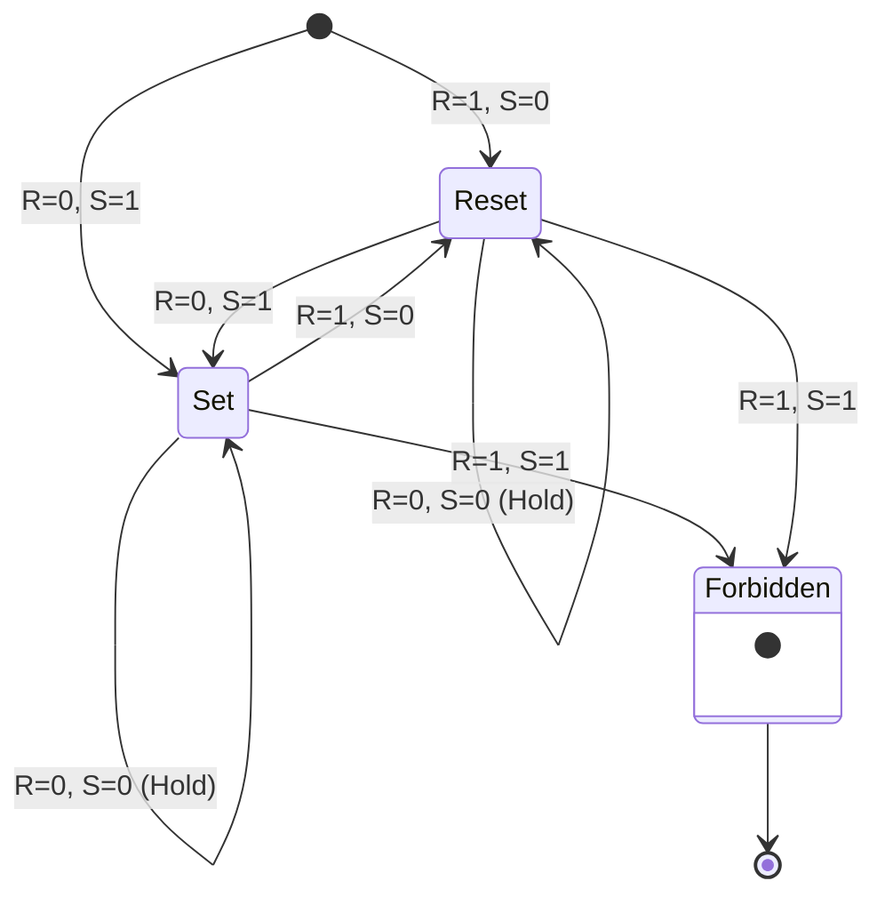
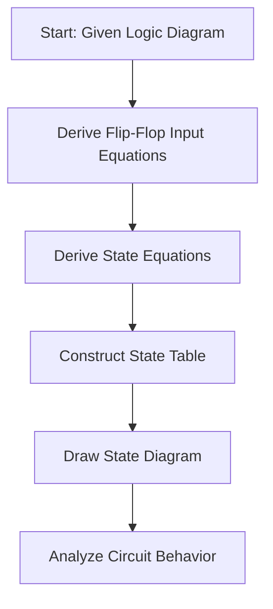
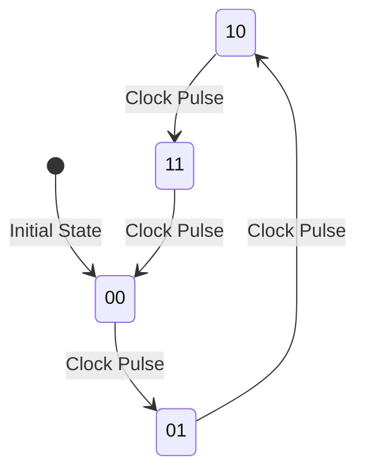

---
tags:
  - CCT1
  - CE
Topic: Seq. circuits, flip-flops, clocks
Semester: CCT1
Course: CE1
Module: K7
Course Date: N/A
Litterature:
  - Digital Design, 5th ed.
Created: 17-11-25
---
- - -
## Table of Contents

- [[#Sequential Logic and Storage Elements|Sequential Logic and Storage Elements]]
	- [[#Sequential Logic and Storage Elements#5.1 Synchronous Sequential Logic - Introduction|5.1 Synchronous Sequential Logic - Introduction]]
	- [[#Sequential Logic and Storage Elements#5.2 Sequential Circuits|5.2 Sequential Circuits]]
	- [[#Sequential Logic and Storage Elements#5.3 Storage Elements: Latches|5.3 Storage Elements: Latches]]
		- [[#5.3 Storage Elements: Latches#SR Latch|SR Latch]]
		- [[#5.3 Storage Elements: Latches#D Latch (Transparent Latch)|D Latch (Transparent Latch)]]
	- [[#Sequential Logic and Storage Elements#5.4 Storage Elements: Flip-Flops|5.4 Storage Elements: Flip-Flops]]
		- [[#5.4 Storage Elements: Flip-Flops#Edge-Triggered D Flip-flop|Edge-Triggered D Flip-flop]]
		- [[#5.4 Storage Elements: Flip-Flops#Other Flip-flops|Other Flip-flops]]
		- [[#5.4 Storage Elements: Flip-Flops#Characteristic Tables|Characteristic Tables]]
		- [[#5.4 Storage Elements: Flip-Flops#Characteristic Equations|Characteristic Equations]]
		- [[#5.4 Storage Elements: Flip-Flops#Direct Inputs|Direct Inputs]]
	- [[#Sequential Logic and Storage Elements#5.5 Analysis of Clocked Sequential Circuits|5.5 Analysis of Clocked Sequential Circuits]]
		- [[#5.5 Analysis of Clocked Sequential Circuits#State Equations|State Equations]]
			- [[#State Equations#Example|Example]]
		- [[#5.5 Analysis of Clocked Sequential Circuits#State Table|State Table]]
		- [[#5.5 Analysis of Clocked Sequential Circuits#State Diagram|State Diagram]]
		- [[#5.5 Analysis of Clocked Sequential Circuits#Flip-flop Input Equations|Flip-flop Input Equations]]
		- [[#5.5 Analysis of Clocked Sequential Circuits#Analysis with D flip-flops|Analysis with D flip-flops]]
		- [[#5.5 Analysis of Clocked Sequential Circuits#Analysis with JK flip-flops|Analysis with JK flip-flops]]
		- [[#5.5 Analysis of Clocked Sequential Circuits#Analysis with T flip-flops|Analysis with T flip-flops]]
		- [[#5.5 Analysis of Clocked Sequential Circuits#Mealy and Moore models of Finite State Machines|Mealy and Moore models of Finite State Machines]]
	- [[#Sequential Logic and Storage Elements#5.6 Capstone Example: $2$-Bit Up-Counter|5.6 Capstone Example: $2$-Bit Up-Counter]]

# Sequential Logic and Storage Elements

| Concept | Description | Key Components |
| :--- | :--- | :--- |
| Sequential Circuits | Circuits with storage elements that maintain state information | Combinational circuit + storage elements + feedback path |
| SR Latch | Basic storage element with Set and Reset inputs | Cross-coupled NOR or NAND gates |
| D Latch | Modified SR latch that eliminates forbidden state | Data input (D) + Enable input (En) |
| D Flip-Flop | Edge-triggered storage element that responds to clock transitions | Master-slave configuration or edge-triggered design |
| JK Flip-Flop | Flip-flop with Set, Reset, and Toggle capabilities | J and K inputs + clock |
| T Flip-Flop | Complementing flip-flop that toggles state on clock transitions | T input + clock |
| State Equations | Algebraic expressions that specify next state as a function of present state and inputs | Boolean expressions with time notation |
| State Table | Tabular representation of present state, inputs, next state, and outputs | Four-section table |
| State Diagram | Graphical representation of states and transitions | Circles (states) + directed lines (transitions) |
| Mealy Model | Finite state machine where output depends on present state and inputs | Output = f(present state, inputs) |
| Moore Model | Finite state machine where output depends only on present state | Output = f(present state) |

---

## 5.1 Synchronous Sequential Logic - Introduction

Virtually all consumer electronics have the ability to send, receive and modify digital information, represented in a binary format. This chapter examines the operation and control of devices utilizing memory; where it has thus far been combinational and thus without the ability to store data.

Sequential circuits act as storage elements, they can store and refer back to information at a later time.

---

## 5.2 Sequential Circuits

A sequential circuit consists of a combinational circuit to which storage elements are connected to form a feedback path. The binary info stored in these elements at any given time, determine the _state_ of the circuit at that time.

![[Pasted image 20251018195932.png]]

_Figure 5.2.1: Block diagram of a sequential circuit_

The outputs in a sequential circuit are a function not only of the inputs, but also of the present state of the storage elements. The next state of the storage elements is also a function of external inputs and the present state. Thus, **a sequential circuit is specified by a time sequence of inputs, outputs, and internal states**. In contrast, the outputs of combinational logic depend only on the present values of the inputs.

There're two main types of sequential circuits, classified as a function of the timing:
- _Synchronous_ circuits, are a system that can be defined from the knowledge of its signals at discrete instants of time
- _Asynchronous_ circuits depends upon the input signals at that instant of time _and_ the order in which the inputs change.

| Attribute | Synchronous Circuits | Asynchronous Circuits |
| :--- | :--- | :--- |
| **Timing Control** | Clock signal determines when changes occur | Changes occur based on signal propagation delays |
| **Stability** | High stability, predictable operation | Potential for instability due to race conditions |
| **Speed** | Limited by clock frequency | Can be faster (no clock delay) but less predictable |
| **Design Complexity** | More straightforward design methodology | More complex due to timing considerations |
| **Power Consumption** | Generally higher due to clock distribution | Often lower, no clock distribution network |

_Table 5.2.1: Comparison of Synchronous and Asynchronous Sequential Circuits_

> [!abstract] **Synchronous vs. Asynchronous: A Practical Analogy**
> 
> Think of a **synchronous** system like a well-rehearsed orchestra. Every musician (circuit component) plays their part at a specific beat dictated by the conductor's baton (the clock signal). The performance is predictable and coordinated.
> 
> An **asynchronous** system is like a jazz improvisation session. Musicians react to each other's cues in real-time. This can be faster and more flexible, but it's also prone to moments of discord (instability) if the timing isn't perfect.

Asynchronous storage elements are typically used in time-delay devices. The storage capability of a time-delay device varies with the time it takes for the signal to propagate through the device. In practice, the internal propagation delay of logic gates is of sufficient duration to produce the needed delay, so that actual delay units may not be necessary. In gate-type asynchronous systems, the storage elements consist of logic gates whose propagation delay provides the required storage. Thus, an asynchronous sequential circuit may be regarded as a combinational circuit with feedback. Because of the feedback among logic gates, an asynchronous sequential circuit may become unstable at times. The instability problem imposes many difficulties on the designer.

A synchronous circuit employs signals that affect memory at only discrete instants of time. Synchronization is achieved by a timing device called a clock generator, which provides a clock signal having the form of a periodic train of clock pulses. The clock signal is commonly denoted by the identifiers `clock` and `clk`. The clock pulses are distributed throughout the system in such a way that storage elements are affected only with the arrival of each pulse. In practice, the clock pulses determine when computational activity will occur within the circuit, and other signals (external inputs and otherwise) determine what changes will take place affecting the storage elements and the outputs.

![[Pasted image 20251018201909.png]]

_Figure 5.2.2: Clock pulse signal_

The storage elements used in sequential circuits are called flip-flops. A flip-flop is a binary storage device that can store $1$ bit of information; in a stable state the output of the flip-flip is either $1$ or $0$.

In a synchronous sequential circuit, a change in state of the flip-flops is initiated only by a clock pulse transition—for example, when the value of the clock signals changes from $0$ to $1$. When a clock pulse is not active, the feedback loop between the value stored in the flip-flop and the value formed at the input to the flip-flop is effectively broken because the flipflop outputs cannot change even if the outputs of the combinational circuit driving their inputs change in value. Thus, the transition from one state to the next occurs only at predetermined intervals dictated by the clock pulses.

---

## 5.3 Storage Elements: Latches

Storage elements in a digital circuit can maintain a binary state as long as power is delivered to the element. The major differences among various types of storage elements are in the number of inputs they possess and in the manner in which the inputs affect the binary state.

Storage elements that operate with signal levels (rather than signal transitions) are referred to as latches; those controlled by a clock transition are flip-flops. Latches are _level sensitive_ devices, while flip-flips are _edge sensitive_.

The two types are related, as latches are the basic circuit from which all flip-flops are constructed.

### SR Latch

The SR latch is comprised of $2$ cross-coupled NOR gates or $2$ cross-coupled NAND gates; with $2$ inputs _S_ and a reset _R_.

![[Pasted image 20251019115912.png]]

_Figure 5.3.1: SR latch with NOR gates_

![[Pasted image 20251019115923.png]]

_Figure 5.3.2: SR latch with NAND gates_

The state of the latch when _R_ is _**NOT**_ active is called the _set state_, the state when _R_ is active is called the _reset state_. The outputs _Q_ and $\overline{Q}$ are usually complements of each other.

When both inputs are = $1$, at the same time, a _"forbidden state"_ in which both output are the same ($0$) occurs rather than them being complementary. Consequently, in practical applications, setting both inputs to $1$ is forbidden.

> [!warning] **Common Pitfall: The Forbidden State**
> 
> In an SR latch (NOR-based), activating both S and R simultaneously ($S=1, R=1$) forces both outputs to $0$. When the inputs return to the hold state ($S=0, R=0$), the latch's final state becomes unpredictable. It will race to a stable state, but the outcome ($Q=0$ or $Q=1$) cannot be guaranteed. **Always design your control logic to prevent this condition.**

In a NOR SR latch:

- The first condition (_S_ = $1$, _R_ = $0$), is the action required by _S_ to put the circuit into _set state_.
- Removing the active _S_ input, leaves the circuit in the same _set state_.
- After both inputs return to $0$, it's then possible to shift the latch to the _reset state_ (_S_ = $0$, _R_ = $1$).
- If both _S_ and _R_ are $1$ both outputs go to $0$ producing an undefined next state.

In a NAND SR latch:

- Works similarly to the NOR latch, but starts with both inputs being $1$.
- The application of $0$ on _S_ causes _Q_ to go to $1$, putting it in _set state_. After both go back to $1$, putting $0$ on _R_ puts the latch into _reset state_.
- The _forbidden state_ on the NAND SR latch is when both inputs = $0$ at the same time.

_Figure 5.3.6: State diagram for an SR latch (NOR-based)_

> [!example] **Practical Application: Switch Debouncing**
> 
> Mechanical switches "bounce" when pressed, creating a series of rapid on/off signals instead of a clean transition. An SR latch can be used to "debounce" the switch. The switch is wired so that its two positions connect to the Set and Reset inputs. The latch's output will change state only once on the first contact and remain stable, ignoring the subsequent bounces.

The operation of the basic SR latch can be modified by providing an additional input signal that determines (controls) when the state of the latch can be changed by determining whether S and R (or S and R) can affect the circuit.

![[Pasted image 20251019123250.png]]

_Figure 5.3.3: SR latch with control input_

The outputs of the NAND gates stay at the logic-$1$ level as long as the enable signal remains at $0$. This is the quiescent condition for the SR latch. When the enable input goes to $1$, information from the S or R input is allowed to affect the latch. The set state is reached with _S_ = $1$, _R_ = $0$, and _En_ = $1$.

### D Latch (Transparent Latch)

One way to eliminate the forbidden condition of the SR latch, is to make it impossible for both inputs to be the same at the same time. This is done in the D latch.

This latch has $2$ inputs, _D_ (data) and _En_ (enable).

![[Pasted image 20251019123547.png]]

_Figure 5.3.4: D latch circuit diagram_

![[Pasted image 20251019123600.png]]

_Figure 5.3.5: D latch logic symbol_

The _D_ Input goes directly to the _S_ input of the SR component, and its complement is applied to the R input. This way the input to $S$ and/or $R$ will never be the same. The _En_ input acts as the control input turning the D component and subsequently the SR component on/off.

> [!tip] **Why "Transparent"?**
> 
> The D latch is often called a "transparent latch" because when the enable signal is high ($En=1$), the output $Q$ follows the input $D$ in real-time. It's as if there's a direct path (a transparent window) from $D$ to $Q$. When $En$ goes low, the window "closes," and the last value of $D$ is frozen at the output $Q$.

---

## 5.4 Storage Elements: Flip-Flops

The state of a latch or flip-flip is switched by a change in control input. This change is called a _trigger_.

Flip-flop circuits are constructed in such a way as to make them operate properly when they are part of a sequential circuit that employs a common clock. The problem with the latch is that it responds to a change in the level of a clock pulse.

![[Pasted image 20251019130531.png]]

_Figure 5.4.1: Latch response to clock pulse level_

The key to the proper operation of a flip-flop is to trigger it only during a signal transition. This can be accomplished by eliminating the feedback path that is inherent in the operation of the sequential circuit using latches.

There are two ways that a latch can be modified to form a flip-flop:

- One way is to employ two latches in a special configuration that isolates the output of the flip-flop and prevents it from being affected while the input to the flip-flop is changing.
- Another way is to produce a flip-flop that triggers only during a signal transition (from $0$ to $1$ or from $1$ to $0$) of the synchronizing signal (clock) and is disabled during the rest of the clock pulse.

### Edge-Triggered D Flip-flop

A D flip-flop is constructed with $2$ D latches and an inverter.

![[Pasted image 20251019130824.png]]

_Figure 5.4.2: Master-slave D flip-flop construction_

When the clock (`Clk`) is disabled (= $0$), the slave is enabled because of the inverter. And its output _Q_ is equal to the master output _Y_. When the clock becomes active (= $1$), the master gets input data _D_ while the slave is disabled, giving no output. Any input _D_ changes the output _Y_ of the master, but cannot affect the slave output _Q_. When the clock then returns to $0$ the master is again disabled and is isolated from any updates in _D_; at the same time re-enabling the slave and the value *Y* is transferred to the output of the flip-flop _Q_.

The behavior of the master–slave flip-flop just described dictates that:

1. The output may change only once,
2. A change in the output is triggered by the negative edge of the clock, and
3. The change may occur only during the clock's negative level.

It is also possible to design the circuit so that the flip-flop output changes on the positive edge of the clock. This happens in a flip-flop that has an additional inverter between the `Clk` terminal and the junction between the other inverter and input `En` of the master latch. Such a flip-flop is triggered with a negative pulse, so that the negative edge of the clock affects the master and the positive edge affects the slave and the output terminal.

![[Pasted image 20251019131539.png]]

_Figure 5.4.3: Positive edge-triggered D flip-flop_

Another construction of an edge-triggered D flip-flop uses $3$ SR latches. Two latches respond to the external _D_ (data) and _Clk_ (clock) inputs. With the third providing the outputs of the flip-flop.

The _S_ and _R_ inputs of the $3$rd output latch are maintained when `Clk` = $0$. This causes the output to remain in the present state:

- If D = $0$ when `Clk` becomes $1$, R changes to $0$. This causes the flip-flop to go to the reset state, making Q = $0$.
- If there is a change in the D input while `Clk` = $1$, terminal R remains at $0$ because Q is $0$. Thus, the flip-flop is locked out and is unresponsive to further changes in the input.
- Similarly, if D = $1$ when `Clk` goes from $0$ to $1$, S changes to $0$. This causes the circuit to go to the set state, making Q = $1$. Any change in D while `Clk` = $1$ does not affect the output.

In sum, when the input clock in the positive-edge-triggered flip-flop makes a positive transition, the value of D is transferred to Q. A negative transition of the clock (i.e., from $1$ to $0$) does not affect the output, nor is the output affected by changes in D when `Clk` is in the steady logic-$1$ level or the logic-$0$ level. Hence, this type of flip-flop responds to the transition from $0$ to $1$ and nothing else.

The timing of the response of a flip-flop to input data and to the clock must be taken into consideration when one is using edge-triggered flip-flops. There is a minimum time called _the setup time_ during which the D input must be maintained at a constant value prior to the occurrence of the clock transition. Similarly, there is a minimum time called _the hold time_ during which the D input must not change after the application of the positive transition of the clock.

The propagation delay time of the flip-flop is defined as the interval between the trigger edge and the stabilization of the output to a new state. These and other parameters are specified in manufacturers' data books for specific logic families.

![[Pasted image 20251019132431.png]]

_Figure 5.4.4: Timing parameters for edge-triggered D flip-flop_

> [!warning] **Common Pitfall: Setup and Hold Time Violations**
> 
> If the D input changes too close to the clock edge (violating setup time) or changes too soon after the clock edge (violating hold time), the flip-flop can enter a **metastable state**. In this state, the output may oscillate or settle at an intermediate voltage level between $0$ and $1$ for an unpredictable amount of time before resolving to a stable $0$ or $1$. This can cause system-wide failures. **Always ensure data is stable during the setup and hold windows specified in the datasheet.**

> [!example] **Practical Application: Data Registers**
> 
> A group of D flip-flops sharing a common clock signal forms a **register**. An $n$-bit register can store an $n$-bit binary number. When the clock pulse arrives, the $n$ data bits presented at the D inputs are simultaneously latched into the flip-flops and appear at the Q outputs. This is the fundamental building block for computer memory and temporary data storage within a CPU.

### Other Flip-flops

Two flip-flops less widely used in the design of digital systems are the JK and T flip-flops.

![[Pasted image 20251019152324.png]]

_Figure 5.4.5: JK flip-flop logic symbol_

There are three operations that can be performed with a flip-flop: Set it to $1$, reset it to $0$, or complement its output. With only a single input, the D flip-flop can set or reset the output, depending on the value of the D input immediately before the clock transition. Synchronized by a clock signal, the JK flip-flop has two inputs and performs all three operations.

![[Pasted image 20251019152345.png]]

_Figure 5.4.6: JK flip-flop circuit diagram_

![[Pasted image 20251019152401.png]]

_Figure 5.4.7: JK flip-flop logic symbol with inputs_

The T (toggle) flip-flop is a complementing flip-flop and can be obtained from a JK flip-flop when inputs J and K are tied together.

![[Pasted image 20251019152443.png]]

_Figure 5.4.8: T flip-flop from JK flip-flop_

![[Pasted image 20251019152450.png]]

_Figure 5.4.9: T flip-flop circuit diagram_

![[Pasted image 20251019152457.png]]

_Figure 5.4.10: T flip-flop logic symbol_

> [!example] **Practical Application: Counters**
> 
> A chain of T flip-flops, where the output of one flip-flop serves as the clock input for the next, forms a simple **binary counter**. If all T inputs are tied to logic $1$, each flip-flop will toggle on every falling edge of its clock signal. The first flip-flop toggles on every clock pulse, the second toggles every two pulses, the third every four, and so on. The combined outputs of the flip-flops represent a binary count that increments with each clock cycle.

### Characteristic Tables

A characteristic table defines the logical properties of a flip-flop by describing its operation in tabular form.

![[Pasted image 20251019152546.png]]

_Figure 5.4.11: Characteristic tables for SR, JK, D, and T flip-flops_

They define the next state (i.e., the state that results from a clock transition) as a function of the inputs and the present state. $Q(t)$ refers to the present state (i.e., the state present prior to the application of a clock edge). $Q(t + 1)$ is the next state one clock period later. Note that the clock edge input is not included in the characteristic table, but is implied to occur between times $t$ and $t + 1$.

- The characteristic table for the JK flip-flop shows that the next state is equal to the present state when inputs J and K are both equal to $0$. This condition can be expressed as $Q(t + 1) = Q(t)$, indicating that the clock produces no change of state. When K = $1$ and J = $0$, the clock resets the flip-flop and $Q(t + 1) = 0$. With J = $1$ and K = $0$, the flip-flop sets and $Q(t + 1) = 1$. When both J and K are equal to $1$, the next state changes to the complement of the present state, a transition that can be expressed as $Q(t + 1) = \overline{Q(t)}$.
    
- The next state of a D flip-flop is dependent only on the D input and is independent of the present state. This can be expressed as $Q(t + 1) = D$. It means that the next-state value is equal to the value of D.
    
- The characteristic table of the T flip-flop has only two conditions: When T = $0$, the clock edge does not change the state; when T = $1$, the clock edge complements the state of the flip-flop.
    

### Characteristic Equations

The logical properties of a flip-flop, as described in the characteristic table, can be expressed algebraically with a characteristic equation.

For a D flip-flop:

$$Q(t+1)=D$$

![[Pasted image 20251019152913.png]]

_Figure 5.4.12: Characteristic equation for D flip-flop_

Which states the value of input D in the present state.

For a JK flip-flop:
$$Q(t+1)=J\overline{Q}+\overline{K}Q$$

![[Pasted image 20251019152948.png]]

_Figure 5.4.13: Characteristic equation for JK flip-flop_

Where Q is the value of the flip-flop output prior to the application of the clock edge.

For T flip-flop:
$$Q(t+1)=T\overline{Q}+\overline{T}Q$$

![[Pasted image 20251019153027.png]]

_Figure 5.4.14: Characteristic equation for T flip-flop_

> [!info] **Understanding the Characteristic Equation**
> 
> The characteristic equation is a powerful tool. It's a compact mathematical formula that fully describes the flip-flop's behavior. For example, the JK equation `$Q(t+1) = J\overline{Q} + \overline{K}Q$` tells you exactly how to calculate the _next_ state ($Q(t+1)$) if you know the _current_ state ($Q$) and the current inputs ($J$ and $K$). This is essential for circuit analysis and design.

### Direct Inputs

Some flip-flops have asynchronous inputs that are used to force the flip-flop to a particular state independently of the clock. The input that sets the flip-flop to $1$ is called _preset_ or _direct set_. The input that clears the flip-flop to $0$ is _called clear_ or _direct reset_.

When power is turned on in a digital system, the state of the flip-flops is unknown. The direct inputs are useful for bringing all flip-flops in the system to a known starting state prior to the clocked operation.

![[Pasted image 20251019153228.png]]

_Figure 5.4.15: D flip-flop with direct reset_

![[Pasted image 20251019153235.png]]

_Figure 5.4.16: Function table for D flip-flop with direct reset_

The function table specifies the operation of the circuit. When R = $0$, the output is reset to $0$. This state is independent of the values of D or `Clk`. Normal clock operation can proceed only after the reset input goes to logic $1$. The clock at `Clk` is shown with an upward arrow to indicate that the flip-flop triggers on the positive edge of the clock. The value in D is transferred to Q with every positive-edge clock signal, provided that R = $1$.

| Flip-Flop Type | Number of Inputs | Key Operations | Primary Use Cases |
| :--- | :--- | :--- | :--- |
| **D Flip-Flop** | 1 (D) + Clock | Store D input on clock edge | Data registers, shift registers |
| **JK Flip-Flop** | 2 (J, K) + Clock | Set (J=1,K=0), Reset (J=0,K=1), Hold (J=0,K=0), Toggle (J=1,K=1) | Counters, general-purpose state machines |
| **T Flip-Flop** | 1 (T) + Clock | Hold (T=0), Toggle (T=1) | Simple binary counters |

_Table 5.4.1: Comparison of D, JK, and T Flip-Flops_

---

## 5.5 Analysis of Clocked Sequential Circuits

Analysis describes what a given circuit will do under certain operating conditions. The analysis of a sequential circuit consists of obtaining a table or a diagram for the time sequence of inputs, outputs, and internal states.

_Figure 5.5.0: Flowchart for the sequential circuit analysis process_

### State Equations

The behavior of a clocked sequential circuit can be described algebraically by means of state equations. A _state equation_ (also called a _transition equation_) specifies the next state, as a function of the present state and inputs.

#### Example

![[Pasted image 20251020115944.png]]

_Figure 5.5.1: Example sequential circuit for analysis_

The example circuit consists of two D flip-flops _A_ and _B_, input _x_ and output _y_. Since the _D_ input determines the value of the next state, it's possible to write a set of state equations:

![[Pasted image 20251020121027.png]]

_Figure 5.5.2: State equations for example circuit_

A state equation is an algebraic expression that specifies the condition for a flip-flop state transition. The left side of the equation, with ($t + 1$), denotes the next state of the flip-flop one clock edge later. The right side of the equation is a Boolean expression that specifies the present state and input conditions that make the next state equal to $1$.

Since all the variables in the Boolean expressions are a function of the present state, we can omit the designation ($t$) after each variable for convenience and can express the state equations in the more compact form.

![[Pasted image 20251020121130.png]]

_Figure 5.5.3: Compact form of state equations_

The Boolean expression(s) for the state equation can be derived directly from the gates that form the _combinational part_ of the sequential circuit. Since the _D_ value(s) of the combinational determine the next state.

![[Pasted image 20251020122500.png]]

_Figure 5.5.4: Combinational circuit for state equations_

Simply removing the _t_ symbol for the present state, leaves us with the boolean output at the present instant of time.

![[Pasted image 20251020122552.png]]

_Figure 5.5.5: Boolean expressions without time notation_

### State Table

Similarly to a truth table for combinational, the time sequence of inputs, outputs and states can be put into a _state table_. The table consists of four sections:

- Present state
- Input
- Future/Next State
- Output

The present-state shows the state of the flip-flop(s) at any given time _t_. The input gives the value of input _x_ for each possible state. The next-state shows the state of the flip-flop(s) one clock-cycle into the future at _t+1_. The output gives the value of output _y_ for each present state and condition.

![[Pasted image 20251020125331.png]]

_Figure 5.5.6: State table for example circuit_

### State Diagram

The information in a state table can be represented graphically.

![[Pasted image 20251020125819.png]]

_Figure 5.5.7: State diagram for example circuit_

A state is represented by a circle and the (clock-triggered) transitions between states are indicated by lines.

![[Pasted image 20251020125925.png]]

_Figure 5.5.8: State diagram notation_

### Flip-flop Input Equations

The logic diagram of a sequential circuit consists of flip-flops and gates. The interconnections among the gates form a combinational circuit and may be specified algebraically with Boolean expressions.

For example, the following input equation specifies an OR gate with inputs x and y connected to the D input of a flip-flop whose output is labeled with the symbol Q:

![[Pasted image 20251020130551.png]]

_Figure 5.5.9: Example flip-flop input equation_

A circuit consisting of two D flip-flops A and B, an input x, and an output y. The logic diagram of the circuit can be expressed algebraically with two flip-flop input equations and an output equation:

![[Pasted image 20251020130629.png]]

_Figure 5.5.10: Flip-flop input and output equations_

### Analysis with D flip-flops

![[Pasted image 20251020130708.png]]

_Figure 5.5.11: Example circuit with D flip-flops_

The `DA` symbol implies a D flip-flop with output A. The x and y variables are the inputs to the circuit. No output equations are given, which implies that the output comes from the output of the flip-flop.

The state table has one column for the present state of flip-flop A, two columns for the two inputs, and one column for the next state of A. The binary numbers under `Axy` are listed from $000$ through $111$. The next-state values are obtained from the state equation.

![[Pasted image 20251020130754.png]]

_Figure 5.5.12: State table for D flip-flop example_

The present state and the output can be either $0$ or $1$, as indicated by the number inside the circles. A slash on the directed lines is not needed, because there is no output from a combinational circuit. The two inputs can have four possible combinations for each state. Two input combinations during each state transition are separated by a comma to simplify the notation.

![[Pasted image 20251020130906.png]]

_Figure 5.5.13: State diagram for D flip-flop example_

### Analysis with JK flip-flops

A state table consists of four sections: present state, inputs, next state, and outputs. The first two are obtained by listing all binary combinations. The output section is determined from the output equations. The next-state values are evaluated from the state equations. For a D-type flip-flop, the state equation is the same as the input equation. When a flip-flop other than the D type is used, such as JK or T, it is necessary to refer to the corresponding characteristic table or characteristic equation to obtain the next-state values. We will illustrate the procedure first by using the characteristic table and again by using the characteristic equation.

![[Pasted image 20251020130920.png]]

_Figure 5.5.14: Example circuit with JK flip-flops_

![[Pasted image 20251020131014.png]]

_Figure 5.5.15: JK flip-flop characteristic table_

![[Pasted image 20251020130931.png]]

_Figure 5.5.16: State table for JK flip-flop example_

![[Pasted image 20251020130941.png]]

_Figure 5.5.17: State diagram for JK flip-flop example_

### Analysis with T flip-flops

The analysis of a sequential circuit with T flip-flops follows the same procedure outlined for JK flip-flops. The next-state values in the state table can be obtained by using either the characteristic table or equation.

![[Pasted image 20251020131050.png]]

_Figure 5.5.18: Example circuit with T flip-flops_

![[Pasted image 20251020131057.png]]

_Figure 5.5.19: T flip-flop characteristic table_

The values for y are obtained from the output equation. The values for the next state can be derived from the state equations by substituting `TA` and `TB` in the characteristic equations, yielding:

![[Pasted image 20251020131113.png]]

_Figure 5.5.20: State equations for T flip-flop example_

The next-state values for A and B in the state table are obtained from the expressions of the two state equations. As long as input x is equal to $1$, the circuit behaves as a binary counter with a sequence of states $00$, $01$, $10$, $11$, and back to $00$. When x = $0$, the circuit remains in the same state. Output y is equal to $1$ when the present state is $11$. Here, the output depends on the present state only and is independent of the input. The two values inside each circle and separated by a slash are for the present state and output.

### Mealy and Moore models of Finite State Machines

The most general model of a sequential circuit has inputs, outputs, and internal states. It is customary to distinguish between two models of sequential circuits: the Mealy model and the Moore model. They differ only in the way the output is generated.

![[Pasted image 20251020131234.png]]

_Figure 5.5.21: Mealy model block diagram_

![[Pasted image 20251020131242.png]]

_Figure 5.5.22: Moore model block diagram_

![[Pasted image 20251020131254.png]]

_Figure 5.5.23: State diagrams for Mealy and Moore models_

- In the Mealy model, the output is a function of both the present state and the input.
- In the Moore model, the output is a function of only the present state.
    - A circuit may have both types of outputs.

The two models of a sequential circuit are commonly referred to as a finite state machine, abbreviated FSM. The Mealy model of a sequential circuit is referred to as a Mealy FSM or Mealy machine. The Moore model is referred to as a Moore FSM or Moore machine.

_**In a Moore model, the outputs of the sequential circuit are synchronized with the clock, because they depend only on flip-flop outputs that are synchronized with the clock.**_

In a Mealy model, the outputs may change if the inputs change during the clock cycle. Moreover, the outputs may have momentary false values because of the delay encountered from the time that the inputs change and the time that the flip-flop outputs change. In order to synchronize a Mealy-type circuit, the inputs of the sequential circuit must be synchronized with the clock and the outputs must be sampled immediately before the clock edge. The inputs are changed at the inactive edge of the clock to ensure that the inputs to the flip-flops stabilize before the active edge of the clock occurs. Thus, the output of the Mealy machine is the value that is present immediately before the active edge of the clock.

> [!warning] **Common Pitfall: Output Glitches in Mealy Machines**
> 
> Because the output of a Mealy machine can change asynchronously with the input, it is susceptible to **glitches**. If the input changes while the combinational logic is settling, the output may momentarily produce an incorrect value. For reliable operation, Mealy outputs should be sampled only at the clock edge or passed through an output register (converting it to a Moore-like output).

| Attribute | Mealy Model | Moore Model |
| :--- | :--- | :--- |
| **Output Dependency** | Present state AND current inputs | Present state ONLY |
| **Output Timing** | Can change asynchronously with inputs | Changes synchronously with clock |
| **Number of States** | May require fewer states | May require more states |
| **Output Glitches** | Susceptible to glitches | Immune to glitches |
| **Response Speed** | Faster response to input changes | Slower response (next clock cycle) |

_Table 5.5.1: Comparison of Mealy and Moore FSM models_

---

## 5.6 Capstone Example: $2$-Bit Up-Counter

To tie together the concepts of storage elements, circuit analysis, and state machines, let's analyze a common and practical circuit: a $2$-bit synchronous up-counter. This circuit will count from $00_2$ ($0$) to $11_2$ ($3$) and then wrap around to $00_2$, incrementing its count on each clock pulse.

> [!example] **Example: Design and Analysis of a 2-Bit Up-Counter**
> 
> **Step 1: Define the Circuit's Goal and Components**
> 
> **Goal:** Create a circuit that counts from $0$ to $3$ in binary and repeats.
> 
> **Components:** We will use two T flip-flops.
> 
> - Flip-flop **A** will represent the **Least Significant Bit (LSB)**.
> - Flip-flop **B** will represent the **Most Significant Bit (MSB)**.
> - Both will share a common clock signal for synchronous operation.
> 
> It's a best practice to clearly label your flip-flops (e.g., A and B) and define what they represent (LSB, MSB) from the start. This prevents confusion when writing equations and tables. The output of the counter is the 2-bit number $Q_B Q_A$.
> 
> **Step 2: Determine the Flip-Flop Input Equations**
> 
> The behavior of a counter is determined by what controls the toggle (T) input of each flip-flop on each clock cycle.
> 
> - For the **LSB (A)** to count up every single time, it must toggle on every clock pulse. Therefore, its T input must always be logic $1$.
>     
>     $$T_A=1$$
>     
> - For the **MSB (B)** to toggle only when the LSB rolls over from $1$ to $0$, its T input should be connected to the output of the LSB. This way, B only toggles when A is $1$.
>     
>     $$T_B=Q_A$$
>     
> **Step 3: Derive the State Equations**
> 
> Now we use the T flip-flop's characteristic equation, $Q(t+1) = T\overline{Q} + \overline{T}Q$, to find the next-state logic for each flip-flop.
> 
> - **For Flip-Flop A:** Substitute $T_A = 1$ into the equation:
>     
>     $$A(t+1)=1 \cdot \overline{A} + \overline{1} \cdot A = \overline{A} + 0 \cdot A = \overline{A}$$
>     
>     This confirms our design: flip-flop A will always toggle (become the complement of its present state).
>     
> - **For Flip-Flop B:** Substitute $T_B = Q_A$ into the equation:
>     
>     $$B(t+1)=Q_A \cdot \overline{B} + \overline{Q_A} \cdot B$$
>     
>     This means: if A is $1$, B toggles. If A is $0$, B holds its present value.
> 
> **Step 4: Construct the State Table**
> 
> We evaluate the state equations for every possible present state ($00$, $01$, $10$, $11$) to build the state table.
> 
> Let's trace the transition from state $01$ ($A=1, B=0$):
> 
> - **Next state for A:** $A(t+1) = \overline{A} = \overline{1} = 0$.
> - **Next state for B:** $B(t+1) = Q_A \cdot \overline{B} + \overline{Q_A} \cdot B = 1 \cdot \overline{0} + \overline{1} \cdot 0 = 1 \cdot 1 + 0 \cdot 0 = 1$.
> - So, the next state is $10$.
> 
> Repeating this for all states gives us the complete table, shown in _Table 5.6.1_.
> 
> **Step 5: Draw the State Diagram**
> 
> The state diagram provides a visual representation of the counting sequence. Each circle is a state, and each arrow is a transition on the clock pulse.
> 
> The sequence $00 \rightarrow 01 \rightarrow 10 \rightarrow 11 \rightarrow 00$ is clearly visible in _Figure 5.6.1_, confirming the circuit's function as an up-counter.
> 
> Always check that the number of states in your diagram matches your expectations. A $2$-bit counter should have $2^2 = 4$ states. If you find more or fewer, you've made a mistake in your state equations or table.
> 
> **Conclusion of Analysis**
> 
> By following a systematic process of defining inputs, deriving state equations, building a state table, and drawing a state diagram, we have successfully analyzed and verified the functionality of a $2$-bit synchronous up-counter. This structured approach is fundamental to understanding and designing any sequential circuit.

| Present State $A(t) B(t)$ | Next State $A(t+1) B(t+1)$ |
| :--- | :--- |
| $0 0$ | $0 1$ |
| $0 1$ | $1 0$ |
| $1 0$ | $1 1$ |
| $1 1$ | $0 0$ |

_Table 5.6.1: State table for the 2-bit up-counter_

_Figure 5.6.1: State diagram for the $2$-bit up-counter_

| Present State (B,A) | Next State (B,A) | Decimal Value |
| :--- | :--- | :--- |
| 00 | 01 | 0 → 1 |
| 01 | 10 | 1 → 2 |
| 10 | 11 | 2 → 3 |
| 11 | 00 | 3 → 0 (overflow) |

_Table 5.6.2: State transitions with decimal values for the 2-bit up-counter_

---

> [!summary] Summary
> 
> Sequential circuits are digital circuits that incorporate storage elements, allowing them to maintain state information over time. Unlike combinational circuits, whose outputs depend only on current inputs, sequential circuits' outputs depend on both current inputs and the current state.
> 
> Storage elements are the fundamental building blocks of sequential circuits. Latches are level-sensitive devices that respond to input signal levels, while flip-flops are edge-sensitive devices that respond to signal transitions (clock edges).
> 
> The SR latch is the basic storage element, consisting of cross-coupled NOR or NAND gates. It has Set (S) and Reset (R) inputs, with a forbidden state when both inputs are activated simultaneously.
> 
> The D latch eliminates the forbidden state by ensuring the S and R inputs are never the same. It has Data (D) and Enable (En) inputs.
> 
> Flip-flops are constructed from latches and respond to clock transitions. The D flip-flop is the most common type, storing the value present at the D input at the clock edge.
> 
> Other flip-flop types include JK flip-flops (which can set, reset, or toggle based on input combinations) and T flip-flops (which toggle their state when the input is $1$).
> 
> Characteristic tables and equations define the logical behavior of flip-flops, describing how the next state depends on the current state and inputs.
> 
> Direct inputs (preset and clear) allow flip-flops to be forced to specific states independently of the clock, useful for initialization.
> 
> Sequential circuit analysis involves deriving state equations, state tables, and state diagrams to describe circuit behavior. State equations specify the next state as a function of the present state and inputs.
> 
> Two main models of finite state machines are the Mealy model (output depends on both present state and inputs) and the Moore model (output depends only on present state). Moore model outputs are synchronized with the clock, while Mealy model outputs may change asynchronously with input changes.
> 
> ### Key Takeaways
> 
> **Sequential Circuits (Section 5.2):**
> 
> - Sequential circuits use **feedback** and **storage elements** to maintain a **state**.
> - Outputs depend on both **current inputs** and the **present state**.
> - **Synchronous** circuits use a **clock** for stable, predictable timing, while **asynchronous** circuits are faster but can be unstable.
> 
> **Latches (Section 5.3):**
> 
> - **Latches** are **level-sensitive** and respond to the **level** of a control input.
> - The **SR latch** is the fundamental building block but has a **forbidden state**.
> - The **D latch** solves this by ensuring S and R are always complementary, making it "transparent" when enabled.
> 
> **Flip-Flops (Section 5.4):**
> 
> - **Flip-flops** are **edge-sensitive** and only change state on a **clock transition**.
> - The **D flip-flop** is the most common, used for **registers** and data storage.
> - **JK flip-flops** are versatile (set, reset, hold, toggle) and are used to build **counters**.
> - **T flip-flops** are specialized for **toggling** and are the core of ripple counters.
> - **Direct inputs** (preset/clear) provide **asynchronous control** for initialization.
> 
> **Sequential Circuit Analysis (Section 5.5):**
> 
> - Analysis involves deriving **state equations**, **state tables**, and **state diagrams** to model circuit behavior.
> - The process for analysis is systematic: start from the logic diagram and end with a behavioral description.
> - The type of flip-flop (D, JK, T) affects how the next state is determined from the input equations.
> - **Mealy** machines (output = state + input) can be faster but may have glitches. **Moore** machines (output = state only) are more predictable and synchronized with the clock.