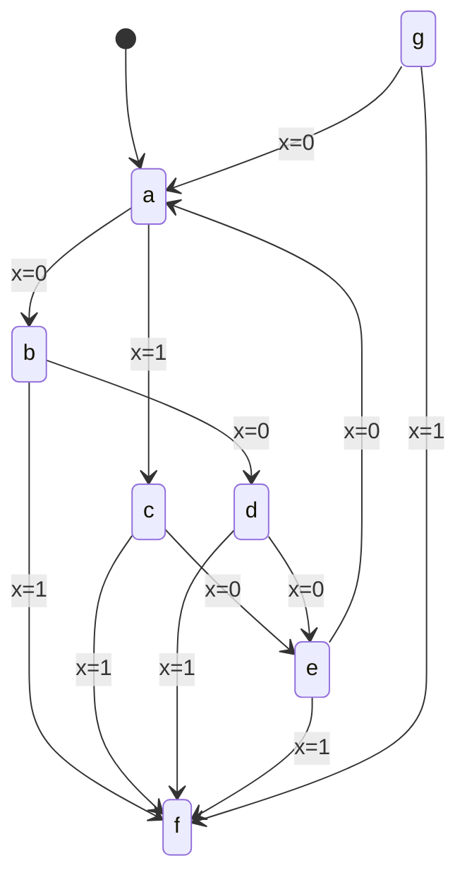
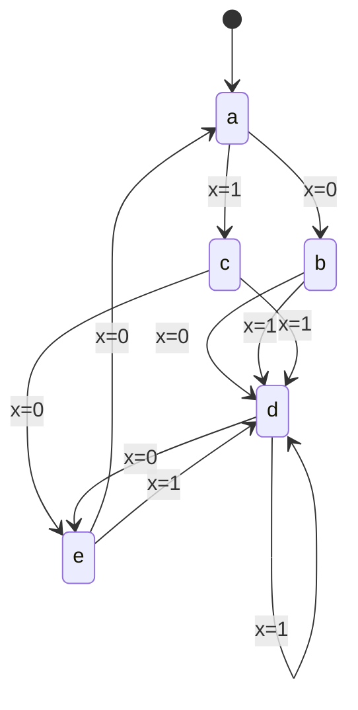
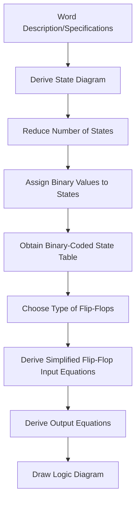

---
tags:
  - CCT1
  - CE
Topic: " state reduction, sequential circuit design"
Semester: CCT1
Course: CE1
Module: K8
Course Date: N/A
Litterature:
  - Digital Design, 5th ed.
Created: 17-11-25
---
- - - 
## Table of Contents

- [[#Sequential Circuit Design: State Reduction and Implementation|Sequential Circuit Design: State Reduction and Implementation]]
	- [[#Sequential Circuit Design: State Reduction and Implementation#5.7 State Reduction and Assignment|5.7 State Reduction and Assignment]]
		- [[#5.7 State Reduction and Assignment#State Reduction|State Reduction]]
		- [[#5.7 State Reduction and Assignment#State Assignment|State Assignment]]
	- [[#Sequential Circuit Design: State Reduction and Implementation#5.8 Design Procedure|5.8 Design Procedure]]
		- [[#5.8 Design Procedure#Synthesis Using D Flip-Flops|Synthesis Using D Flip-Flops]]
		- [[#5.8 Design Procedure#Excitation Tables|Excitation Tables]]
		- [[#5.8 Design Procedure#Synthesis Using JK Flip-Flops|Synthesis Using JK Flip-Flops]]
		- [[#5.8 Design Procedure#Synthesis Using T Flip-Flops|Synthesis Using T Flip-Flops]]

# Sequential Circuit Design: State Reduction and Implementation

| Concept | Description | Key Components/Techniques |
| :--- | :--- | :--- |
| State Reduction | Process of minimizing the number of states in a sequential circuit without altering input-output relationships | State equivalence identification, implication tables |
| State Assignment | Process of assigning binary values to states in a sequential circuit | Binary coding, don't-care conditions |
| Design Procedure | Systematic approach to designing sequential circuits from specifications | state diagram, state table, flip-flop selection, equation derivation |
| D Flip-Flop Synthesis | Design method using D flip-flops as storage elements | Direct mapping from state table to input equations |
| JK Flip-Flop Synthesis | Design method using JK flip-flops as storage elements | Excitation tables, input condition derivation |
| T Flip-Flop Synthesis | Design method using T flip-flops as storage elements | Complement property, counter applications |
| Excitation Tables | Tables showing required input conditions for flip-flop state transitions | Present state, next state, input conditions |

---

## 5.7 State Reduction and Assignment

### State Reduction

The reduction in the number of flip-flops in a sequential circuit is referred to as a _state reduction_ problem. An unpredictable effect of reducing the number of flip-flops is that the circuit may require more combinational gates to realize the next-state and output logic.

![[Pasted image 20251028085531.png]]
_Figure 5.7.1: Example of state reduction in a sequential circuit_

![[Pasted image 20251028085803.png]]
_Figure 5.7.2: State reduction example showing equivalent states_

In each column, we have the present state, input value, and output value. The next state is written on top of the next column.

With two sequential circuits, where one has fewer states than the other, if identical input sequences are applied and identical outputs occur for all of those sequences, then the two circuits are said to be equivalent, and one may replace the other.

The problem of state reduction is to find ways of reducing the number of states in a sequential circuit without altering the input-output relationships.

> [!info] **State Equivalence Definition**
> 
> "Two states are said to be equivalent if, for each member of the set of inputs, they give exactly the same output and send the circuit either to the same state or to an equivalent state."

When two states are equivalent, one of them can be removed without altering the input-output relationships.

> [!example] **Step-by-Step State Reduction**
> 
> Let's find equivalent states in the table above:
> 
> 1.  **Scan for identical transitions:** Look for rows where the present state is different, but for the same input, the next state and output are identical.
> 2.  **Identify candidates:** States $e$ and $g$ are perfect candidates. For input $x=0$, both go to state $a$ with output $0$. For input $x=1$, both go to state $f$ with output $1$.
> 3.  **Confirm equivalence:** Since for all possible inputs, $e$ and $g$ produce identical outputs and transition to the same next state, they are equivalent.
> 4.  **Eliminate redundancy:** We can remove state $g$ and replace every instance of it with $e$.

To reduce the number of states:

- First, we need a state table; since it's far more convenient to apply procedures for state reduction to a table, rather than a diagram.
- Going through the state table, we're searching for present states that go to the same next state and have the same output for both input combinations.

![[Pasted image 20251028112646.png]]
_Figure 5.7.3: State table showing equivalent states_

![[Pasted image 20251028112655.png]]
_Figure 5.7.4: Equivalent states e and g with same transitions_

The present states _e_ and _g_ satisfy these conditions, both going to _a_ and _f_, and have outputs _0_ and _1_ for x = 0 and x = 1.

![[Pasted image 20251028113613.png]]
_Figure 5.7.5: State reduction process removing redundant states_

Therefore, the states _e_ and _g_ are equivalent, and one of these states is redundant.

To remove a state:

- If the bottom row _g_ is removed, the state _g_ is replaced with _e_, each time _g_ occurs in the "next state".
- In _f_, the next state for x = 0, would be changed from _g_ to 'e', with the same outputs.
- But now _f_ and _d_ would be equivalent, both going to _e_ and _f_, with outputs _0_ and _1_.
- Thus _f_ can also be removed.
- Replacing the instances of _f_ with _d_ in the next state.

![[Pasted image 20251028114807.png]]
_Figure 5.7.6: Final reduced state table_

![[Pasted image 20251028135910.png]]
_Figure 5.7.7: Reduced state diagram_

_Figure 5.7.8: Visualizing state equivalence in the original state diagram_

_Figure 5.7.9: Final reduced state diagram_

Checking each pair of states for equivalence can be done systematically by means of a procedure that employs an implication table, which consists of squares, one for every suspected pair of possible equivalent states. By judicious use of the table, it is possible to determine all pairs of equivalent states in a state table.

The fact that a state table has been reduced to fewer states does not guarantee a saving in the number of flip-flops or the number of gates. In actual practice, designers may skip this step because target devices are rich in resources.

> [!tip] **Practical Consideration**
> 
> In modern digital design with FPGAs and ASICs, state reduction is often skipped because:
> 
> - Storage elements (flip-flops) are abundant
> - The complexity of additional combinational logic may outweigh the benefits
> - Automated synthesis tools can optimize the implementation regardless of the initial state count

### State Assignment

In order to design a sequential circuit with physical components, it is necessary to assign unique coded binary values to the states.

For a circuit with $m$ states, the codes must contain $n$ bits, where $2^n \geq m$.

Unused states are treated as don't-care conditions during the design, which usually helps in obtaining simpler circuits.

![[Pasted image 20251028141618.png]]
_Figure 5.7.10: State assignment example_

![[Pasted image 20251028141653.png]]
_Figure 5.7.11: Binary state assignment table_

> [!tip] **State Assignment Strategies**
> 
> Different state assignments can lead to significantly different circuit complexities:
> 
> - **Adjacent Assignment**: Assign codes to states that transition to each other such that they differ in only one bit (Gray code)
> - **One-Hot Assignment**: Use one flip-flop per state (only one is '1' at any time)
> - **Optimized Assignment**: Use algorithms to find assignments that minimize combinational logic

The binary form of the state table is used to derive the next-state and output-forming combinational logic part of the sequential circuit. The complexity of the combinational circuit depends on the binary state assignment chosen. Sometimes, the name transition table is used for a state table with a binary assignment. This convention distinguishes it from a state table with symbolic names for states. In this book, we use the same name for both types of state tables.

---

> [!note] **Section Summary: State Reduction**
> 
> - Only equivalent states can be merged
> - Equivalence requires identical outputs AND transitions to equivalent states
> - Modern tools often skip this step due to abundant flip-flops
> - Manual reduction is valuable for understanding and resource-constrained designs

## 5.8 Design Procedure

Design procedures or methodologies specify hardware that will implement a desired behavior. For small circuits, it may be done manually, but industry relies on automated synthesis tools for designing massive integrated circuits.

The sequential building block used by synthesis tools is a D flip-flop. Together with additional logic, it can implement the behavior of JK and T flip-flops.

Designers generally do not concern themselves with the type of flip-flop; rather, their focus is on correctly describing the sequential functionality that is to be implemented by a synthesis tool.

The design of a clocked sequential circuit starts from a set of specifications and culminates in a logic diagram or a list of Boolean functions from which the logic diagram can be obtained. In contrast to a combinational circuit, which is fully specified by a truth table, a sequential circuit requires a state table for its specification.

In a _synchronous_ sequential circuit, design of the circuit consists of choosing the flip-flops and then finding a combinational gate structure that, together, fulfills the stated specs. The number of flip-flops is determined from the number of states needed in the circuit and the choice of state assignment codes. The combinational circuit is derived from the state table by evaluating the flip-flop input equations and output equations.

The procedure for designing synchronous sequential circuits can be summarized by a list of recommended steps:

_Figure 5.8.1: Sequential circuit design procedure flowchart_

The first step is a critical part of the process, because succeeding steps depend on it. We will give one simple example to demonstrate how a state diagram is obtained from a word specification.

> [!tip] **Modern Design Approach**
> 
> In contemporary digital design:
> 
> - Steps 1-4 are often automated through HDL descriptions
> - Step 5 typically defaults to D flip-flops
> - Steps 6-8 are performed by synthesis tools
> - Manual design is still valuable for understanding and for small circuits

---

### Synthesis Using D Flip-Flops

Once a state diagram has been derived, the rest of the design follows a straightforward synthesis procedure.

To design a circuit by hand, we need to assign binary codes to the states and list a state table.

![[Pasted image 20251028143043.png]]
_Figure 5.8.2: Example state diagram for D flip-flop synthesis_

![[Pasted image 20251028143103.png]]
_Figure 5.8.3: State table for D flip-flop synthesis_

![[Pasted image 20251028143209.png]]
_Figure 5.8.4: Binary state assignment for D flip-flop synthesis_

![[Pasted image 20251028143130.png]]
_Figure 5.8.5: Binary state table for D flip-flop synthesis_

The flip-flop input equations can be obtained directly from the next-state columns of $A$ and $B$ expressed in sum-of-minterms. Where $A$ and $B$ are present-state values of the flip-flops, $x$ is the input, $DA$ and $DB$ are the input equations.

The minterms for output $y$ are obtained from the output column in the state table. The Boolean equations are simplified by means of the maps:

![[Pasted image 20251028143426.png]]
_Figure 5.8.6: Karnaugh maps for D flip-flop synthesis_

The advantage of designing with D flip-flops is that the Boolean equations describing the inputs to the flip-flops can be obtained directly from the state table. Software tools automatically infer and select the D-type flip-flop from a properly written HDL model.

> [!tip] **Why D Flip-Flops are Preferred in Automated Design**
> 
> - Direct mapping from state table to input equations
> - No need for excitation tables
> - Well-suited to HDL descriptions
> - Predictable timing characteristics

---

### Excitation Tables

> [!info] **Purpose of Excitation Tables**
> 
> Excitation tables bridge the gap between what state you _want_ (next state) and what inputs you _need_ to achieve it. They translate abstract state transitions into concrete input requirements for your chosen flip-flop type.

The design of a sequential circuit with flip-flops other than D type is complicated by the fact that the input equations for the circuit must be derived indirectly from the state table.

In order to determine the input equations for these flip-flops, it is necessary to derive a functional relationship between the state table and the input equations.

Each table has a column for the present state Q(t), a column for the next state Q(t+1), and a column for each input to show how the required transition is achieved. There are four possible transitions from the present state to the next state.

The required input conditions for each of the four transitions are derived from the information available in the characteristic table. The symbol X in the tables represents a don't-care condition, which means that it does not matter whether the input is 1 or 0.

![[Pasted image 20251028143650.png]]
_Figure 5.8.7: Excitation table for JK flip-flop_

> [!example] **How to Read a JK Excitation Table**
> 
> To find the required J and K inputs:
> 
> 1.  Locate your present state (Q) in the left column
> 2.  Find your desired next state (Q+1) in the top row
> 3.  The intersection gives you the required J and K values
> 4.  An 'X' means that input can be either 0 or 1 (don't-care)

For the JK flip-flop:

- When both present state and next state are 0, the J input must remain at 0 and the K input can be either 0 or 1.
- Similarly, when both present state and next state are 1, the K input must remain at 0, while the J input can be 0 or 1.
- If the flip-flop is to have a transition from a 0-state to a 1-state, J must be equal to 1, since the J input sets the flip-flop. However, input K may be either 0 or 1.
- For a transition from a 1-state to a 0-state, we must have K = 1, since the K input clears the flip-flop. However, the J input may be either 0 or 1.

| Transition | Present State | Next State | J Input | K Input |
| :--- | :--- | :--- | :--- | :--- |
| No Change | 0 | 0 | 0 | X |
| No Change | 1 | 1 | X | 0 |
| Set | 0 | 1 | 1 | X |
| Reset | 1 | 0 | X | 1 |

_Table 5.8.1: JK flip-flop transition requirements_

For the excitation table for a T flip-flop, from the characteristic table, we find that when input T = 1, the state of the flip-flop is complemented, and when T = 0, the state of the flip-flop remains unchanged. Therefore, when the state of the flip-flop must remain the same, the requirement is that T = 0. When the state of the flip-flop has to be complemented, T must equal 1.

| Transition | Present State | Next State | T Input |
| :--- | :--- | :--- | :--- |
| No Change | 0 | 0 | 0 |
| No Change | 1 | 1 | 0 |
| Complement | 0 | 1 | 1 |
| Complement | 1 | 0 | 1 |

_Table 5.8.2: T flip-flop transition requirements_

---

### Synthesis Using JK Flip-Flops

The manual synthesis procedure for sequential circuits with JK flip-flops is the same as with D flip-flops, except that the input equations must be evaluated from the present-state to next-state transition derived from the excitation table.

The flip-flop inputs are derived from the state table in conjunction with the excitation table for the JK flip-flop.

![[Pasted image 20251028144422.png]]
_Figure 5.8.8: State table for JK flip-flop synthesis_

> [!example] **Deriving JK Inputs for One Row**
> 
> Let's derive the inputs for flip-flop A in the first row of the state table:
> 
> 1.  **Identify the transition:** For flip-flop A, the present state is 0 and the next state is 0.
> 2.  **Consult the excitation table:** Looking at the JK excitation table for a "No Change" transition from 0, we find that $JA = 0$ and $KA = X$.
> 3.  **Apply to the circuit:** Therefore, for this row, the inputs are $JA = 0$ and $KA = X$.
> 4.  **Repeat for other flip-flops:** We then do the same for flip-flop B in the same row.

To do this conjunction, we look at the next-state of the state table, and see that for the current state A=0 and next-state A=0. Then we look in the excitation table for the flip-flop A for the same condition where the present state Q and the next state Q+1 are also both 0, we find that a transition of states from present state 0 to next state 0 requires that input J be 0 and input K be a don't-care. So 0 and X are entered in the first row under $JA$ and $KA$, respectively.

Since the first row also shows a transition for flip-flop B from 0 in the present state to 0 in the next state, 0 and X are inserted into the first row under $JB$ and $KB$, respectively.

The second row of the table shows a transition for flip-flop B from 0 in the present state to 1 in the next state. From the excitation table, we find that a transition from 0 to 1 requires that J be 1 and K be a don't-care, so 1 and X are copied into the second row under $JB$ and $KB$, respectively.

The process is continued for each row in the table and for each flip-flop, with the input conditions from the excitation table copied into the proper row of the particular flip-flop being considered.

![[Pasted image 20251028145057.png]]
_Figure 5.8.9: JK flip-flop input equations_

![[Pasted image 20251028145108.png]]
_Figure 5.8.10: Simplified JK flip-flop input equations_

---

### Synthesis Using T Flip-Flops

![[Pasted image 20251028145151.png]]
_Figure 5.8.11: State table for T flip-flop synthesis_

An $n$-bit binary counter consists of $n$ flip-flops that can count in binary from 0 to $2^n-1$. Remember that state transitions in clocked sequential circuits are initiated by a clock edge; flip-flops remain in their present states if no clock is applied. For that reason, the clock does not appear explicitly as an input variable in a state diagram or state table. Binary counters are constructed most efficiently with T flip-flops because of their complement property.

The flip-flop excitation for the T inputs is derived from the excitation table of the T flip-flop and by inspection of the state transition of the present state to the next state. The next state of a counter depends entirely on its present state, and the state transition occurs every time the clock goes through a transition.

![[Pasted image 20251028150502.png]]
_Figure 5.8.12: T flip-flop input equations for binary counter_

As an illustration, consider the flip-flop input entries for row 001. The present state here is 001 and the next state is 010, which is the next count in the sequence. Comparing these two counts, we note that $A2$ goes from 0 to 0, so $TA2$ is marked with 0 because flip-flop $A2$ must not change when a clock occurs. Also, $A1$ goes from 0 to 1, so $TA1$ is marked with a 1 because this flip-flop must be complemented in the next clock edge. Similarly, $A0$ goes from 1 to 0, indicating that it must be complemented, so $TA0$ is marked with a 1. The last row, with present state 111, is compared with the first count 000, which is its next state. Going from all 1's to all 0's requires that all three flip-flops be complemented.

The flip-flop input equations are simplified in the maps: Note that $TA0$ has 1's in all eight minterms because the least significant bit of the counter is complemented with each count. A Boolean function that includes all minterms defines a constant value of 1. The input equations listed under each map specify the combinational part of the counter.

![[Pasted image 20251028150450.png]]
_Figure 5.8.13: Karnaugh maps for T flip-flop synthesis_

![[Pasted image 20251028150513.png]]
_Figure 5.8.14: Final T flip-flop binary counter implementation_

For simplicity, reset signal is not shown, but be aware that every design should include a reset signal.

---

> [!warning] **Common Pitfalls to Avoid**
> 
> - **Setup/Hold Time Violations:** If the input to a flip-flop changes too close to the clock edge, the flip-flop can enter a metastable state, leading to unpredictable output. Always consult the datasheet for $t_{setup}$ and $t_{hold}$ requirements.
> - **Incomplete State Assignment:** Forgetting to define the behavior for unused states ($2^n - m$ states) can lead to unpredictable behavior if the circuit accidentally enters one. Treat them as don't-cares to simplify logic.
>     
> - **Mealy Machine Glitches:** Outputs in a Mealy machine can change asynchronously with inputs, causing momentary false values (glitches). Synchronize inputs or add an output register to create a Moore-like output for critical signals.
>     
> - **Missing Reset Circuit:** Every practical sequential circuit needs a reset mechanism (asynchronous preset/clear) to initialize to a known state on power-up.
>     

> [!tip] **Simple Optimization Techniques**
> 
> - **Karnaugh Map Simplification:** After deriving the flip-flop input and output equations, use Karnaugh maps or Boolean algebra to find the minimal sum-of-products implementation.
>     
> - **State Assignment Optimization:** The choice of binary codes for states affects the complexity of the combinational logic. Try assigning codes to states that transition to each other such that they differ in only one bit (Gray code) to minimize logic.
>     
> - **Factoring Common Terms:** Look for common Boolean terms in the flip-flop input equations. Factoring them out can reduce gate count. For example, if $DA = A'x + B'x$, it can be rewritten as $DA = (A' + B')x$.
>     
> - **Choosing the Right Flip-Flop:** While D flip-flops are general-purpose, using T flip-flops for counters or JK flip-flops for toggle-heavy logic can result in a simpler overall design.
>     

| Flip-Flop Type | Best For... | Pros | Cons |
| :--- | :--- | :--- | :--- |
| **D Flip-Flop** | General-purpose, data storage, HDL synthesis | Direct mapping from state table, predictable timing, simple to use | Can require more logic for toggle/set/reset functions compared to JK/T |
| **JK Flip-Flop** | Versatile control, counters, state machines with set/reset/toggle needs | Very flexible (set, reset, hold, toggle), can reduce logic for complex transitions | Requires excitation table for manual design, more inputs to control |
| **T Flip-Flop** | Simple binary counters, ripple counters | Extremely efficient for counting/complementing operations, minimal control logic | Limited functionality (only hold or toggle), not as versatile as JK |

_Table 5.8.3: Comparison of D, JK, and T Flip-Flops_

---

> [!summary] Summary
> 
> State reduction is the process of minimizing the number of states in a sequential circuit without altering input-output relationships. Two states are equivalent if they produce the same outputs for all input sequences and transition to equivalent states.
> 
> State assignment involves assigning binary codes to states in a sequential circuit. For a circuit with $m$ states, $n$ flip-flops are needed where $2^n \geq m$. Unused states can be treated as don't-care conditions.
> 
> The design procedure for sequential circuits includes: deriving a state diagram, reducing states if necessary, assigning binary values to states, obtaining a binary-coded state table, choosing flip-flop types, deriving simplified input and output equations, and drawing the logic diagram.
> 
> D flip-flops offer the most straightforward synthesis approach, with input equations directly obtained from the state table. This makes them preferred for automated design tools.
> 
> JK flip-flops require excitation tables to determine input conditions for state transitions. The JK flip-flop is versatile, capable of set, reset, hold, and toggle operations.
> 
> T flip-flops are ideal for counter applications due to their complement property. Binary counters are most efficiently implemented with T flip-flops.
> 
> Excitation tables show the required input conditions for flip-flop state transitions. For JK flip-flops, J=1 sets the flip-flop, K=1 resets it, and J=K=0 holds the state. For T flip-flops, T=1 complements the state and T=0 holds it.