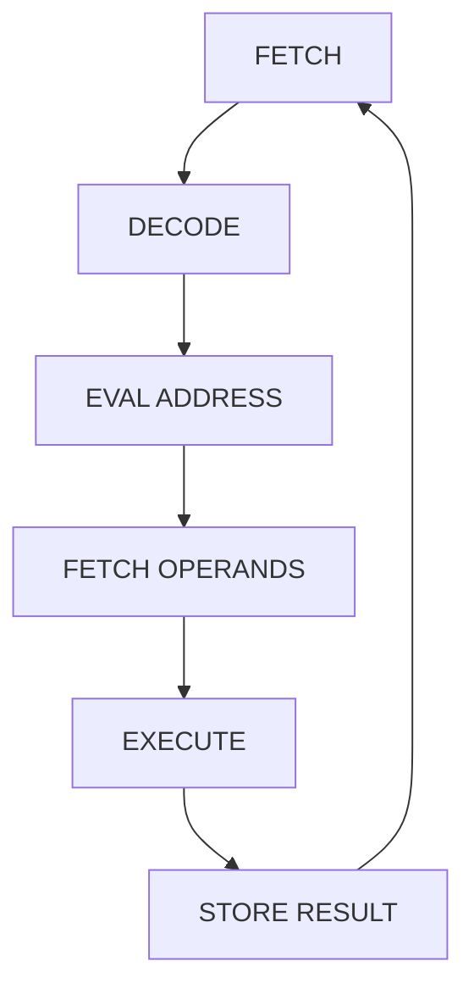
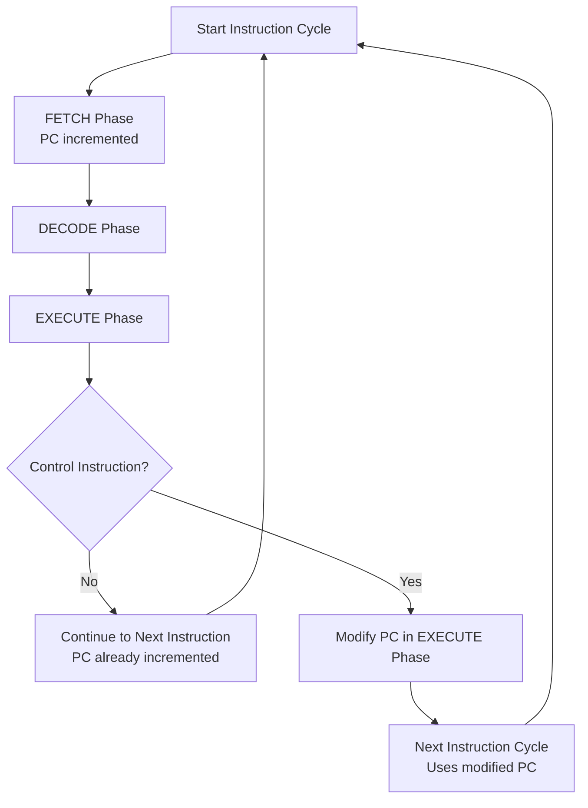
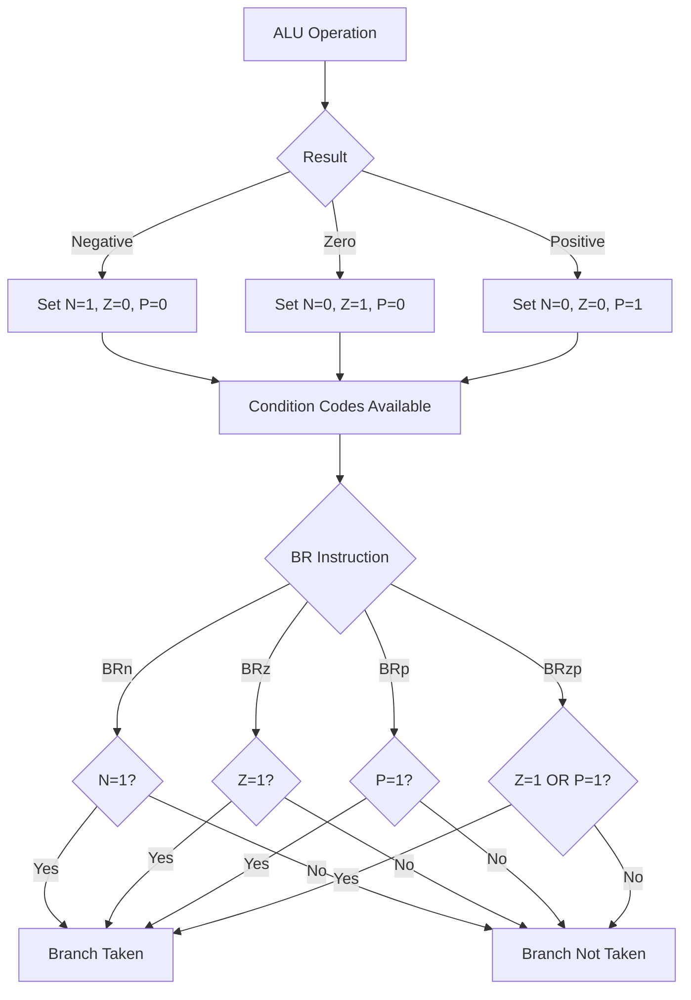
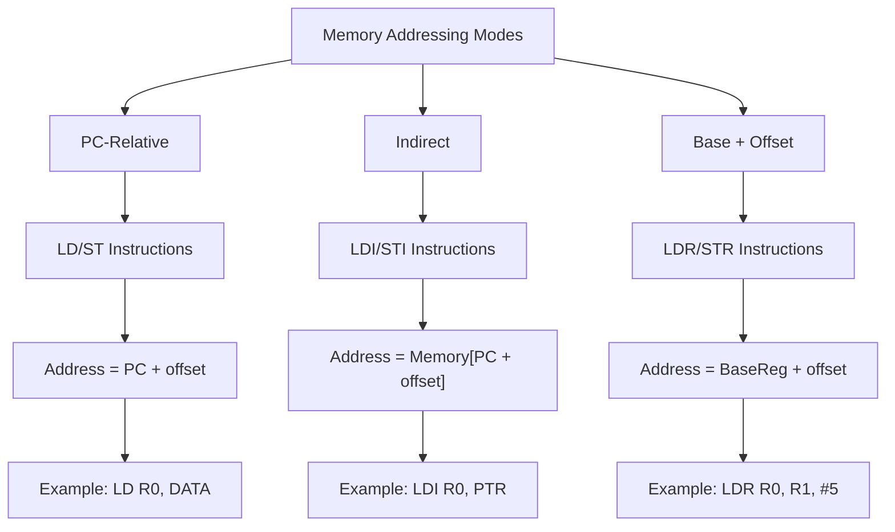
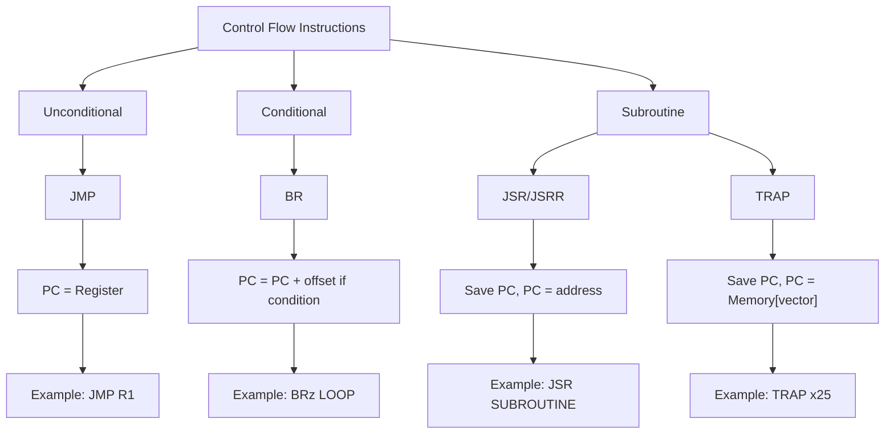

---
tags:
  - CCT1
  - CE
  - C
Topic: The von Neumann Model
Semester: CCT1
Course: CE1
Module: K9
Course Date: 05-11-25
Litterature:
  - "Introduction\rto Computing\rSystems, 3rd Edition"
Created: 03-11-25
---
- - -
## Table of Contents

- [[#LC-3 Computer Architecture and Programming|LC-3 Computer Architecture and Programming]]
	- [[#LC-3 Computer Architecture and Programming#Quick Reference Table|Quick Reference Table]]
	- [[#LC-3 Computer Architecture and Programming#4.1 Basic Components|4.1 Basic Components]]
		- [[#4.1 Basic Components#Memory|Memory]]
		- [[#4.1 Basic Components#Processing Unit|Processing Unit]]
		- [[#4.1 Basic Components#I/O|I/O]]
		- [[#4.1 Basic Components#Control Unit|Control Unit]]
	- [[#LC-3 Computer Architecture and Programming#4.2 The LC-3: An Example von Neumann Machine|4.2 The LC-3: An Example von Neumann Machine]]
		- [[#4.2 The LC-3: An Example von Neumann Machine#Memory|Memory]]
		- [[#4.2 The LC-3: An Example von Neumann Machine#I/O|I/O]]
		- [[#4.2 The LC-3: An Example von Neumann Machine#The Processing Unit|The Processing Unit]]
		- [[#4.2 The LC-3: An Example von Neumann Machine#The Control Unit|The Control Unit]]
	- [[#LC-3 Computer Architecture and Programming#4.3 Instruction Processing|4.3 Instruction Processing]]
		- [[#4.3 Instruction Processing#The Instruction|The Instruction]]
			- [[#The Instruction#Operate|Operate]]
			- [[#The Instruction#Data Movement|Data Movement]]
			- [[#The Instruction#Control|Control]]
		- [[#4.3 Instruction Processing#The Instruction Cycle (not the clk cycle)|The Instruction Cycle (not the clk cycle)]]
			- [[#The Instruction Cycle (not the clk cycle)#FETCH|FETCH]]
			- [[#The Instruction Cycle (not the clk cycle)#DECODE|DECODE]]
			- [[#The Instruction Cycle (not the clk cycle)#EVAL ADDRESS|EVAL ADDRESS]]
			- [[#The Instruction Cycle (not the clk cycle)#FETCH OPERANDS|FETCH OPERANDS]]
			- [[#The Instruction Cycle (not the clk cycle)#EXECUTE|EXECUTE]]
			- [[#The Instruction Cycle (not the clk cycle)#STORE RESULT|STORE RESULT]]
		- [[#4.3 Instruction Processing#Changing the Sequence of Execution|Changing the Sequence of Execution]]
			- [[#Changing the Sequence of Execution#How Control Instructions Work: The Program Counter (PC)|How Control Instructions Work: The Program Counter (PC)]]
		- [[#4.3 Instruction Processing#Control of the Instruction Cycle|Control of the Instruction Cycle]]
		- [[#4.3 Instruction Processing#Skipping Sequential Instruction|Skipping Sequential Instruction]]
		- [[#4.3 Instruction Processing#Halting the Computer (the TRAP Instruction)|Halting the Computer (the TRAP Instruction)]]
	- [[#LC-3 Computer Architecture and Programming#4.4 Our First Program: A Multiplication Algorithm|4.4 Our First Program: A Multiplication Algorithm]]
		- [[#4.4 Our First Program: A Multiplication Algorithm#The Algorithm|The Algorithm]]
			- [[#The Algorithm#Outside the Algorithm|Outside the Algorithm]]
			- [[#The Algorithm#The Plan|The Plan]]
			- [[#The Algorithm#Execution|Execution]]
	- [[#LC-3 Computer Architecture and Programming#Additional Worked Examples|Additional Worked Examples]]
		- [[#Additional Worked Examples#PC-Relative Addressing Example|PC-Relative Addressing Example]]
		- [[#Additional Worked Examples#Conditional Branching Example|Conditional Branching Example]]
		- [[#Additional Worked Examples#TRAP Instruction Example|TRAP Instruction Example]]
		- [[#Additional Worked Examples#Memory Addressing Modes Comparison|Memory Addressing Modes Comparison]]
		- [[#Additional Worked Examples#Control Flow Instructions Comparison|Control Flow Instructions Comparison]]
	- [[#LC-3 Computer Architecture and Programming#Common Pitfalls|Common Pitfalls]]
		- [[#Common Pitfalls#PC-Relative Addressing Pitfalls|PC-Relative Addressing Pitfalls]]
		- [[#Common Pitfalls#Register Initialization Pitfalls|Register Initialization Pitfalls]]
		- [[#Common Pitfalls#Condition Code Pitfalls|Condition Code Pitfalls]]
		- [[#Common Pitfalls#Loop Control Pitfalls|Loop Control Pitfalls]]


# LC-3 Computer Architecture and Programming

## Quick Reference Table

| Category          | Opcode (Hex) | Opcode (Binary) | Mnemonic   | Description                                 | Sets Condition Codes? |
| :---------------- | :----------- | :-------------- | :--------- | :------------------------------------------ | :-------------------- |
| **Operate**       | `0x1`        | `0001`          | `ADD`      | Adds source operands and stores result      | Yes                   |
|                   | `0x5`        | `0101`          | `AND`      | Performs bitwise AND on source operands     | Yes                   |
|                   | `0x9`        | `1001`          | `NOT`      | Performs bitwise NOT on source operand      | Yes                   |
| **Data Movement** | `0x2`        | `0010`          | `LD`       | Loads data from memory (PC-relative)        | Yes                   |
|                   | `0xA`        | `1010`          | `LDI`      | Loads data indirectly from memory           | Yes                   |
|                   | `0x6`        | `0110`          | `LDR`      | Loads data from memory (Base+offset)        | Yes                   |
|                   | `0xE`        | `1110`          | `LEA`      | Loads effective address into register       | Yes                   |
|                   | `0x3`        | `0011`          | `ST`       | Stores data to memory (PC-relative)         | No                    |
|                   | `0xB`        | `1011`          | `STI`      | Stores data indirectly to memory            | No                    |
|                   | `0x7`        | `0111`          | `STR`      | Stores data to memory (Base+offset)         | No                    |
| **Control**       | `0x0`        | `0000`          | `BR`       | Conditional branch based on condition codes | No                    |
|                   | `0xC`        | `1100`          | `JMP`      | Unconditional jump to address in register   | No                    |
|                   | `0xC`        | `1100`          | `JSR/JSRR` | Jump to subroutine                          | No                    |
|                   | `0xF`        | `1111`          | `TRAP`     | System call/service call                    | No                    |
|                   | `0x8`        | `1000`          | `RTI`      | Return from interrupt                       | No                    |

---

## 4.1 Basic Components

> [!info] 
> John von Neumann proposed a fundamental model of a computer for processing computer programs in 1946.

A computer program consists of a set of instructions, each specifying a well-defined piece of work for computer to carry out. The _instruction_ is the smallest piece of work specified in a computer program. That is, the computer either carries out the work specified by an instruction or it does not. The computer does not have the luxury of carrying out only _a piece_ of an instruction.

The von Neumann model consists of five parts:

1. [[#Memory]]
2. [[#Processing Unit]]
3. [[#I/O|Input]]
4. [[#I/O|Output]]
5. [[#Control Unit]]

![[Pasted image 20251103091355.png]]

_Figure 4.1.1: The von Neumann model of a computer showing the five basic components._

### Memory

One of today's computer systems is $2^{34}$ by 8 bits. That is, a typical memory in today's world of computers consists of $2^{34}$ distinct memory locations, each of which is capable of storing eight bits of information.

We say that such a memory has an address space of $2^{34}$ uniquely identifiable locations, and an addressability of eight bits. We refer to such a memory as a 16-gigabyte memory (abbreviated, 16 GB). The "16 giga" refers to $2^4$ locations, and "byte" refers to eight bits stored in each location.

> [!info] 
> The term is 16 _giga_ because 16 is $2^4$ and _giga_ is the term we use to represent $2^{30}$, which is approximately one billion; $2^4$ times $2^{30}$ = $2^{34}$. A _byte_ is the word we use to describe eight bits, much the way we use the word _gallon_ to describe four quarts.

To read the contents of a memory cell/location, we first place the address of that location in the memory's address register (MAR). The information stored in the location having that address will be placed in the memory's data register (MDR).

![[Pasted image 20251103093249.png]]

_Figure 4.1.2: Memory read operation showing the relationship between MAR, MDR, and memory._

To write (or store) a value in a memory location, we first write the address of the memory location in MAR, and the value to be stored in MDR. The information contained in MDR will be written into the memory location whose address is in MAR.

![[Pasted image 20251105135807.png]] ![[Pasted image 20251105135824.png]] ![[Pasted image 20251105135841.png]]

> [!warning] Note 
> The value stored _**in**_ a location can be changed, but the location's _**memory address**_ remains unchanged.

### Processing Unit

> [!info] The processing unit 
> The actual processing of information in a computer is carried out by the processing unit.

The processing unit in a modern computer can consist of many sophisticated complex functional units, each performing one particular operation (divide, square root, etc.).

The simplest processing unit, and the one normally thought of when discussing the basic von Neumann model, is the **ALU**. _ALU_ is the abbreviation for _Arithmetic and Logic Unit_, so called because it is usually capable of performing basic arithmetic functions (like ADD and SUBTRACT) and basic logic operations (like bitwise AND, OR, and NOT).

The ALU normally processes data elements of a fixed size referred to as _the word length_ of the computer. These data elements are called _words_.

> [!example] 
> To perform ADD, the ALU receives two words as inputs and produces a single word (the sum) as output. Each ISA has its own word length, depending on the intended use of the computer.

> [!info] Micro- & Central-Processing-Units (CPUs) today 
> Most microprocessors and CPUs today, used in Personal Computers (PCs) and cell phones, have a _word length_ of 64 bits. In the LC-3, the ALU's word length is 16 bits.

It is almost always the case that a computer provides some small amount of storage very close to the ALU to allow results to be temporarily stored if they will be needed to produce additional results in the near future.

> [!example] If a computer is to calculate $(A+B) \cdot C$, 
> it could store the result of $A+B$ in memory, and then subsequently read it in order to multiply that result by $C$. However, the time it takes to access memory is long compared to the time it takes to perform ADD or MULTIPLY. Therefore, we have temporary storage for storing the result of $A+B$ in order to avoid the much longer access time that would be necessary when it came time to multiply.

The most common form of temporary storage is a set of registers. Typically, the size of each register is identical to the size of values processed by the ALU; that is, they each contain one word. The LC-3 has eight registers (R0, R1, … R7), each containing 1 word length of 16 bits. Current microprocessors typically contain 32 registers, each consisting of 32 or 64 bits, depending on the architecture. These serve the same purpose as the eight 16-bit registers in the LC-3.

### I/O

> [!info] I is for _Input_ 
> In order for a computer to process information, the information must get into the computer.

> [!info] O is for _Output_ 
> In order to use the results of that processing, those results must be displayed in some fashion outside the computer.

Many devices exist for the purposes of input and output. They are generically referred to as _peripherals_ because they are in some sense "accessories" to the processing function.

- _In the LC-3_, it uses the two most basic input and output devices. For input, we will use the keyboard; for output, we will use the monitor.

### Control Unit

> [!info] 
> The control unit is like the conductor of an orchestra; it is in charge of making all the other parts of the computer play together.

When we describe the step-by-step process of executing a computer program, it is the control unit that keeps track of both where we are within the process of executing the program and where we are in the process of executing each instruction. To keep track of which instruction is to be processed next, the control unit has a register that contains the next instruction's address.

---

## 4.2 The LC-3: An Example von Neumann Machine

> [!info] 
> The Little Computer 3 (LC-3) is a simplified, educational computer architecture. It's _**not**_ a physical machine you can buy, but rather a conceptual model and a software simulator used to teach the fundamentals of computer organization and architecture.

![[Pasted image 20251103104602.png]]

_Figure 4.2.1: The LC-3 architecture showing memory, processing unit, control unit, and I/O components._

### Memory

Consists of storage elements, along with the Memory Address Register (MAR) for addressing individual locations and the Memory Data Register (MDR) for holding the contents of a memory location on its way to/from storage.

![[Pasted image 20251105135929.png]]

_Figure 4.2.2: LC-3 memory organization showing MAR and MDR._

### I/O

Consists of a keyboard and a monitor.

- The simplest keyboard requires two registers: a keyboard data register (KBDR) for holding the ASCII codes of keys struck and a keyboard status register (KBSR) for maintaining status information about keys struck.
- The simplest monitor also requires two registers: a display data register (DDR) for holding the ASCII code of something to be displayed on the screen and a display status register (DSR) for maintaining associated status information.

![[Pasted image 20251105135942.png]] ![[Pasted image 20251105135954.png]]

_Figure 4.2.3: LC-3 I/O device registers._

### The Processing Unit

Consists of a functional unit (ALU) that performs arithmetic and logic operations and eight registers (R0, … R7) for storing temporary values that will be needed in the near future as operands for subsequent instructions.

![[Pasted image 20251105140013.png]]

_Figure 4.2.4: LC-3 processing unit with ALU and registers._

### The Control Unit

Consists of all the structures needed to manage the processing that is carried out by the computer.

![[Pasted image 20251105140033.png]]

_Figure 4.2.5: LC-3 control unit components._

---

## 4.3 Instruction Processing

> [!info] 
> The central idea in the von Neumann model of computer processing is that the program and data are both stored as sequences of bits in the computer's memory, and the program is executed one instruction at a time under the direction of the control unit.

### The Instruction

The most basic unit of computer processing is the _instruction_. It is made up of two parts:

1. The _opcode_
    - The part of an instruction that specifies the operation (e.g., `ADD`, `LD`).
2. The _operands_
    - The data or location of data that an instruction operates on.

![[Pasted image 20251105140322.png]]

_Figure 4.3.1: Basic structure of an LC-3 instruction._

> [!info]- LC-3 Opcodes
> 
> |Instruction|Binary Opcode|Hex Opcode|
> |---|---|---|
> |BR|`0000`|`0x0`|
> |ADD|`0001`|`0x1`|
> |LD|`0010`|`0x2`|
> |ST|`0011`|`0x3`|
> |JSR/JSRR|`0100`|`0x4`|
> |AND|`0101`|`0x5`|
> |LDR|`0110`|`0x6`|
> |STR|`0111`|`0x7`|
> |RTI|`1000`|`0x8`|
> |NOT|`1001`|`0x9`|
> |LDI|`1010`|`0xA`|
> |STI|`1011`|`0xB`|
> |JMP|`1100`|`0xC`|
> |Reserved|`1101`|`0xD`|
> |LEA|`1110`|`0xE`|
> |TRAP|`1111`|`0xF`|

_Table 4.3.1: LC-3 instruction opcodes in binary and hexadecimal._

> - The **Reserved** opcode (`1101`) is not used in the standard LC-3 instruction set.
> - The **TRAP** instruction uses the lower 8 bits to specify a trap vector (e.g., `x25` for `HALT`).

There are fundamentally three kinds of instructions:

1. [[#Operate]]
2. [[#Data Movement]]
3. [[#Control]]

#### Operate

Instructions operate on data.

The LC-3 has 3 `operate` instructions: 1 arithmetic

- ADD

![[Pasted image 20251103110649.png]] ![[Pasted image 20251103110713.png]]

2 logical

- AND

![[Pasted image 20251103110728.png]]

- NOT

> [!summary]- LC-3 Operate Instructions
> 
> - **ADD** – Add two values
> - **AND** – Bitwise AND
> - **NOT** – Bitwise NOT (inverts bits)

#### Data Movement

Instructions move information from the processing unit to and from memory and to and from input/output devices.

The LC-3 has six data movement instructions. One of which is the LD (LoaD) instruction.

![[Pasted image 20251103113035.png]]

> [!summary]- LC-3 Data Movement Instructions
> 
> - **LD** – Load from memory using PC-relative offset
> - **LDI** – Load indirectly (address points to another address)
> - **LDR** – Load using base register and offset
> - **LEA** – Load effective address (address itself, not contents)
> - **ST** – Store to memory using PC-relative offset
> - **STI** – Store indirectly
> - **STR** – Store using base register and offset

#### Control

Instructions are necessary for altering the sequential processing of instructions.

> [!info] 
> If a program consists of instructions 1,2,3,4...10 located in memory locations A, A+1, A+2, ...A+9, normally the instructions would be executed in the sequence 1,2,3...10.

An LC-3 instruction consists of 16 bits (one word), numbered from left to right, bit `15` to bit `0`. Bits `15:12` contain the _opcode_. This means there are at most $2^4$ distinct _opcodes_. Of which one is reserved for some future use. Bits `11:0` are used to figure out where the operands are.

> [!summary]- LC-3 Control Instructions
> 
> - **BR** – Conditional branch (based on condition codes: N, Z, P)
> - **JSR/JSRR** – Jump to subroutine (JSR uses PC-relative, JSRR uses register)
> - **JMP** – Unconditional jump
> - **RTI** – Return from interrupt
> - **TRAP** – System call (used for I/O and other OS-level functions)

### The Instruction Cycle (not the clk cycle)

Instructions are processed under the direction of the control unit in a very systematic, step-by-step manner. The entire sequence of steps needed to process an instruction is called the _instruction cycle_.

The instruction cycle consists of six sequential _phases_, each phase requiring "zero or more" steps. Not all instructions require all six phases.

1. [[#FETCH]]
2. [[#DECODE]]
3. [[#EVAL ADDRESS]]
4. [[#FETCH OPERANDS]]
5. [[#EXECUTE]]
6. [[#STORE RESULT]]

_Figure 4.3.2: Flowchart of the six phases of the instruction cycle._

#### FETCH

The FETCH phase obtains the next instruction from memory and loads it into the instruction register (IR) of the control unit.

The FETCH phase takes the following steps:

- Step 1: Load the MAR with the contents of the PC, and simultaneously increment the PC.
- Step 2: Interrogate memory, resulting in the instruction being placed in the MDR.
- Step 3: Load the IR with the contents of the MDR.

Each of these steps is under the direction of the [[#Control Unit]]

#### DECODE

The DECODE phase examines the instruction in order to figure out what the microarchitecture is being asked to do.

This involves:

- Identifying the instruction type ([[#Operate]], [[#Data Movement]], or [[#Control]])
- Determining which specific operation within that type is required
- Identifying the addressing mode and operands

> [!info] 
> In the LC-3 A 4-to-16 decoder identifies which of the 16 opcodes is to be processed. The output line asserted is the one corresponding to the opcode at the input.

#### EVAL ADDRESS

The EVAL ADDRESS phase computes the _address_ of the _memory location_ that is needed to process the instruction.

Such as:

- For immediate addressing, the operand is already in the instruction
- For PC-relative addressing, the offset is added to the PC
- For indirect addressing, the memory location specified in the instruction contains the address of the actual operand

#### FETCH OPERANDS

The FETCH OPERANDS phase obtains the "source operands" needed to process the instruction.

The actual data values are retrieved:

- From registers (if register addressing mode)
- From memory (if memory addressing mode)
- From the instruction itself (if immediate addressing mode)

> [!example] In LD 
> This phase took two steps: loading the MAR with the address calculated in the EVALUATE ADDRESS phase and reading the memory that resulted in the source operand being placed in the MDR.

> [!example] In ADD 
> This phase consisted of obtaining the source operands from R2 and R6. In most current microprocessors, this phase (for the ADD instruction) can be done at the same time the instruction is being executed (the fifth phase of the instruction cycle).

#### EXECUTE

This phase carries out the execution of the instruction.

> [!example] In ADD 
> This phase consisted of the step of performing the addition in the ALU.

#### STORE RESULT

The (possibly) final phase of an instruction's execution. The result is written to its designated destination.

In the LC-3, an ADD instruction can fetch its source operands, perform the ADD in the ALU, and store the result in the destination register all in a single clock cycle. A separate STORE RESULT phase is not needed.

### Changing the Sequence of Execution

> [!info] 
> Up to this point It's assumed that a computer program is executed **in sequence**. That is, the first instruction is executed, then the second, followed by the third, and so on.

#### How Control Instructions Work: The Program Counter (PC)

As we know, each instruction cycle starts with loading the MAR with the contents of the Program Counter (PC). Therefore, if we wish to change the sequence of instructions to be executed, **we must change the contents of the PC**.

> [!warning] Note 
> The change to the PC must happen _after_ it is incremented during the [[#FETCH]] phase of the current instruction, but _before_ the `FETCH` phase of the next instruction cycle begins.

Control instructions perform this function by loading a new value into the PC during the `[[#EXECUTE]]` phase. This action **overwrites the incremented PC** that was automatically loaded during the `FETCH` phase.

The result is that at the start of the next instruction cycle, when the computer accesses the PC to get the address of the next instruction, it will get the address loaded during the previous instruction's [[#EXECUTE]] phase, rather than the address of the next sequential instruction.


_Figure 4.3.3: Flowchart showing how control instructions modify the normal instruction flow._

### Control of the Instruction Cycle

The instruction cycle is controlled by a synchronous finite state machine.

> [!question] Why do we care about the Finite State Machine? 
> The FSM is the "brain" of the control unit. It's the physical implementation that ensures every step of every instruction happens in the correct order. Understanding it is the difference between knowing _what_ the computer does and knowing _how_ it does it.

1. Processing starts with State _1_. The FETCH phase takes three clock cycles, corresponding to the three steps [[#FETCH|described]] earlier.

For the contents of the PC to be loaded into the MAR, the finite state machine must assert `GatePC` and `LD.MAR`.

- `GatePC` connects the PC to the processor bus.
- `LD.MAR` is the write enable signal of the MAR register, loads the contents of the bus into the MAR at the end of the current clock cycle. (Registers are loaded at the end of the clock cycle if the corresponding control signal is asserted.)

In order for the PC to be incremented, the finite state machine must assert the `PCMUX` select lines to choose the output of the box labeled +1 and must also assert the `LD.PC` signal to load the output of the PCMUX into the PC at the end of the current cycle.

- `PCMUX` is a multiplexer that selects the _source_ of the next value for the Program Counter (PC).
- `LD.PC` is a simple, 1-bit control signal, that _enables_ the value selected by `PCMUX` to actually be loaded _into_ the Program Counter register.

2. The finite state machine then goes to State _2_. Here, the MDR is loaded with the instruction, which is read from memory.
    
3. In State _3_, the instruction is transferred from the MDR to the instruction register (IR). This requires the finite state machine to assert `GateMDR` and `LD.IR`, which causes the IR to be loaded at the end of the clock cycle, concluding the FETCH phase of the instruction cycle.
    

The DECODE phase takes a single clock cycle. 4. In State 4, using the external input IR, and in particular the opcode bits of the instruction, the finite state machine can go to the appropriate next state for processing instructions depending on the particular opcode in IR 15:12.

Processing continues _clock cycle by clock cycle_ until the instruction completes execution, and the next state logic returns the finite state machine to [[#Control of the Instruction Cycle|State 1]].

### Skipping Sequential Instruction

> [!info] 
> It is sometimes necessary not to execute the next sequential instruction but rather to access another location to find the next instruction to execute. Instructions that change the flow of instruction processing in this way are called _control instructions_.

In the case of the conditional branch instruction (BR), at the end of its instruction cycle, the PC contains one of two addresses: either the incremented PC that was loaded in State 1 or the new address computed from sign-extending bits 8:0 of the BR instruction and adding it to the PC, which was loaded in State 63.

![[Pasted image 20251103125953.png]] ![[Pasted image 20251103125922.png]] ![[Pasted image 20251103125931.png]]

> [!info] Condition Codes (N, Z, P): 
> Single-bit flags set by the ALU after most operations to indicate if the result was Negative, Zero, or Positive.


_Figure 4.3.4: Flowchart showing how condition codes are set and used by conditional branch instructions._

### Halting the Computer (the TRAP Instruction)

It appears that the computer will continue processing instructions, carrying out the instruction cycle again and again, ad nauseam.

Usually, user programs execute under the control of an operating system. Operating systems are just computer programs themselves. As far as the computer is concerned, the instruction cycle continues whether a user program is being processed or the operating system is being processed. This is fine as far as user programs are concerned since each user program terminates with a control instruction that changes the PC to again start processing the operating system—often to initiate the execution of another user program.

When the `TRAP` instruction executes, the PC is loaded with the contents of the memory location specified by the _trap vector_. For a command like `TRAP x25`, the control unit loads the PC with the contents of memory location `x0025`. Memory locations `x0000` to `x00FF` are _**reserved**_ for the operating system. The OS places the starting addresses of its service routines (like `HALT`, `GETC`, `OUT`) in these locations. This table is called the **trap vector table**.

What if we actually want to stop this potentially infinite sequence of instruction cycles? Stopping the instruction sequencing requires stopping the control unit. Here the next clock cycle corresponds to the next state of the instruction cycle, which is either the next state of the current phase of the instruction cycle or the first state of the next phase of the instruction cycle. Stopping the instruction cycle requires stopping the clock.

> [!summary] The _clock generator_ 
> is a crystal oscillator, a piezoelectric device. Together with an AND gate, where TRAP is used to control this gate, controlling when to "start" and "stop" the clock. (In modern computers, it's a command for when to terminate the program and return to the OS).

The crystal oscillator is a **black box** that produces an oscillating voltage.

![[Pasted image 20251103130748.png]]

- If the RUN latch is in the 1 state, the output of the clock circuit is the same as the output of the clock generator.
- If the RUN latch is in the 0 state, the output of the clock circuit is 0. Stopping the instruction cycle requires only clearing the RUN latch. Every computer has some mechanism for doing that. In some older machines, it is done by executing a `HALT` instruction. In the LC-3, as in many other machines, it is done under the control of the operating system.

If a user program requires help from the operating system, it requests that help with a `TRAP` instruction (opcode = 1111) and an eight-bit code called a _trap vector_, which identifies the help that the user program needs. The eight-bit code `x25` tells the operating system that the program has finished executing and the computer can stop processing instructions.

> [!summary]  
> The instruction cycle is a six-phase process managed by a finite state machine. Control instructions like `BR` alter the normal flow by overwriting the PC during the EXECUTE phase, while `TRAP` instructions provide a way to call operating system services.

---

## 4.4 Our First Program: A Multiplication Algorithm

> [!info] 
> We have all the tools needed to write our first program: data movement (`LD`), operate (`ADD`, `AND`), control (`BR`), and system calls (`TRAP`).

Suppose the computer does not know how to multiply two positive integers.

> [!Summary] Old School Old computers had ADD instructions, but they did not have multiply instructions.

> [!question] The Problem: 
> Multiplication without a `MUL` Instruction How can we perform multiplication if we only have an `ADD` instruction?

> [!example] To multiply 5 times 4, we can use the principle of **repeated addition**. 
> We know that $5 \times 4$ is the same as $5 + 5 + 5 + 5$. We can write a program to automate this process.

### The Algorithm

#### Outside the Algorithm

In a step "outside" this algorithm, the values _5_ and _4_ have been allocated to 2 memory locations:
```assembly
; ===================================================================
; Program Setup: Place initial values in memory
; This part is often done by an assembler or loader, not the program itself.
; ===================================================================

; --- Set up the first number (5) ---
AND R0, R0, #0      ; Clear R0 to 0 (using bitwise AND trick)
ADD R0, R0, #5      ; R0 = 5 (first multiplicand)
ST R0, VAL1          ; Store first multiplicand at memory location VAL1

; --- Set up the second number (4) ---
AND R0, R0, #0      ; Clear R0 again
ADD R0, R0, #4      ; R0 = 4 (second multiplicand)
ST R0, VAL2          ; Store second multiplicand at memory location VAL2

; At this point, memory locations VAL1 and VAL2 are set.
; ===================================================================
; Memory Map Reference
; VAL1 -> M[x3007] (will hold the value 5)
; VAL2 -> M[x3008] (will hold the value 4)
; ===================================================================
```
#### The Plan

- Memory location `M[x3007]` contains the value **5**.
- Memory location `M[x3008]` contains the value **4**. The plan is to:

1. Copy the values from memory back into registers.
2. Initialize a "result" register to equal **0**.
3. Create a loop that:
    - Adds the value **5** of the first register to the result register.
    - Subtracts **1** from the second, counter register.
4. Continue looping until the counter register reaches **0**.
5. The result register will then hold the result register, giving the answer (20).

#### Execution

> [!example] Detailed Walkthrough of the Multiplication Program
> 
> **Goal**: Calculate $5 \times 4$ and store the result in a register.
> 
> **Strategy**: Use repeated addition. Add the value `5` to a running total four times.
> ```assembly
> ; ===================================================================
>; Program: Multiply two numbers using repeated addition
>; Location: Starts at memory address x3000
>; Input: First number (5) at M[x3007], Second number (4) at M[x3008]
>; Output: Product (20) in R3 when the program halts
>; ===================================================================
>
>ORIG x3000          ; This tells the assembler where the program starts in memory
>
>; --- Step 1: Load the two numbers from memory into registers ---
>LD R1, VAL1          ; Load the first number (5) from memory into R1.
>                        ; The PC is at x3001. VAL1 is at x3007.
>                        ; The assembler calculates the PC-relative offset as x3007 - (x3001+1) = 5.
>
>LD R2, VAL2          ; Load the second number (4) from memory into R2.
>                        ; The PC is at x3002. VAL2 is at x3008.
>                        ; The assembler calculates the PC-relative offset as x3008 - (x3002+1) = 5.
>
>; --- Step 2: Initialize the registers for the loop ---
>AND R3, R3, #0      ; Clear R3 to 0. R3 will be our running product (the sum).
>ADD R4, R2, #0      ; Copy the value from R2 (4) into R4. R4 will be our loop counter.
>
>; --- Step 3: The main multiplication loop ---
>LOOP_START
>    ADD R3, R3, R1      ; Add the first number (R1=5) to our running product (R3).
>                        ; R3 = R3 + 5.
>
>    ADD R4, R4, #-1     ; Decrement our loop counter (R4).
>                        ; R4 = R4 - 1.
>
>    BRp LOOP_START       ; Branch back to LOOP_START if the counter (R4) is still Positive.
>                        ; The BRp instruction checks the 'P' condition code.
>                        ; If the last operation (ADD R4, R4, #-1) resulted in a
>                        ; positive number, the PC is loaded with the address of LOOP_START.
>                        ; If the result was zero or negative, the branch is not taken,
>                        ; and execution falls through to the next instruction.
>
>; --- Step 4: The program is finished. The result is in R3. ---
>END_MULTIPLY
>    TRAP x25            ; Call the operating system to halt the program.
>                        ; The value 20 is now in R3.
>
>; --- Data Definitions ---
>VAL1 .FILL x0005      ; Reserve a memory location and initialize it with the value 5.
>VAL2 .FILL x0004      ; Reserve a memory location and initialize it with the value 4.
>
>; ===================================================================
>; End of Program
>; ===================================================================
> ```
>
> **Execution Trace (High Level):**
> 
> 1. `R1` is loaded with `5`. `R2` is loaded with `4`.
> 2. `R3` is initialized to `0`. `R4` is initialized to `4`.
> 3. **Loop 1:** `R3` becomes `0 + 5 = 5`. `R4` becomes `4 - 1 = 3`. `BRp` is taken.
> 4. **Loop 2:** `R3` becomes `5 + 5 = 10`. `R4` becomes `3 - 1 = 2`. `BRp` is taken.
> 5. **Loop 3:** `R3` becomes `10 + 5 = 15`. `R4` becomes `2 - 1 = 1`. `BRp` is taken.
> 6. **Loop 4:** `R3` becomes `15 + 5 = 20`. `R4` becomes `1 - 1 = 0`. `BRp` is _not_ taken.
> 7. Execution continues to `END_MULTIPLY`. `TRAP x25` halts the machine.
> 8. The final value in `R3` is `20`.
>    ```mermaid
>    flowchart TD
>    START --> FETCH
>    subgraph FETCH [FETCH Phase]
>        direction LR
>        A1[Load MAR, Increment PC] --> A2[Read Memory to MDR] --> A3[Load IR from MDR]
>    end
>    FETCH --> DECODE[DECODE Phase]
>    DECODE --> MEM_CHECK{Memory Access Required?}
>    MEM_CHECK -- No --> EXECUTE[EXECUTE Phase]
>    MEM_CHECK -- Yes --> EVAL_ADDR[EVALUATE ADDRESS Phase]
>    EVAL_ADDR --> FETCH_OP[FETCH OPERANDS Phase]
>    FETCH_OP --> EXECUTE
>    EXECUTE --> STORE_CHECK{Store Result?}
>    STORE_CHECK -- No --> START
>    STORE_CHECK -- Yes --> STORE_RES[STORE RESULT Phase]
>    STORE_RES --> START
>    ```

> [!tip] A common trick is to initialize a register to 0, by using a bitwise AND operation with 0, resulting in a 0 no matter the current value of the register. (x AND 0 = 0)

![[Pasted image 20251103154606.png]] ![[Pasted image 20251103154644.png]]

_Figure 4.4.1: Flowchart of the multiplication algorithm showing initialization, processing, and result._

---

## Additional Worked Examples

### PC-Relative Addressing Example

> [!example] PC-Relative Addressing with LD Instruction
> 
> **Goal**: Load a value from memory using PC-relative addressing.
> 
> **Scenario**: The instruction `LD R0, DATA` is at memory location `x3000`, and the label `DATA` is at memory location `x3005`.
> 
> **Process**:
> 1. During the FETCH phase, the PC is incremented to `x3001`.
> 2. The offset is calculated as: `x3005 - x3001 = 4` (or `x0004` in hex).
> 3. The effective address is calculated as: `PC + offset = x3001 + x0004 = x3005`.
> 4. The value at memory location `x3005` is loaded into R0.
> 
> ```assembly
> ORIG x3000
> LD R0, DATA    ; Loads the value at x3005 into R0
> ; ... other instructions ...
> DATA .FILL x001F  ; This is at address x3005
> ```

### Conditional Branching Example

> [!example] Using BR Instruction for Conditional Logic
> 
> **Goal**: Implement a simple if-else structure using conditional branching.
> 
> **Scenario**: Compare two values in R1 and R2. If R1 > R2, increment R3; otherwise, decrement R3.
> 
> **Process**:
> 1. Subtract R2 from R1 using the ADD instruction with a negative value.
> 2. Check the condition codes (N, Z, P) set by the subtraction.
> 3. Use the BR instruction to branch based on the condition codes.
> 
> ```assembly
> ; R1 and R2 contain values to compare
> ; R3 will be incremented or decremented based on comparison
> 
> NOT R2, R2      ; R2 = NOT R2
> ADD R2, R2, #1  ; R2 = -R2 (two's complement)
> ADD R0, R1, R2  ; R0 = R1 + (-R2) = R1 - R2
> 
> BRp IS_GREATER  ; If R1 > R2 (result positive), branch to IS_GREATER
> BRz IS_EQUAL    ; If R1 = R2 (result zero), branch to IS_EQUAL
> 
> ; R1 < R2 (result negative)
> ADD R3, R3, #-1 ; Decrement R3
> BR END_COMPARE  ; Skip the other branches
> 
> IS_EQUAL
> ; Handle equal case (no change to R3 in this example)
> BR END_COMPARE  ; Skip the other branches
> 
> IS_GREATER
> ADD R3, R3, #1  ; Increment R3
> 
> END_COMPARE
> ; ... continue with program ...
> ```

### TRAP Instruction Example

> [!example] Using TRAP for I/O Operations
> 
> **Goal**: Read a character from the keyboard and display it on the monitor.
> 
> **Process**:
> 1. Use TRAP x20 (GETC) to read a character from the keyboard into R0.
> 2. Use TRAP x21 (OUT) to display the character in R0 on the monitor.
> 3. Use TRAP x25 (HALT) to stop the program.
> 
> ```assembly
> ORIG x3000
> 
> ; Read a character from the keyboard
> TRAP x20       ; GETC - reads a character into R0
> 
> ; Echo the character to the monitor
> TRAP x21       ; OUT - displays the character in R0
> 
> ; Halt the program
> TRAP x25       ; HALT - stops execution
> 
> .END
> ```

### Memory Addressing Modes Comparison


_Figure 4.5.1: Comparison of different memory addressing modes in LC-3._

### Control Flow Instructions Comparison


_Figure 4.5.2: Comparison of different control flow instructions in LC-3._

---

## Common Pitfalls

> [!warning] Common Pitfalls in LC-3 Programming 
> Understanding these common mistakes will help you write more efficient and correct code.

### PC-Relative Addressing Pitfalls

> [!example] Incorrect Offset Calculation 
> A common mistake when using PC-relative addressing is forgetting that the PC used in the calculation is the **incremented PC**, not the PC of the current instruction.
> 
> **Incorrect**: `LD R1, DATA` where DATA is at `$x3010$` and the instruction is at `$x3005$`
> 
> **Correct**: The assembler calculates the offset as `$x3010$ - ($x3005$ + 1) = 10` (`$0x000A$`)
>
>```assembly
>; Incorrect - assumes PC doesn't increment
>LD R1, x3005  ; This would load from x300A, not x3010
>
>; Correct - accounts for PC increment
>LD R1, DATA  ; Assembler calculates correct offset
>```
### Register Initialization Pitfalls

> [!example] Forgetting to Initialize Registers 
> Another common mistake is assuming registers start with a value of 0, when they may contain leftover values from previous operations.
>
>```assembly
>; Incorrect - assumes R1 is 0
>ADD R1, R1, #5  ; If R1 contained 3, result would be 8, not 5
>
>; Correct - explicitly initialize
>AND R1, R1, #0  ; Ensures R1 is 0 before adding
>ADD R1, R1, #5  ; Now result is guaranteed to be 5
>```
### Condition Code Pitfalls

> [!example] Ignoring Condition Codes 
> A frequent error is writing code that assumes a certain condition without explicitly checking the condition codes first.
>
>```assembly
>; Incorrect - doesn't check condition codes
>BR LOOP  ; Will always branch regardless of previous operation
>
>; Correct - checks condition codes first
>ADD R1, R1, #0  ; Set condition codes
>BRz LOOP  ; Only branch if result was zero
>```
### Loop Control Pitfalls

> [!example] Infinite Loops 
> Creating loops that never terminate is a common beginner mistake.
>
>```assembly
>; Incorrect - infinite loop if R2 starts negative
>ADD R2, R2, #1  ; If R2 = -1, this makes it 0, not -2
>BRn LOOP  ; If R2 was -2, it's now 0, so no branch
>
>; Correct - handles negative values properly
>ADD R2, R2, #1  ; If R2 = -1, this makes it 0, not -2
>BRp LOOP  ; Only branch if R2 is positive
>```

> [!summary] The LC-3 
> is a simplified von Neumann architecture with a 16-bit word length, 8 general-purpose registers, and a 16-bit address space. It processes instructions through a six-phase instruction cycle managed by a finite state machine. The three main instruction types are operate (ADD, AND, NOT), data movement (LD, ST, etc.), and control (BR, JMP, TRAP, etc.). Understanding these fundamentals is essential before moving to more complex programming tasks.
> 
> The instruction cycle is a six-phase process managed by a finite state machine. Control instructions like `BR` alter the normal flow by overwriting the PC during the EXECUTE phase, while `TRAP` instructions provide a way to call operating system services.